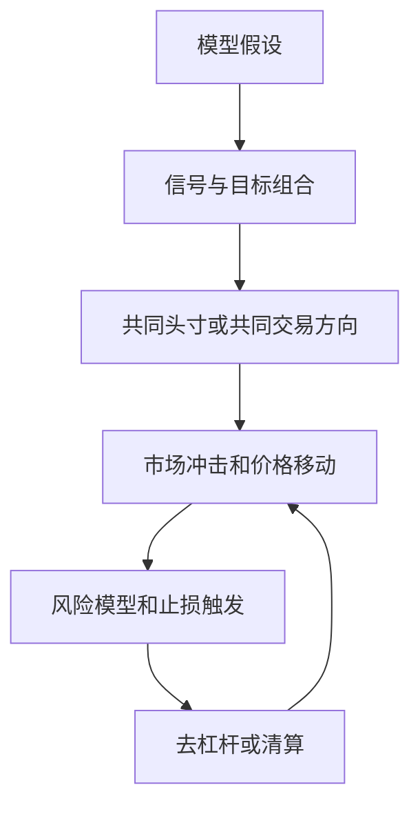

# 第10章 量化策略的风险内生性

> 如果对数据进行深入研究，它们将会表明任何事情。  
> -- 格雷戈·伊斯特布鲁克

## 章节主旨

本章进入第三部分“量化投资策略实战指南”，讨论量化交易中最重要、也最容易被误解的风险：策略自身产生或放大的风险。

前文已经区分了两类敞口：

1. 可以带来长期回报的敞口，例如阿尔法和贝塔。
2. 不能带来长期回报、只是偶然伴随策略出现的敞口，即风险。

主动型量化交易通常不希望长期持有贝塔敞口，因为贝塔可以通过低成本指数工具获得。本章主要关注阿尔法风险敞口：本应产生超额收益的策略暴露，在某些市场状态下没有得到补偿，甚至反过来造成损失。

作者强调，量化策略的风险不是只来自“市场下跌”。它可能来自模型问错问题、模型使用错误假设、结构关系突然改变、外部冲击打破历史规律、多个相似投资者同时清算、交易拥挤导致市场冲击放大等。部分风险是量化交易特有的，更多风险则是量化交易比主观交易更容易系统性暴露出来。

本章核心问题包括：

1. 模型风险如何产生。
2. 市场关系为什么会改变。
3. 外生冲击如何让历史规律失效。
4. 同质投资者和蔓延风险如何放大量化策略亏损。
5. 宽客如何监控和管理这些风险。

## 一、风险内生性的含义

所谓风险内生性，是指风险不是完全来自外部市场，而可能由策略、模型、持仓结构、交易行为和市场参与者相互作用共同产生。

对于量化策略而言，模型会系统性地产生交易信号；投资组合构建模型会系统性地放大或压缩头寸；执行模型会系统性地向市场释放订单。如果许多宽客使用相近的数据、相近的信号、相近的风控规则和相近的去杠杆机制，那么某个市场冲击就可能被策略群体自身放大。

这种风险常具有三个特征：

1. 平时不明显，压力状态下突然显现。
2. 单个模型看似合理，组合到市场层面却可能产生拥挤。
3. 历史回测不一定能揭示，因为历史样本可能没有包含相同的拥挤和清算状态。

可以用一个简单框架表示量化风险的传导：

这个循环说明，风险管理本身也可能成为风险放大器。例如，当波动率上升时，许多模型同时降低杠杆；当价格偏离历史关系时，许多相似策略同时平仓；当交易成本急剧上升时，清算价格进一步恶化。

## 二、模型风险

模型风险是量化策略最典型的风险之一。模型只是现实世界的简化表达，不可能完整复制现实世界。模型风险通常来自三类问题：

1. 建模的不适宜性：模型被用于它本不适合回答的问题。
2. 模型误设：模型结构、变量、分布或参数假设不正确。
3. 执行错误：模型本身可能合理，但实现、数据、交易或操作发生错误。

作者强调，计算机只能回答被交给它的问题。若问题本身错误，计算机会给出精确但无意义的答案。风险模型尤其容易出现这种“错误精确度”：一个看似严密的数字让人误以为风险已经被理解。

### 1. 建模的不适宜性

建模不适宜是指把模型用于无法有效建模的问题，或者用单一指标概括本应多维理解的风险。

典型例子是过度依赖 VaR。VaR 试图回答“在给定置信度和持有期内，组合最大可能损失是多少”。在正态分布、稳定波动率、稳定相关性等假设下，VaR 可以写成：

$$
VaR_c \approx z_c \sigma_p V
$$

其中：

1. $c$ 是置信水平。
2. $z_c$ 是对应的标准正态分位数。
3. $\sigma_p$ 是组合收益波动率。
4. $V$ 是组合价值。

这个表达清楚、简洁，但问题在于金融市场尾部常常不是正态分布。若收益服从正态分布，4 个标准差事件大约每 33333 个交易日才发生一次；但标准普尔 500 指数在 2000-2008 年样本中，约每 13 个月就出现一次 4 标准差事件，发生频率约为正态假设的 118 倍。

因此，VaR 可以作为风险语言的一部分，却不能成为风险管理的全部。真正的风险管理还需要情景分析、压力测试、流动性分析、模型失效诊断和极端尾部假设。

### 2. 模型误设

模型误设是指模型的变量、函数形式、分布假设或结构关系与真实世界不匹配。

最常见的问题之一是把非线性关系当作线性关系。相关系数只衡量线性关系：

$$
\rho_{X,Y}=\frac{\operatorname{Cov}(X,Y)}{\sigma_X\sigma_Y}
$$

若两个资产之间存在非线性关系，相关系数可能给出误导性结果。图10-1 展示了两个例子：XOM 与 JAVA 的关系呈非线性拱形，不能被简单线性相关充分描述；XOM 与 CVX 同属大型能源公司，关系更接近线性。

这说明，模型不能只因为某个统计量好看就被接受。宽客需要理解经济关系和市场机制，判断统计指标是否真的刻画了要交易的关系。

模型误设还可能来自：

1. 用短期稳定关系推断长期关系。
2. 用正常时期的相关性推断危机时期的相关性。
3. 用历史波动率代表未来波动率。
4. 把流动性充足时期的交易成本用于压力环境。
5. 忽略杠杆、融资、卖空限制和交易拥挤。

### 3. 执行错误

执行错误是指模型理论上合理，但实际落地时发生错误。它包括数据错误、代码错误、参数错误、订单错误、系统故障和人工干预错误。

书中提到的例子包括，某些投资组合因为技术或流程错误被错误清算，导致原本不应发生的大规模交易。此类错误与策略思想无关，却能造成真实损失。

执行错误的危险在于：

1. 量化系统通常自动化程度高，错误可能快速扩散。
2. 模型输出可能被交易系统直接执行，错误没有人工缓冲。
3. 错误规模常与组合规模、杠杆和交易频率相关。
4. 错误发生后，回补或修复本身也可能产生成本。

因此，宽客必须把模型验证、软件测试、数据校验、交易前风控、交易后核对和异常报警纳入同一个生产流程。

## 三、结构关系变化风险

结构关系变化风险是指资产之间原本稳定的关系发生改变，导致依赖这种关系的模型失效。

图10-2 展示了嘉信理财（SCHW）和美林证券（MER）之间的相关关系变化。两家公司在某些时期关系紧密，但互联网泡沫和信用危机会改变它们所处的经营环境和风险驱动因素，使历史相关关系不再可靠。

结构关系变化对量化策略尤其重要，因为许多策略依赖历史关系：

1. 统计套利依赖相似股票之间的价差收敛。
2. 相对价值策略依赖一组资产的相对估值稳定。
3. 风险模型依赖风险因子与资产收益之间关系稳定。
4. 投资组合优化依赖协方差和相关矩阵稳定。

如果关系发生结构性变化，模型可能仍然按照旧关系交易。例如，一只股票因基本面恶化而便宜，均值回复模型却可能把它识别为反弹机会；两只股票曾经同涨同跌，但行业格局或融资环境改变后，价差扩大可能不是机会，而是新均衡。

一个简化的价差模型可以写成：

$$
Spread_t = P_{A,t} - \beta P_{B,t}
$$

若 $\beta$ 是历史估计值，策略通常假设：

$$
Spread_t \rightarrow \bar{Spread}
$$

但结构关系改变时，真正发生的可能是：

$$
\bar{Spread}_{old} \neq \bar{Spread}_{new}
$$

这时继续押注旧均值会产生持续损失。

图10-3 展示 2003-2008 年价值-成长价差。图10-4 将价值-成长价差与原油价格以 2006 年 8 月 16 日为基准标准化后比较，显示原油 ETF 与价值/成长价差之间存在镜像趋势和镜像反转。这类关系说明，某些看似纯股票风格的策略，可能隐含着对宏观变量或商品价格的暴露。

## 四、外生冲击风险

外生冲击是模型外部的突发事件，例如战争、恐怖袭击、政策变化、监管禁令、金融机构救助、市场制度改变、宏观危机等。

图10-5 展示 1999 年 12 月至 2008 年 12 月标准普尔 500 指数，并标出 9/11、伊拉克战争、贝尔斯登救助、金融板块卖空制度改变等事件。这些事件并不是模型从价格历史中必然可以推断出来的，却会突然改变市场行为。

外生冲击的关键问题是：它改变的不是某个参数，而是市场参与者的约束和行为。

例如：

1. 卖空禁令改变空头策略可执行性。
2. 救助政策改变信用风险和金融股风险定价。
3. 战争和恐怖袭击改变风险偏好和流动性需求。
4. 交易制度变化改变订单流、价差和执行成本。
5. 融资市场冻结改变杠杆策略的强制清算风险。

外生冲击无法完全预测，但可以通过压力测试和情景分析预先思考。例如：

$$
Loss_{scenario} = w^\top r_{scenario}
$$

其中 $w$ 是组合权重，$r_{scenario}$ 是假设冲击下的资产收益。与只看历史波动不同，情景分析允许宽客主动构造“历史没有发生但可能发生”的状态。

## 五、蔓延风险和同质投资者风险

蔓延风险是指一个市场、一个策略或一个投资者群体的压力传导到其他市场、策略或投资者。对于量化策略，蔓延风险常与同质投资者风险相互加强。

同质投资者风险来自多个宽客使用相似思想、相似数据、相似风险模型和相似交易约束。即使每个宽客独立决策，市场压力下也可能出现相同方向交易。

典型过程如下：

1. 某个策略短期亏损。
2. 风险模型提示波动率上升或回撤扩大。
3. 投资者赎回、融资方收紧或风控要求降杠杆。
4. 多个基金同时卖出相似多头、回补相似空头。
5. 价格变化进一步恶化其他基金的模型损益。
6. 更多去杠杆触发，形成清算循环。

组合目标波动率或杠杆常可写成：

$$
L_t = \frac{\sigma_{target}}{\sigma_t}
$$

当估计波动率 $\sigma_t$ 上升时，目标杠杆 $L_t$ 下降。若许多策略采用类似规则，就可能同时降低头寸。

交易规模相对市场容量也很重要。若交易量 $Q$ 相对于平均日成交量 $ADV$ 过大，市场冲击会快速上升：

$$
Participation = \frac{Q}{ADV}
$$

交易成本可用一个凸函数近似：

$$
TC(Q)=a+bQ+cQ^2,\quad c>0
$$

这说明，清算规模越大，边际成本越高。压力状态下的交易成本不是线性的，越急着卖，越容易把价格打向不利方向。

## 六、2007年8月量化清算危机

2007 年 8 月的量化清算危机是本章讨论风险内生性的核心案例。许多量化股票市场中性策略同时遭遇异常亏损，尤其是价值、成长、动量、反转等风格关系在短时间内出现剧烈变化。

危机的关键不是市场整体暴跌，而是多个量化策略拥挤在相似交易中。当某些基金被迫降低风险或清算头寸时，它们卖出其他量化基金也持有的多头，回补其他量化基金也持有的空头。结果是：

1. 原本“便宜”的股票继续下跌。
2. 原本“昂贵”的股票因空头回补上涨。
3. 价值-成长价差快速反转。
4. 同类模型发生连锁亏损。
5. 清算本身导致模型信号更极端。

这类事件显示，市场中策略的收益来源可能在正常时期看似分散，但在压力时期高度相关。

## 七、表10-1：PHM 案例

表10-1 使用普尔特房地产公司（PHM）说明清算压力如何影响价格和成交量。

| PHM，2007年夏天 | 价格变化 | 平均日交易量 |
| --- | ---: | ---: |
| 5月31日至7月23日 | -22.0% | 350万股 |
| 7月24日至8月3日 | -12.5% | 720万股 |
| 8月6-9日 | +15.6% | 1040万股 |
| 8月10-31日 | -22.6% | 570万股 |

这个案例的含义是：

1. 5 月 31 日至 7 月 23 日，PHM 已经下跌 22%，日均交易量约 350 万股。
2. 7 月 24 日至 8 月 3 日，交易量增至 720 万股，股价继续快速下跌。
3. 8 月 6-9 日，交易量进一步增至 1040 万股，股价在 4 个交易日反弹 15.6%。
4. 这 4 天恢复了此前 44 天跌幅的大约一半，变化速度约快 20 倍。
5. 8 月 9 日附近的空头回补承受了严重市场冲击成本，支付价格超过 15%。
6. 清算压力减弱后，PHM 在 8 月 10-31 日又下跌 22.6%。

这说明短期价格反转不一定来自基本面改善，而可能来自强制交易、空头回补和拥挤清算。

## 八、宽客如何监控风险

作者强调，宽客不能只依赖单个风险数字。有效监控应覆盖模型、市场、组合、执行和操作多个层面。

### 1. 模型监控

模型监控关注模型是否仍然适用于当前市场。常见问题包括：

1. 预测信号是否仍有收益。
2. 信号分组收益是否仍保持单调性。
3. 历史相关关系是否发生破裂。
4. 估计残差是否异常扩大。
5. 模型所依赖的数据是否仍可靠。

### 2. 敞口监控

宽客需要知道组合暴露在哪些风险因子上。若 $w$ 是组合权重，$b_k$ 是第 $k$ 个因子暴露向量，则组合因子敞口为：

$$
Exposure_k = b_k^\top w
$$

这可以用于监控市场、行业、风格、国家、货币、期限、波动率、流动性等敞口。

### 3. 损益归因

每日损益可写成：

$$
PnL_t = \sum_i q_i(P_{i,t}-P_{i,t-1})
$$

其中 $q_i$ 是持仓数量，$P_{i,t}$ 是资产价格。更进一步，宽客需要把损益拆分为：

1. 阿尔法收益。
2. 风格或因子收益。
3. 市场贝塔收益。
4. 交易成本。
5. 滑价和市场冲击。
6. 数据或执行错误。

若亏损来自预期阿尔法短期失效，处理方式与来自错误交易、数据污染或结构关系改变完全不同。

### 4. 流动性和拥挤监控

流动性监控不仅要看平均成交量，还要看可执行性。关键指标包括：

1. 头寸占 ADV 的比例。
2. 清算所需天数。
3. 买卖价差变化。
4. 市场深度。
5. 参与率。
6. 同类策略拥挤度。

清算天数可近似为：

$$
DaysToLiquidate_i = \frac{|Q_i|}{\alpha \cdot ADV_i}
$$

其中 $\alpha$ 是可接受参与率。若某策略需要在很短时间内卖出大量头寸，实际交易成本可能远高于正常估计。

### 5. 压力测试和情景分析

宽客应测试模型在极端但合理情景下的表现，包括：

1. 相关性趋近于 1。
2. 波动率突然上升。
3. 交易成本成倍增加。
4. 流动性枯竭。
5. 赎回或融资压力迫使降杠杆。
6. 卖空限制或监管规则改变。
7. 关键数据源失效。

压力测试不能预测所有灾难，但可以让团队提前知道哪些风险会致命。

## 九、图表说明

### 图10-1：非线性和线性相关关系示例

图10-1 对比两类关系：XOM/JAVA 的关系更像非线性拱形，XOM/CVX 更接近线性关系。它说明相关系数只度量线性共同变化，不能替代对关系结构的理解。

### 图10-2：两只股票相关关系结构改变

图10-2 展示 SCHW/MER 的相关关系分阶段变化。互联网泡沫和信用危机改变了两家公司共同风险来源，使历史相关性不再稳定。

### 图10-3：2003-2008年价值-成长价差

图10-3 显示价值与成长风格之间的价差在多年中并非稳定均值回复，而会出现长期趋势和剧烈反转。

### 图10-4：价值-成长价差与原油价格

图10-4 以 2006 年 8 月 16 日为基准标准化，比较价值-成长价差与原油 ETF。两者呈镜像趋势和镜像反转，提示股票风格策略可能隐含宏观或商品价格暴露。

### 图10-5：1999年12月至2008年12月标准普尔500指数

图10-5 标出 9/11、伊拉克战争、贝尔斯登救助、金融板块卖空规则变化等外生冲击，说明市场风险常来自模型外部的制度和事件变化。

## 十、公式与定义补全

### 1. 相关系数

$$
\rho_{X,Y}=\frac{\operatorname{Cov}(X,Y)}{\sigma_X\sigma_Y}
$$

相关系数只刻画线性关系。非线性、状态切换和尾部相关需要额外方法判断。

### 2. VaR

$$
VaR_c \approx z_c \sigma_p V
$$

VaR 的关键风险在于分布、波动率、相关性和流动性假设错误。它不应被当作风险全貌。

### 3. 目标波动率杠杆

$$
L_t = \frac{\sigma_{target}}{\sigma_t}
$$

当波动率上升时，目标杠杆下降。若许多投资者同时使用类似规则，去杠杆可能放大市场冲击。

### 4. 市场冲击成本

$$
TC(Q)=a+bQ+cQ^2,\quad c>0
$$

交易成本常随交易规模凸性上升，压力状态下尤其明显。

### 5. 因子敞口

$$
Exposure_k = b_k^\top w
$$

组合需要持续监控市场、行业、风格、流动性和宏观因子暴露。

### 6. 组合损益

$$
PnL_t = \sum_i q_i(P_{i,t}-P_{i,t-1})
$$

损益监控必须进一步拆分来源，区分阿尔法失效、风险敞口、交易成本和执行错误。

## 小结

量化交易的纪律性、计算能力和科学严谨性可以帮助投资者在竞争激烈的市场中寻找收益，但宽客也必须处理一系列特殊风险。模型风险是量化交易最典型的风险，结构关系变化、外生冲击、同质投资者和蔓延风险则会在压力时期放大损失。

本章的核心提醒是：风险数字不等于风险理解。宽客必须理解模型假设、市场关系、交易拥挤、流动性和执行过程，并用监控、压力测试、敞口归因和异常处理机制降低下行风险。

下一章转向市场上对量化交易的常见批评，并区分哪些批评有合理成分，哪些批评来自误解。
