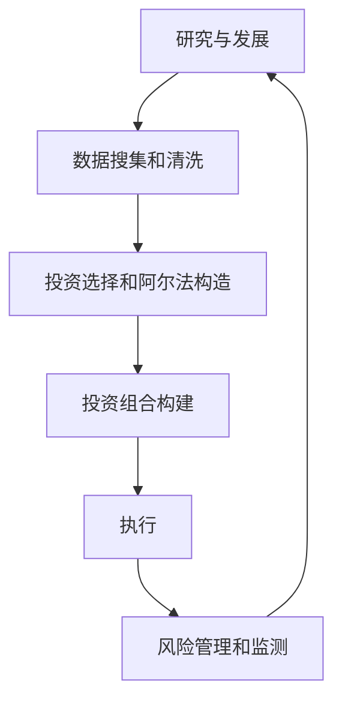

# 第12章 评估宽客和量化交易策略

> ……天赋毫无意义，而谦卑地并努力工作获得的经验意味着一切。  
> -- 帕特里克·聚斯金德

## 章节主旨

本章讨论如何评估量化交易策略和宽客。目标是区分好的、中等的和差的策略与团队。

作者强调，评估宽客不只是看业绩记录。真正的问题是：为什么应相信这个团队用这个策略在未来仍可能获利？对于对冲基金，这个问题可以表述为：这个经理的优势是什么？

评估宽客有四个层次：

1. 理解策略本身：利润来自哪里，风险是什么，什么环境下有效。
2. 判断团队能力：他们是否有能力研究、改进、维护和更新策略。
3. 核实诚信：团队是否适合作为受托人管理资本。
4. 判断组合适配：策略是否改善投资者已有组合，而不是重复已有风险。

本章也提供了实务化的访谈方法：建立信任、具备专业知识、有组织地管理信息。作者认为，宽客并非完全不可了解。投资者不需要得到专有秘密，也可以通过正确的问题理解策略的菜单、选择和原因。

## 一、评估宽客的两个核心目标

评估过程有两个核心目标。

第一，理解策略本身。投资者必须知道策略的收益来源、风险来源和适用环境。只有理解这些，才能决定何时投资、分配多少资本，以及在策略亏损时如何判断是正常回撤还是模型失效。

第二，判断宽客有多优秀。量化团队类似工程团队：不仅要能设计好引擎，还要能持续改进引擎，必要时重新设计新引擎。策略会老化，市场会改变，竞争会增加，因此团队的研究和迭代能力至关重要。

可以把评估问题写成：

$$
Expected\ Value = Edge \times Durability \times Integrity \times Fit
$$

这个表达不是书中的正式公式，而是对本章逻辑的补全：优势、可持续性、诚信和组合适配缺一不可。某个维度为零，投资价值就可能为零。

## 二、收集信息：从审讯技巧到投资访谈

作者借用《审问者》中汉斯·约阿希姆·沙尔夫的三个技巧，说明如何从不愿透露太多信息的对象那里收集信息。这不是把投资者和宽客关系比作审讯，而是因为两者都有一个共同点：一方拥有另一方需要的信息，但不愿完全公开。

三个技巧是：

1. 建立信任。
2. 拥有专业知识。
3. 组织和管理信息。

### 1. 建立信任

宽客愿意透露多少信息，很大程度取决于是否信任投资者。若投资者粗鲁地询问敏感信息，或喜欢谈论其他宽客的策略，宽客自然会担心自己的信息被传播。

作者所在机构的做法是严格保密其他宽客信息。当宽客询问其他宽客做什么时，回答通常是不能讨论。这种纪律使被访者知道，自己提供的信息也会被保护。

建立信任并不意味着放弃追问，而是让对方相信追问是为了理解风险和组合适配，不是为了窃取策略。

### 2. 专业知识

当提问者已经知道大部分可能答案时，被访者更难用“这是专有秘密”搪塞。沙尔夫之所以能从飞行员那里获得信息，是因为他已经知道很多背景，只需要一点点补充。

投资者也应先掌握量化交易的基本菜单：

1. 阿尔法模型类型。
2. 风险模型类型。
3. 交易成本模型。
4. 投资组合构建方式。
5. 执行方法。
6. 数据来源和清洗方法。
7. 研究流程。

这本书本身就是菜单。投资者不一定需要知道专有细节，但应能判断宽客选择了菜单中的哪些项目，为什么这样选，以及这些选择对风险和收益意味着什么。

### 3. 信息组织

收集信息后必须有组织地管理。沙尔夫团队用卡片和索引建立类似关系数据库的系统，使每条信息能与其他信息连接。

投资者也应把每次尽调的信息结构化记录。例如：

1. 宽客当前研究课题。
2. 过去三个月模型新增内容。
3. 数据、执行、风控工具的变化。
4. 策略表现与之前解释是否一致。
5. 团队回答是否前后一致。

若宽客突然出现一个过去从未提过的重要模块，可能说明研究过程不够严谨。若访问办公室时看不到此前宣称使用的工具或软件，也应追问。

信息管理让投资者能够识别时间序列上的一致性，而不是只听一次演示。

## 三、评估量化交易策略：六大模块

作者把量化策略的投资过程概括为六个主要内容：

1. 研究和发展策略。
2. 数据搜寻、收集、清洗和管理。
3. 投资选择和构造。
4. 投资组合构建。
5. 执行。
6. 风险管理和监测。

这六项与“黑箱”各模块对应。评估策略，就是检查这些模块是否有清晰逻辑、可验证流程和合理取舍。

### 1. 研究和发展策略

应询问的问题包括：

1. 交易思想如何产生？
2. 如何测试这些思想？
3. 模型如何拟合？
4. 样本内测试和样本外测试如何划分？
5. 如何判断策略有效？
6. 如何处理过度拟合、前视偏差和数据污染？

关键不是宽客给出一个“看起来很聪明”的想法，而是能说明从观察、假设、测试、拒绝、上线到持续监控的完整流程。

### 2. 数据搜寻、收集、清洗和管理

应询问的问题包括：

1. 使用哪些数据？
2. 数据从哪里获得？
3. 数据如何存储？
4. 为什么采用这种存储方式？
5. 如何清洗数据？
6. 如何处理缺失、错误、延迟、修订和幸存者偏差？

数据不是模型的附属品。许多量化策略的优势来自数据清洁、组织和使用方式，而不是来自数学公式本身。

### 3. 投资选择和构造

应询问的问题包括：

1. 阿尔法背后的理论是什么？
2. 阿尔法属于哪类：趋势、反转、情绪、价值/收益、成长、品质等？
3. 策略做相对赌注还是方向型赌注？
4. 如果是相对赌注，相对关系具体是什么？
5. 投资期限多长？
6. 投资领域包括哪些资产、市场和地区？
7. 多个阿尔法模型如何组合？

投资者需要区分宽客是在交易真实经济逻辑、统计关系、市场结构，还是只是在拟合历史噪声。

### 4. 投资组合构建

应询问的问题包括：

1. 如何确定头寸大小？
2. 有哪些限额，为什么这样设置？
3. 投资组合构建模型有哪些输入？
4. 目标函数是什么？
5. 如何平衡阿尔法、风险和交易成本？

若目标函数写成简化形式，可表示为：

$$
\max_w \ \mu^\top w - \lambda w^\top \Sigma w - TC(w-w_0)
$$

其中：

1. $w$ 是目标权重。
2. $\mu$ 是预期收益或阿尔法。
3. $\Sigma$ 是协方差矩阵。
4. $TC(w-w_0)$ 是从当前组合 $w_0$ 调整到目标组合的交易成本。
5. $\lambda$ 是风险厌恶或风险权重。

不同宽客不一定使用这个优化形式，但投资者应理解他们如何权衡这三个核心输入。

### 5. 执行

应询问的问题包括：

1. 使用哪种交易成本模型，为什么？
2. 交易是人工执行还是自动执行？
3. 执行算法如何构建？
4. 使用明单还是暗单？
5. 订单是主动还是被动？
6. 如何评估滑价和市场冲击？

执行差异会显著影响结果。作者举例，两个策略几乎相同的交易者，若其中一个通过优化执行或降低交易成本，使每一美元交易多赚 0.01%，在高换手下年化收益可能从 10% 提升到 12%，对 5 亿美元资金意味着每年多 1000 万美元。

### 6. 风险管理和监测

应询问的问题包括：

1. 风险模型考虑哪些因素？
2. 为什么选择这些风险因素？
3. 有哪些风险限额？
4. 限额为什么这样设？
5. 什么情况下会干预模型？
6. 策略运行后监测哪些指标？

风险管理不只是避免损失，也要避免在正常回撤中错误放弃策略，或者在真正失效时迟迟不行动。

## 四、历史收益：策略留下的足迹

访谈不是唯一工具。历史收益是策略留下的足迹。

如果宽客说自己做的是多资产趋势跟踪、平均持仓 6 个月，则长期趋势存在时策略应表现较好，长期趋势反转时应表现较差。收益模式应该与策略解释一致。

若策略叙述与历史收益不匹配，可能说明：

1. 宽客没有充分理解自己的策略。
2. 投资者没有理解策略。
3. 策略发生了重大变化。
4. 收益来自未披露的风险敞口。
5. 业绩记录存在问题。

可以用回归或归因检验策略足迹：

$$
R_{manager,t}=\alpha+\sum_k \beta_k F_{k,t}+\epsilon_t
$$

若经理声称没有某类风险暴露，但回归显示长期显著暴露，投资者应继续追问。

## 五、评估量化交易者

评估宽客不能脱离策略。团队能力必须与策略所需能力匹配。

优秀宽客应具备：

1. 与策略相关的方法训练。
2. 与策略相关的实战经验。
3. 细心、谨慎和谦逊。
4. 对数据污染、竞争加剧、模型失效保持警惕。
5. 能深入解释策略细节和取舍。
6. 能把研究转化为生产系统。

作者强调，博士学位不是品质或技能的保证。许多成功宽客没有高学位，而一些失败者甚至拥有诺贝尔奖。真正重要的是判断力、经验、研究流程和细节质量。

### 1. 细节决定差异

许多量化策略依赖微小优势。若一个策略每年交易 260000 次，执行、数据、信号、风险和成本的微小改进都会被放大。

可用简单分解理解：

$$
Annual\ Incremental\ PnL \approx Turnover \times Capital \times Improvement
$$

若改进仅为每美元 0.01%，在高换手和大资金下也会形成可观收益。

### 2. 细节也检验思考深度

如果宽客在抽查的几个领域都思考深入，说明他在其他领域也可能严谨。相反，若高层叙述流畅但细节空洞，风险很大。

但细节评估有难点：

1. 有些细节确实属于专有信息。
2. 投资者需要专业知识才能判断细节是否合理。
3. 宽客可能愿意说流程，但不愿说参数或算法。

因此，非量化投资者尤其需要强大的信息管理和持续尽调能力。

## 六、优势

优势是评估投资组合经理最关键的因素。作者定义的优势，是有利于投资组合经理成功概率的因素。

优势有三个共性来源：

1. 投资过程优势。
2. 缺乏竞争优势。
3. 结构性优势。

优势不同于竞争优势。交易者没有竞争者也可能亏损；策略竞争少也不代表它有内在收益。投资优势更强调策略本身是否有成功概率。

### 1. 投资过程优势

投资过程优势来自前述六大模块中的一个或多个。对宽客而言，优势常来自：

1. 研究经验和技能。
2. 获取清洁数据的能力。
3. 数据处理流程。
4. 模型开发和验证能力。
5. 执行和交易成本控制。
6. 风险监测和灾难处理能力。

研究优势必须能够不断产生、测试和上线策略。许多模型会逐渐平庸，研究过程若不能持续输出新改进，优势会衰退。

研究过程还应处理：

1. 过度拟合。
2. 前视偏差。
3. 样本内/样本外划分。
4. 策略上线标准。
5. 生产监控。

作者建议通过追问“为什么”判断研究过程。例如，若经理说头寸反转 10% 就平仓，应追问为什么是 10%，不是 5% 或 50%。

### 2. 灾难处理也是优势的一部分

宽客如何处理灾难，对理解优势持续性很重要。

缺乏经验的宽客可能在小亏损后恐慌清算，也可能在策略真正失效时坚持不改。两者都危险。优秀宽客应基于良好监测工具定位问题，而不是情绪化反应。

这可以概括为：

$$
Response = Diagnosis + Discipline - Panic
$$

亏损本身不是充分信息。关键是诊断亏损来自正常噪声、市场结构变化、模型错误、数据错误还是执行错误。

### 3. 数据优势

数据优势来自对某类数据的访问或更好的收集、清洗、存储能力。

书中例子是利用手机 GPS 地理位置数据构造更及时的宏观经济指标。如果数据有效，且其他人无法快速复制，就可能形成优势。

但在技术和监管快速发展的时代，可持续的独占数据优势很难。更可持续的往往是数据工程能力：如何获取、清洗、校验、存储和使用数据。

### 4. 缺乏竞争优势

缺乏竞争优势来自某个策略暂时没有太多竞争者。但高利润会吸引进入者，最终压低收益。

量化多头/空头和统计套利都经历过这一过程：

1. 初期竞争少，收益好。
2. 好结果吸引人才和资本。
3. 竞争增加，利润下降。
4. 一些参与者退出。
5. 剩余参与者利润空间恢复。

这说明策略“死亡”有时更像周期性拥挤和出清。

评估缺乏竞争优势时，应问：为什么别人没有做？是因为门槛高，还是因为别人暂时没注意到？

### 5. 结构性优势

结构性优势通常来自市场结构或规则。例如，场内交易者曾因交易所身份获得更便宜、更快交易能力；某些电子通信网络提供流动性回扣，使提供流动性本身成为盈利模式。

结构性优势可能有效，但也可能被规则改变移除。市场结构变化会让原本稳定的优势消失。

## 七、评估宽客的诚信

作者认为，大多数宽客诚实且有道德，因此可以基于“信任但核实”的原则合作。但在投资前，应尽可能核实宽客是否适合作为受托人。

### 1. 受托人视角

投资者的工作不是判断宽客“人品好不好”，而是判断宽客是否能作为受托人代表投资者行事。受托人必须：

1. 以客户最大利益行事。
2. 坦率披露利益冲突。
3. 公开可能阻碍履职的重要事项。
4. 对风险和失败保持诚实。

### 2. 背景和征信核查

可使用的工具包括：

1. 背景核查。
2. 教育背景审查。
3. 征信调查。
4. 过往投资者访谈。
5. 网络和行业声誉核实。

询问已有投资者时，不仅要问为什么喜欢该基金经理，也要问弱点是什么。弱点往往比赞美更有信息量。

### 3. 用细节检验一致性

欺骗者可能准备好高层叙述，却很难在低层细节上长期保持一致。

对策略可以追问：

1. 数据怎么来。
2. 数据怎么清洗。
3. 模型如何上线。
4. 风控如何触发。
5. 最近一次模型变更是什么。

对背景也可以追问：

1. 学校期间住在哪里。
2. 论文题目是什么。
3. 答辩委员会成员是谁。
4. 过去职位的具体职责是什么。

答案缺乏理解、自相矛盾或无法站住脚，不一定直接证明不诚信，但至少说明经理可能不优秀，足以构成谨慎理由。

### 4. 麦道夫教训

投资者不应只因业绩记录长、声誉好就投资。麦道夫从不解释策略如何持续获得正收益，坚持称策略是专有的。若投资者不能深入理解策略，就不值得投资。

作者强调：不是花费太多才说“否”，而应在有相当自信时才说“是”。

## 八、宽客如何适应投资组合

假设宽客通过评估，投资者还必须决定如何分配资金，以及该策略是否适合现有组合。

作者提出三个关键维度：

1. 阿尔法风险敞口类型。
2. 赌注结构。
3. 投资期限。

### 1. 阿尔法投资组合

投资组合构建本质上是风险敞口分配。投资者应平衡不同阿尔法类型：

1. 趋势型。
2. 回复型。
3. 价值/收益型。
4. 成长型。
5. 品质型。
6. 情绪型。

量化趋势跟踪和主观趋势跟踪在风险敞口上可能类似。程序化策略能不知疲倦地捕捉机会，人工交易者可能避免一些程序化错误，但从组合角度看，两者都可能暴露于趋势因子。

组合层面的阿尔法暴露可以简化为：

$$
AlphaExposure_k = \sum_m Allocation_m \times Loading_{m,k}
$$

其中 $Allocation_m$ 是给第 $m$ 个经理或策略的资本分配，$Loading_{m,k}$ 是其对第 $k$ 类阿尔法风险的暴露。

### 2. 赌注结构

相对赌注和绝对赌注的风险不同。

相对赌注依赖一组资产之间关系稳定。当关系改变时，结构本身成为风险来源。例如，相对均值回复策略在资产关系破裂时容易亏损。

绝对赌注的均值回复策略可能在市场体制改变中获益，因为它押注流行趋势反转，而不是依赖两个资产之间的固定关系。

因此，即使在同一阿尔法类别中，也应分散赌注结构。例如，相对均值回复和绝对均值回复不应被视为完全相同的风险。

### 3. 投资期限多样化

长期量化策略通常容量更大，但业绩周期更长、更不均匀，需要多年才能判断经理是否真正有问题，也可能遭遇拥挤风险。

短期策略通常表现更持续，但容量有限，也依赖市场条件：

1. 交易量需要足够高。
2. 波动率不能太低。
3. 金融产品之间相关性不能过高。
4. 策略规模不能超过有效容量。

短期交易者若因融资便利而不断扩张资产，可能削弱策略有效性。

### 4. 图12-1：理论驱动阿尔法模型框架

图12-1 总结了理论驱动阿尔法模型的分类框架。它把投资组合适配问题映射到三类维度：

1. 阿尔法类型。
2. 赌注结构。
3. 时间期限。

作者认为，资产类别、地区、模型设定和运行频率在正常市场中也会增加多样性；但在压力时期，上述三类因素更重要。

## 九、评估清单汇总

可以将本章尽调问题整理为以下框架：

| 模块 | 核心问题 | 主要风险 |
| --- | --- | --- |
| 研究 | 思想如何产生、测试和上线 | 过度拟合、前视偏差、研究低效 |
| 数据 | 数据来源、清洗、存储和校验 | 数据污染、幸存者偏差、可得性偏差 |
| 阿尔法 | 策略理论、类型、期限和领域 | 伪逻辑、隐含风险、拥挤 |
| 组合构建 | 头寸规模、限额、目标函数 | 风险失衡、过度集中、成本忽略 |
| 执行 | 成本模型、订单方式、自动化 | 滑价、市场冲击、执行错误 |
| 风险监测 | 风险因素、限额、干预规则 | 迟钝、恐慌、隐藏敞口 |
| 团队 | 经验、判断力、细节能力 | 纸面资历强但实务弱 |
| 诚信 | 背景核查、受托责任、细节一致性 | 欺骗、利益冲突、信息不透明 |
| 组合适配 | 阿尔法、赌注结构、期限分散 | 重复暴露、容量过大、相关性上升 |

## 小结

评估宽客和量化策略，必须理解策略、策略特征以及策略产生和演化的过程。投资者有三个工具：建立信任、掌握量化交易知识、有组织地管理信息。

最终，投资者要判断宽客是否有优势、优势来自哪里、能持续多久、未来会受到什么威胁。优势通常来自人的品质和投资过程，而不是来自漂亮演示或单纯历史业绩。

一旦宽客通过审查，投资者还要认真考虑组合适配。合理的量化配置应在阿尔法类型、赌注结构和投资期限上实现多样化。

作者用一个优秀量化公司高级职员的话总结本章精神：没有秘诀，就是不断改进策略的每个部分，包括数据、执行算法、投资组合构建算法，并雇用合适的人，让他们持续一点一滴地改进。
