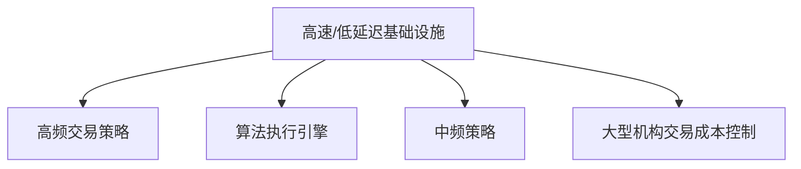

# 第14章 高速交易

> 薄冰上滑冰的安全性取决于速度的大小。  
> -- 爱默生

## 章节主旨

本章讨论高速交易，也称低延迟交易。作者首先区分两个概念：高速交易不是高频交易本身，而是高频交易和许多算法执行策略共同依赖的基础设施。高频交易是策略类别，高速交易是进入市场、处理数据、生成信号、发送订单和取消订单的速度能力。

本章主要回答：

1. 为什么速度对交易者重要。
2. 被动订单、进取型订单和撤单中速度如何影响收益。
3. 延迟来自哪些环节。
4. 共址、主机托管、市场中心间传输、订单簿构建、数据突发、信号计算和风险检查如何影响低延迟交易。
5. 为什么平均延迟不足以描述系统能力，尾部分位点更重要。

作者的核心观点是：速度优势不是高频交易独有，也不是现代市场才有。资本市场历史上，接近交易所、通信更快、信息处理更快一直是竞争优势。从信鸽到电话，从交易所附近办公到数据中心共址，本质都是降低信息和订单延迟。

## 一、高速交易与高频交易的区别

高速交易指交易者以尽可能低的延迟进入市场，并以低延迟执行交易决定。它关注的是基础设施能力，包括数据接收、订单簿重建、信号计算、风险检查和订单发送。

高频交易是使用这些基础设施的一类策略。除此之外，长期投资者的算法执行引擎也需要速度，因为大额交易的执行质量会受到行情变化和队列位置影响。

两者关系可以表示为：

因此，不能把所有低延迟技术都等同于高频交易争议。

## 二、速度的重要性：从订单类型开始

无论阿尔法模型、风险模型或组合构建模型多复杂，最终都要通过订单进入市场。理解速度的重要性，必须先理解订单类型。

本章重点讨论三种场景：

1. 放置被动订单。
2. 放置进取型订单。
3. 取消被动订单。

### 1. 被动订单

被动订单是不能立即成交的限价订单。例如，XYZ 股票最低卖价为 100.01 美元，交易者提交 100.00 美元或更低价格买入的限价单，该订单不会立即成交，因此成为被动订单。

被动订单累积形成限价订单簿。大多数市场采用价格/时间优先：

1. 买方最高价格优先。
2. 卖方最低价格优先。
3. 同价位先到先成交。

有些市场采用价格/规模优先，同价位大订单相对小订单更优先。

### 2. 进取型订单

进取型订单是可以立即执行的订单，包括：

1. 市场订单。
2. 与订单簿已有订单成交的进取型限价订单。

市场买单不考虑价格，只要求买入数量。例如，若订单簿最低卖价为 100.01 美元、规模 2000 股，次低卖价为 100.02 美元、规模 2950 股，则 3000 股市场买单会先以 100.01 美元买入 2000 股，再以 100.02 美元买入 1000 股。

进取型限价单则指定价格，但若该价格能够与已有订单成交，也会立即执行。例如，在最高买价 100.00 美元处有买单，提交以 100.00 美元卖出 1000 股的限价单，会立即与买方成交。

### 3. 连接与改进

连接（joining）是指在当前最优价格处增加订单规模。例如最低卖价为 100.02 美元，新增一个 100.02 美元限价卖单，就是连接最低卖价队列。它通常是被动订单，因为不能立即成交。

改进（improving）是指提交比当前最优价格更有竞争力的订单。例如最低卖价为 100.02 美元，新增 100.01 美元限价卖单，就缩小了买卖价差。由于价格优先，它即使最后进入市场，也获得最高卖方优先权。

## 三、订单簿示例：表14-1至表14-10的结构还原

原书表14-1至表14-10通过虚构股票 XYZ 展示订单簿变化。表格主体可归纳为以下状态。

### 1. 初始订单簿与大市场买单

表14-1 初始订单簿：

| 买方ID | 买方规模 | 买价 | 卖价 | 卖方规模 | 卖方ID |
| --- | ---: | ---: | ---: | ---: | --- |
| 买1 | 55 | 100.00 | 100.01 | 2000 | 卖1 |
| 买2 | 1000 | 100.00 | 100.02 | 2950 | 卖2 |
| 买3 | 3100 | 99.99 | 100.02 | 600 | 卖3 |
| 买4 | 200 | 99.99 | 100.03 | 300 | 卖4 |
| 买5 | 5000 | 99.98 | 100.04 | 1000 | 卖5 |

若 3000 股市场买单进入市场：

1. 以 100.01 美元成交 2000 股，吃掉卖1。
2. 以 100.02 美元成交 1000 股，部分吃掉卖2。

表14-2 成交后卖2剩余 1950 股，最低卖价变为 100.02 美元：

| 买方ID | 买方规模 | 买价 | 卖价 | 卖方规模 | 卖方ID |
| --- | ---: | ---: | ---: | ---: | --- |
| 买1 | 55 | 100.00 | 100.02 | 1950 | 卖2 |
| 买2 | 1000 | 100.00 | 100.02 | 600 | 卖3 |
| 买3 | 3100 | 99.99 | 100.03 | 300 | 卖4 |
| 买4 | 200 | 99.99 | 100.04 | 1000 | 卖5 |
| 买5 | 5000 | 99.98 |  |  |  |

### 2. 进取型限价卖单

在表14-2状态下，以 100.00 美元卖出 1000 股的限价单会立即成交：

1. 先与买1的 55 股成交。
2. 再与买2的 945 股成交。
3. 买2剩余 55 股，仍在 100.00 美元最高买价。

表14-3 说明，能立即成交的限价单也是进取型订单。

### 3. 连接订单

表14-4展示“连接”状态：若在最低卖价 100.02 美元处新增 1000 股卖单（卖6），该订单加入已有 100.02 美元卖方队列之后。它价格相同但时间较晚，因此优先权低于先到的卖2和卖3。

连接订单不能立即成交，通常是被动订单。

### 4. 改进订单

表14-5展示“改进”状态：若新增一个 100.01 美元限价卖单（卖7），它将最低卖价从 100.02 美元降至 100.01 美元，缩小买卖价差。由于价格更优，卖7获得卖方最高优先权，即使它最后进入市场。

这个例子说明：

1. 同价位时，时间优先重要。
2. 更优价格可以超过时间优先。
3. 改进订单通过缩小价差获得优先地位。

## 四、流动性的准确定义

市场参与者常把流动性等同于订单簿规模或深度，但作者认为这会误导。

流动性应定义为：

> 在任意时刻，能够立即以公允价格进行一定规模交易的可行性。

这个定义包含三个维度：

1. 即时性。
2. 规模。
3. 公允价格。

订单簿中挂单多，不一定代表真实流动性好。如果买卖规模严重不平衡，或价格远离公允价值，市场仍可能缺乏流动性。

公允价格有两层含义：

1. 反映金融工具基本经济暴露。
2. 对相似金融工具的价格变化保持敏感。

因此，进取型订单虽然会移除订单簿数量，但如果它把价格推向更合理水平，也可能增加流动性。相反，被动累积大头寸的执行策略可能减少市场流动性，因为它把未来必须交易的压力隐藏在订单簿外。

## 五、逆向选择与速度

逆向选择是理解速度价值的核心。放置被动订单时，交易者公开表达了买入或卖出意愿，但不知道将与自己成交的对手是否掌握更有利信息。

被动订单的收益来源可能包括：

1. 赚取买卖价差。
2. 获得交易所流动性回扣。
3. 在价格未变坏前退出头寸。

但若被动订单总是在不利信息到来时成交，就会亏损。

可以把被动订单预期收益写成：

$$
E[PnL] = SpreadCapture + Rebate - AdverseSelection - ExitCost
$$

Tradeworx 内部研究估计，2010 年流动性股票中，被动订单在进入市场一分钟内无成本按中间价退出的平均利润约为每股 -0.2 美分。换言之，若没有流动性回扣，被动订单平均是亏损的。

## 六、放置被动订单中速度的必要性

表14-6至表14-9说明队列位置的重要性。

表14-6 初始状态：

| 买方ID | 买方规模 | 买价 | 卖价 | 卖方规模 | 卖方ID |
| --- | ---: | ---: | ---: | ---: | --- |
| 买1 | 3100 | 99.99 | 100.01 | 2000 | 卖1 |
| 买2 | 200 | 99.99 | 100.02 | 2950 | 卖2 |
| 买3 | 5000 | 99.98 | 100.02 | 600 | 卖3 |
|  |  |  | 100.03 | 300 | 卖4 |
|  |  |  | 100.04 | 1000 | 卖5 |

表14-7是在表14-6基础上加入 100.00 美元买单后的状态。若交易者以 100.00 美元买入 1000 股，并在该价位队列前部，则新的订单簿中 100.00 美元买价由买4的 1000 股和后续买5的 6000 股组成。若卖出 1000 股的进取型订单进入，队首买4成交，形成表14-8所示状态：最高买价仍是 100.00 美元，因为队列后面还有买5。

若交易者排在 100.00 美元队列最后，前面有大量买单，直到他的订单成交时，100.00 美元买盘可能已经被耗尽。成交后最高买价下降到 99.99 美元，而他买入的 100.00 美元头寸很可能变成最优卖价，处在不利位置。

Tradeworx 发现，对于给定价格，队列最前与队列最后的盈利约相差每股 1.7 美分。考虑到所有被动订单平均每股亏损约 0.2 美分，这个队列位置差异非常大。

队列优势可以写成：

$$
QueueEdge = PnL_{front} - PnL_{back}
$$

本章给出的经验值是：

$$
QueueEdge \approx 0.017\ dollars/share
$$

因此，被动订单速度取决于三个变量：

1. 逆向选择指标。
2. 交易量。
3. 建立和维护顶级速度的成本。

投资者越少、持有时间越长，对顶级速度要求越低。但大型机构和高换手策略仍可能因交易量大而需要较快速度。

## 七、放置进取型订单中速度的必要性

进取型订单愿意支付买卖价差，以换取确定成交。速度对它们同样重要。

### 1. 进取型限价订单

两个交易者都想以 100.01 美元买入 2000 股时，第一个进入市场的订单会与已有 100.01 美元卖单成交；第二个订单则不能立即成交，而成为新的最高买单。

第二个交易者可能出现三种结果：

1. 最终以 100.01 美元成交，但面临逆向选择。
2. 改用更高价格成交。
3. 不能成交。

无论哪种结果，相对第一个成交者都更差。

### 2. 市场订单

市场订单几乎总能成交，但价格不可控。若一个市场买单进入前，最优卖价被别人先吃掉，慢订单会滑到更高价格。

滑价可以表示为：

$$
Slippage = ExecutionPrice - DecisionPrice
$$

对买单而言，滑价越高越差；对卖单而言，执行价低于决策价也形成滑价。

趋势交易者尤其需要速度，因为若信号正确，价格会朝预期方向快速移动；慢订单会错过更好价格。

## 八、取消被动订单中速度的必要性

撤单速度同样重要。若市场快速变化，原来合理的被动订单可能变成陈旧订单。

例如，交易者以 100.00 美元挂卖单，当前最低卖价是 99.98 美元。若市场快速上涨，100.00 美元卖单可能在价格已远高于 100.00 美元时成交，交易者错失更高卖价。若他能迅速撤单并用更高价格替代，就能避免损失。

撤单速度的价值来自避免陈旧订单被逆向选择：

$$
CancelValue = Loss_{stale\ fill} - Cost_{cancel\ and\ replace}
$$

在单笔小订单上差异可能不大，但一年中反复发生会形成巨大成本。

## 九、延迟根源

本章后半部分讨论交易者可控制的延迟来源。

### 1. 市场内外的传输

算法执行引擎必须快速接收市场数据，并快速把订单送回市场。距离交易所匹配引擎越近，往返延迟越低。

匹配引擎是交易所用于：

1. 给订单打时间戳。
2. 排序订单优先级。
3. 匹配买卖双方。
4. 播送交易数据。

当交易公司的服务器与交易所匹配引擎放在同一数据中心，并通过交叉连接（cross-connect）相连，就称为共址或共置。若服务器不在同一中心但靠近交易所，则称为主机托管或邻近托管（proximity hosting）。

往返延迟可以简化为：

$$
Latency_{roundtrip}=Latency_{data\ in}+Latency_{processing}+Latency_{order\ out}
$$

纽约与旧金山之间通过较快光纤传输，单程约 50 毫秒，往返约 100 毫秒。对于高频策略，100 毫秒内可能发生大量订单簿变化，因此远程交易会显著落后。

### 2. 市场中心间的传输

同一证券可能在多个交易所交易。美国股票市场有多个官方交易所和大量暗池。若要建立统一市场视图，必须聚合多个市场中心的数据。

距离越远，自然延迟越大。重要长距离线路包括：

1. 芝加哥与纽约。
2. 纽约与伦敦。

芝加哥与纽约之间直线光速传播理论上约 4 毫秒单程，但传统光纤路径因玻璃介质和线路不直，延迟约 7-8 毫秒。Spread Networks 修建更直接光纤线路，将单程延迟降至约 6.5 毫秒。后来微波方案宣称可降至约 4.25-4.5 毫秒，因为微波在空气中比光在玻璃中更快，但可靠性和容量有约束。

纽约与伦敦之间，Hibernia Atlantic 铺设横跨大西洋光纤，把单程延迟从约 65 毫秒降至约 59.6 毫秒。

速度竞争在这些线路上接近物理极限。

### 3. 建立订单簿

交易所发送给交易者的通常不是完整订单簿，而是消息流：

1. 新订单。
2. 撤单。
3. 成交。

交易者必须从当天第一条消息开始处理所有消息，才能构建任意时刻的准确订单簿。任何遗漏或顺序错误都会造成错误状态。

订单簿重建要求：

1. 快速处理消息。
2. 不丢失消息。
3. 正确处理时间戳。
4. 在速度和精度间做工程权衡。

### 4. 整合订单簿

分散市场中，需要把多个交易所的信息整合成统一订单簿。即使每个交易所本地订单簿正确，整合仍会遇到问题：

1. 不同交易所信息延迟不同。
2. 时间戳精度不同。
3. 消息到达顺序可能不等于真实市场发生顺序。
4. 统一订单簿必须校正这些差异。

整合错误可能导致交易系统以为存在套利或流动性，实际只是数据延迟。

## 十、数据突发

数据突发是低延迟系统最重要的挑战之一。消息不是匀速到达的。电话网络工程常用泊松分布描述在某段时间内平均稳定的到达率：

$$
P(N(t)=k)=\frac{(\lambda t)^k e^{-\lambda t}}{k!}
$$

但交易数据不符合平稳泊松假设。因为交易者行为相互影响，一个订单可能触发其他订单和撤单，形成正反馈。1 秒内平均到达率不能代表 1 毫秒内的突发强度。

表14-11 展示 2012 年 7 月 20 日 EBAY 在不同时间间隔和不同分位点的信息数：

| 时间间隔 | 50% | 99% | 99.9% | 99.99% | 99.999% |
| --- | ---: | ---: | ---: | ---: | ---: |
| 1秒 | 13 | 259 | 546 | 1755 | 4179 |
| 100毫秒 | 0 | 13 | 84 | 863 | 1306 |
| 10毫秒 | 0 | 1 | 7 | 269 | 557 |
| 1毫秒 | 0 | 0 | 1 | 56 | 106 |

这个表说明：

1. 若信息平稳，1 秒 99.99% 分位的 1755 条信息，对应 1 毫秒应约 1.755 条。
2. 实际 1 毫秒 99.99% 分位有 56 条，远高于平稳假设。
3. 1 秒平均或分位无法描述毫秒级突发。

一天交易 6.5 小时约为：

$$
6.5 \times 60 \times 60 \times 1000 = 23{,}400{,}000\ milliseconds
$$

即使只关注最繁忙的 0.01%，也有：

$$
23{,}400{,}000 \times 0.0001 = 2340\ milliseconds
$$

对毫秒级交易系统而言，这不是可以忽略的数量。

系统若要在某个时标响应，就必须处理同一时标下的尾部消息到达率。仅报告平均延迟或平均吞吐量是不够的。

## 十一、信号构建

数据正确处理后，还要快速构建交易信号。低延迟系统可服务于两类策略：

1. 执行算法。
2. 高频策略。

不同策略复杂度差异很大。即使想法简单，也可能需要极快计算。

作者用指数套利说明。若 SPY ETF 跟踪标准普尔 500 指数，而指数由 500 只股票和对应权重构成，则理论指数价值可由成分股自下而上计算：

$$
IndexValue_t = \sum_{i=1}^{500} w_i P_{i,t}
$$

若 ETF 市场价格偏离理论价值，扣除费用和结构差异后，可以买入低估资产、卖出高估资产。机会很小且竞争激烈，因此计算必须快。

作者强调，很多高频交易想法并不复杂，困难在于以足够快的速度、足够高的可靠性执行。

## 十二、风险检查

订单进入市场前需要经过风险检查。监管者要求经纪交易商确保每笔交易：

1. 在交易者权限范围内。
2. 不明显错误。
3. 遵守监管准则。

常见风险检查包括：

1. 购买力是否足够。
2. 开放订单数量是否有效。
3. 是否因错误产生过多开放订单。
4. 单笔交易是否规模过大。

裸接入（naked access）指客户在内部完成风险检查后，直接把订单送往交易所，而不经过经纪商服务器。这样能减少延迟，但经纪商仍承担责任。美国市场准入规则实施后，监管禁止裸接入，要求交易者使用经纪交易商控制的风险检查。

风险检查带来的延迟可能来自：

1. 客户服务器到经纪商服务器的额外网络跳转。
2. 经纪商风控软件速度较慢。
3. 风控系统需要可扩展性而非极限速度。

对高频交易者而言，几十微秒都很重要。市场准入规则推动大型高频公司建立自己的经纪交易商，或推动商业风险检查系统竞争。

## 十三、骑士资本与低延迟风险

作者在小结中提到，2012 年骑士资本几乎破产的事件常被批评者用来证明高频交易导致市场不稳定。但作者认为，骑士的问题来自其软件发布错误。骑士和股东承担了严重后果，不是散户、养老金或市场系统承担。

这说明强大技术会放大错误，但市场也会惩罚错误。关键不是禁止技术，而是做好测试、风控、部署和责任约束。

## 十四、公式与概念补全

### 1. 买卖价差

$$
Spread = BestAsk - BestBid
$$

被动订单试图赚取价差，进取型订单支付价差以换取立即成交。

### 2. 中间价

$$
MidPrice = \frac{BestBid + BestAsk}{2}
$$

Tradeworx 对被动订单收益的估计使用中间价作为退出价格。

### 3. 滑价

$$
Slippage_{buy}=ExecutionPrice-DecisionPrice
$$

买单执行价高于决策价形成负面滑价；卖单则相反。

### 4. 队列优势

$$
QueueEdge = PnL_{front} - PnL_{back}
$$

本章给出的经验结论是，同价位队首与队尾的盈利差约每股 1.7 美分。

### 5. 往返延迟

$$
Latency_{roundtrip}=Latency_{data\ in}+Latency_{processing}+Latency_{order\ out}
$$

低延迟系统需要优化每个环节，而不是只优化订单发送。

### 6. 泊松到达模型

$$
P(N(t)=k)=\frac{(\lambda t)^k e^{-\lambda t}}{k!}
$$

电话网络中泊松假设较合理，但交易消息存在聚集和反馈，尾部突发远高于平稳泊松直觉。

### 7. 指数理论价值

$$
IndexValue_t = \sum_i w_i P_{i,t}
$$

指数套利和 ETF 套利需要快速比较指数、ETF、期货和成分股价值。

## 小结

本章说明了速度为什么重要，以及延迟来自哪里。对被动订单而言，速度影响队列位置和逆向选择；对进取型订单而言，速度影响能否按目标价格成交；对撤单而言，速度决定能否避免陈旧订单被不利成交。

低延迟交易的挑战不只是线路快，还包括市场中心间传输、订单簿重建、统一订单簿整合、数据突发、信号计算和风险检查。平均延迟不足以描述系统能力，真正关键的是尾部分位点，尤其是第 99、99.9、99.99 分位下系统是否仍能处理消息和下单。

作者认为，低延迟优势本身是合法、道德且公平的竞争优势。它像其他行业中的技术投资一样，有风险、有成本、有失败者，也不保证成功。下一章转向高频交易者具体使用的策略类型。
