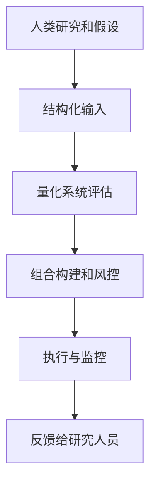

# 第17章 量化交易的展望

> 所有思想和行为的演变必须首先显示为异端和不当行为。  
> -- 萧伯纳

## 章节主旨

本章是全书结尾，讨论量化交易未来可能的发展方向。

作者认为，所谓“黑箱交易”已经存在 30 多年。读者通过本书应能理解，量化策略并不是真正神秘的黑箱，而是把交易者和投资者原本已经做过的事情进行系统化实施。

自动化过程常伴随反感和恐惧。有时是因为自动化替代人的工作，有时是因为无知导致恐惧。作者认为，反对宽客的情绪背后，反映的是市场正在经历转折：自动化和程序化已经深度进入资本市场，未做好准备的机构和个人会感到痛苦，而新的参与者会适应并进入。

本章展望的主题包括：

1. 市场更加公平和透明。
2. 低延迟竞争接近物理和工程极限。
3. 研究领域仍有大量改进空间。
4. 混合量化策略会发展。
5. 机器学习和大数据会增加可行性。
6. 高频与传统量化之间的中频策略可能成为机会。
7. 投资者对量化策略接受度提高。
8. 行业结构会继续变化。
9. 监管和公众敌意会继续影响宽客。

## 一、量化交易不是神秘黑箱

作者在全书最后重申，量化交易不是魔法。它只是把投资思想、数据处理、风险控制、交易执行和研究流程系统化、自动化。

量化交易的核心仍然是本书反复讨论的几个模块：

1. 阿尔法思想是否有根据。
2. 数据是否可靠。
3. 风险是否被理解。
4. 交易成本是否被控制。
5. 投资组合是否合理构建。
6. 执行是否有效。
7. 研究流程是否持续改进。

量化交易未来的发展，不会脱离这些基本问题，只会在更复杂的数据、更快的系统、更成熟的市场结构和更高的投资者要求下重新解决这些问题。

## 二、市场会更加公平、透明和平等

作者认为，今天的市场比过去更公平和平等。技术水平和透明度提高，使不太熟练的市场参与者和观察者也能更容易接触市场信息。

未来，市场仍会受到持续压力，要求进一步减少不公平性和复杂结构带来的问题。作者预计，一些明显造成市场问题的因素会被修复，例如对封闭市场的禁令等市场结构缺陷。

这一趋势对宽客有双重影响：

1. 不透明或结构性优势会逐渐减少。
2. 真正的研究、数据、风险控制和执行能力会更重要。

## 三、低延迟竞争接近极限

低延迟技术竞争正在接近渐近极限。芝加哥到纽约、纽约到伦敦等线路的延迟已经接近物理约束，继续改进的空间越来越小。

当市场接近最小延迟极限后，竞争焦点可能从“谁更快”转向“谁更聪明”：

1. 谁能更好理解市场结构。
2. 谁能更好处理数据。
3. 谁能更好构造信号。
4. 谁能更好管理风险。
5. 谁能更好整合研究和生产系统。

作者还认为，当速度平台逐步标准化后，每家公司重复建设同样最高性能基础设施的必要性会下降。平台标准化也可能减少部分对高频交易的批评，因为参与者会更容易使用相似基础设施。

低延迟竞争可理解为一个边际收益递减过程：

$$
MarginalValue(\Delta latency) \downarrow \quad \text{as} \quad latency \rightarrow latency_{physical\ limit}
$$

越接近物理极限，每一微秒改进成本越高、收益越有限。

## 四、研究仍需重大改进

作者认为，从本书第一版到第二版，量化研究领域进步并不大。许多策略仍然相对简单，频繁使用无效或低效信号，并与阿尔法模型、持仓管理和风险管理混合在一起。

仍需研究的领域包括：

1. 更好地构建阿尔法模型。
2. 更好地管理持仓。
3. 更好地管理风险。
4. 更好地判断策略未来何时可能盈利或亏损。
5. 更好地理解量化交易行业本身。

尤其是预测策略状态的模型仍然少见。也就是说，不仅要预测资产收益，还要预测某类策略或模型在未来环境中是否仍有效。

这个问题可写成两层预测：

$$
E[R_{asset,t+1}|X_t]
$$

和：

$$
E[R_{strategy,t+1}|MarketState_t]
$$

传统量化研究多关注前者，而作者认为后者越来越重要。

## 五、混合量化策略会发展

作者认为，量化系统的使用方式也需要发展。已有一些混合量化策略：量化系统筛选机会，人类对剩余流程保留自由裁量权。

另一种更有趣的方向是反过来：人类分析师把想法输入系统，由系统决定投资组合。也就是说，不是用计算机支持人类决策，而是用人类输入支持系统决策。

混合量化的关键是结合：

1. 人类的主观理解、经验和创造力。
2. 机器的客观性、稳定性和执行纪律。

可以把混合流程表示为：

作者提到，至少一家突出的自由裁量资本交易公司已在这个方向努力，初期结果有前景。

## 六、机器学习会更可行

由于计算机处理能力不断提升，复杂机器学习方法越来越可行。

但金融数据有两个困难：

1. 噪声极大。
2. 数据很脏。

机器学习在量化交易中并非自动成功。能否盈利取决于研究者能否处理噪声、数据污染、过拟合、样本外失效和市场适应性。

作者认为，机器学习可能尤其适用于短期交易策略，因为短期策略有更多观察值，也更可能捕捉暂时性低效。

机器学习应用的基本风险可概括为：

$$
GeneralizationGap = Performance_{in\ sample} - Performance_{out\ of\ sample}
$$

金融机器学习最大的危险就是样本内表现漂亮、样本外失效。

## 七、大数据会成为量化交易的重要来源

大数据是来自技术行业的概念，指超出标准数据库工具处理能力的数据集。在量化交易中，它通常指来自网络和其他非传统渠道的大规模数据。

作者举例：

1. 微博。
2. 博客。
3. 网络文本。
4. 其他在线内容。

这些数据可用于衡量情绪，尝试预测短期股价走势。大数据的核心机会在于：传统市场数据之外的信息可能更早反映投资者情绪、消费行为或经济活动。

但大数据也有风险：

1. 噪声高。
2. 非结构化。
3. 易过拟合。
4. 数据可得性和合规问题复杂。
5. 信号可能迅速拥挤和衰减。

## 八、中频策略可能成为机会

作者认为，高频量化策略和传统量化策略之间的交叉地带可能是有趣机会集。这类策略可称为中等频率策略。

中频策略特点包括：

1. 持仓时间短于传统量化策略。
2. 持仓时间长于典型高频策略。
3. 更关注阿尔法策略。
4. 使用订单簿、交易和高频数据预测一小时或更长时间内的价格行为。
5. 需要一定高频技术能力，但不一定追求最极端的微秒速度。

中频策略介于两种难以掌控的风格之间，因此进入壁垒较高：

1. 需要高频基础设施和数据处理能力。
2. 需要传统量化阿尔法研究能力。
3. 需要交易成本和容量控制。
4. 需要比高频更强的风险和组合管理。

随着高频交易在许多市场因交易量下降和竞争激烈而更具挑战性，中频策略可能成为值得观察的方向。

## 九、投资者对量化策略接受度提高

作者观察到，过去曾认为“不会投资量化基金”的养老金和大型传统基金中的基金，到 2012 年已有数十亿美元配置到量化基金。

这说明系统化交易策略越来越被投资者接受。过去被认为过于不透明的量化策略，正在进入更多机构组合。

但作者也提醒，太多资金流入大型资产聚集平台，这些机构可能更关注资产规模，而不是阿尔法创造。资金向大管理人集中，未必等于更好的投资结果。

## 十、行业结构会继续变化

过去五年，量化交易行业发生巨大变化：

1. 一些受尊敬的量化机构倒闭。
2. 大量新机构进入市场。
3. 2007 年量化清算产生长期影响。
4. 2008 年雷曼兄弟倒闭改变市场结构。
5. 对冲基金行业更加制度化。
6. 《多德-弗兰克法案》限制银行自营交易，使许多人才离开银行体系。

作者预期，量化策略中繁琐、昂贵的部分可能会集中化和共享，包括：

1. 数据获取。
2. 数据管理。
3. 操作和制度管理。
4. 执行基础设施。

但小型公司和没有知名宽客领导的创新公司，筹集交易资金仍然困难。

## 十一、监管与公众敌意仍是挑战

宽客未来不仅要面对策略竞争，还要面对大众媒体和监管环境。

作者认为，量化交易和高频交易常被错误地与大型投行造成的经济问题、失败 IPO、市场制度缺陷等混在一起。事实上，自 2008 年后期以来，许多宽客受到政府干预、地缘政治事件和市场反复混乱的影响，而不是造成这些问题。

这种环境可能带来自然选择：

1. 较弱或不幸运的公司退出。
2. 较强和较幸运的公司必须更加努力才能生存。
3. 行业会经历整合和专业化。
4. 投资者会更关注透明度、风控和可解释性。

## 十二、全书总结性框架

量化交易未来的竞争，可以概括为以下几个方向：

| 方向 | 未来趋势 | 对宽客的要求 |
| --- | --- | --- |
| 市场结构 | 更透明、更公平 | 理解规则变化和执行环境 |
| 低延迟 | 接近物理极限 | 从速度竞争转向研究和系统综合能力 |
| 研究 | 仍需创新 | 更严谨的科学方法和策略状态预测 |
| 混合量化 | 人机结合 | 把人类判断结构化输入系统 |
| 机器学习 | 更可行但更易过拟合 | 强样本外验证和噪声控制 |
| 大数据 | 信息来源扩展 | 数据工程、合规和信号稳定性 |
| 中频策略 | 机会可能增加 | 同时具备高频技术和阿尔法研究 |
| 投资者接受度 | 继续提高 | 更清晰的解释和组合适配 |
| 行业结构 | 集中与共享基础设施 | 小公司需找到差异化优势 |
| 监管环境 | 仍有压力 | 合规、透明和稳健生产系统 |

## 小结

量化交易的未来不会是神秘黑箱的胜利，而是系统化研究、数据工程、执行能力、风险管理和持续改进的竞争。

市场会更透明，低延迟竞争会接近极限，单纯速度优势的边际价值会下降。研究、机器学习、大数据、混合量化和中频策略会成为重要方向，但它们也带来噪声、过拟合、容量、合规和竞争加剧等挑战。

作者最后的判断是，量化交易行业会经历自然选择。弱者和不幸运者会退出，强者和适应者需要更努力生存。量化交易不会消失，它会继续成为现代市场的重要组成部分。
