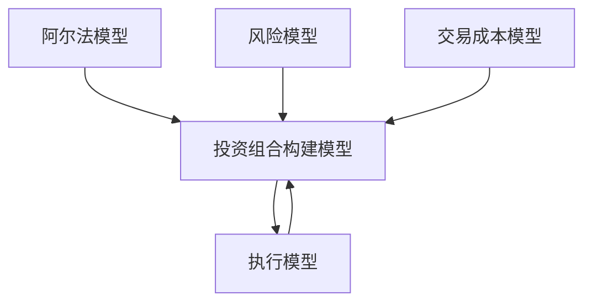
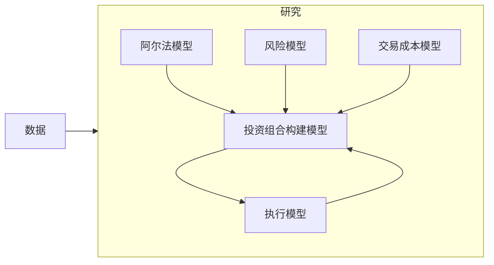

# 第2章 量化交易简介

> 有线电报就像一只身长很长的猫。你在纽约拽一下它的尾巴，它在洛杉矶就会发出喵喵的叫声。可以理解吗？无线电的原理与之类似。你在这里发出信号，他们在别处接收信号，唯一的区别就是并不存在这样一只形象的猫。  
> ——爱因斯坦解释何为无线电

## 章节主旨

本章的核心目标是拆开“黑箱”这个概念。作者并不否认量化交易系统可能复杂，但强调绝大多数量化交易策略本质上仍是可以理解的决策过程。所谓宽客，不是让机器替代人类思考，而是把人类形成的交易思想、判断规则、风险约束、交易成本估计和执行逻辑系统化，并尽可能自动化地执行。

本章围绕两个问题展开：

1. 什么是宽客：宽客如何区别于主观判断型交易者、机器人和“伪宽客”。
2. 量化交易系统如何构成：阿尔法模型、风险模型、交易成本模型、投资组合构建模型、执行模型，以及数据和研究如何共同构成“黑箱”。

## 一、黑箱的误解：复杂不等于不可理解

提到黑箱，人们常想到鲁布·戈德堡装置：输入看似简单，但经过复杂迂回的机制后输出神秘结果。媒体对量化交易的描述也常带有这种色彩。例如，《华盛顿邮报》把量化对冲基金描述为通过复杂而巧妙的数学算法发掘异常和隐藏获利机会；《纽约时报》则描述其基于复杂数学指标，通过电脑程序同时买卖成千上万只股票。一些优秀投资者也因不了解“量化黑箱”如何运行而选择不投资这类策略。

作者认为，这种描述夸大了神秘性。黑箱在自然科学和金融中通常指：给系统输入变量，可以产生输出变量，但外部观察者不清楚内部运行机制。量化交易策略确实可能复杂，也确实可能带有神秘感，但它本质上仍是一种决策过程。多数策略并不比其他决策过程更难理解。

统计套利就是例子。统计套利听起来高深，但基本思想并不复杂：相似金融资产的市场行为应该相似。如果埃克森美孚和雪佛龙这类基本面相似的股票价格短期显著偏离，更可能是供需短期不平衡，而不是两者基本价值突然发生根本变化。围绕这一想法形成的交易每天可以达到数十亿美元规模。主观交易者也使用类似策略，只是更常称为配对交易。区别在于，主观交易者常依靠经验判断“两种资产是否相似”“什么因素驱动偏离”，而宽客会尝试用一致、可研究、可复现的框架回答这些问题。

## 二、何为宽客

宽客通常基于理论构造追求超额利润的交易策略，并系统化地实施。宽客被称为宽客，不是因为他们交易思想一定和主观交易者完全不同，而是因为他们会严密研究策略如何产生、如何被验证、如何被执行。

作者强调，宽客不是机器人，也没有消除人对投资过程的贡献。无论是跟踪标准普尔 500 指数，还是构建复杂金融产品，宽客都使用数学和计算机工具。但本书关注的是长期来看投资策略回报与市场趋势无关、追求阿尔法超额利润的量化交易策略。

宽客的工作包括两个层面：

1. 构造和研究核心投资策略。
2. 设计软件系统，使策略能够自动实现。

当系统“开始运转”后，人的操作通常集中在投资组合的日常管理和异常情况处理上，而不是逐笔决定买卖。但作者反复提醒，不应低估人类判断的重要性。优秀宽客仍需要良好判断力，因为系统会严格执行人类给定的规则。如果规则设计有缺陷，自动化只会更稳定、更快速地放大错误。

作者用制导系统作类比：如果设计者在制导系统中犯错，越来越多导弹按照错误指令发射，偏差会越来越严重，最终可能导致灾难性后果。量化交易也是如此。自动化本身不是安全保障，自动化执行的是人设计的逻辑。

## 三、系统化方法的边界：何时需要人工干预

为了理解量化交易的本质，需要明确系统化方法的适用范围，也就是何时宽客不得不放弃纯系统化方法，使用主观判断干预。

最常见情形是：出现了影响市场行为的新信息，而既有策略无法自动正确处理。作者举了 2008 年美林与美国银行合并的例子。合并消息使美林股价大幅上涨。如果量化策略只看到价格上涨和估值变化，可能判断美林严重高估并应做空。但如果上涨是由合并消息合理解释的，理性宽客不会简单做空。这时需要人工干预，将美林从备选股票中移除，避免模型基于不完整或无关信息做出错误决策。

这正是“输入垃圾，输出垃圾”的例子。如果模型所依赖的信息不准确、不完整或与当前决策无关，系统输出就可能错误。投资经理如果意识到某些金融产品受到了模型无法处理的信息影响，就可能暂停或取消这些产品的交易。

不同机构的干预标准并不相同：

1. 激进型交易组织可能在听到可信并购传闻后，就将相关股票剔除交易名单。
2. 更严格系统化的宽客可能从不轻易改变交易名单。
3. 市场风险过大时，许多宽客会降低投资组合资金规模或杠杆。例如 2001 年“9·11”事件后，很多宽客因担心突发事件冲击资本市场而降低杠杆，待市场恢复正常后再提高杠杆。

由此可见，量化交易不是没有人工判断，而是把人工判断尽量前置到规则设计、研究验证、异常处理和风险控制中。

## 四、量化交易、主观交易与伪宽客的边界

作者在操作层面给出一个重要区分：严格主观判断型交易、严格系统型或自动化交易之间，还存在许多混合策略。

判断一项策略是否属于量化交易，关键不在于是否使用了计算机或数学工具，而在于日常交易品种选择和头寸规模是否由系统决定。

如果建仓品种选择和头寸规模都由系统自动生成，则属于量化交易。若其中任何一个关键环节需要人工主观决定，则不能算严格意义上的量化交易。

随着量化交易规模扩大，市场上出现越来越多“伪宽客”。他们使用部分量化工具，但保留关键人工判断。典型情形包括：

1. 用自动化系统扫描大量潜在交易机会，把候选对象缩小到可管理范围，再人工筛选最终投资对象。
2. 人工选择交易品种，但由电脑优化具体配置并管理风险。
3. 电脑先筛选出所有可交易品种，再由人决定不同品种的头寸规模。

这些伪宽客使用了宽客常用技术，因此本书讨论的技术也会覆盖他们的一部分做法。但从严格定义看，只要交易品种选择或头寸规模依赖人工最终判断，就不属于完全量化交易。

## 五、量化交易系统的典型结构

理解宽客和黑箱的最好方法，是逐一理解量化交易系统的组成部分。本书后续部分也以这个结构作为框架。

图 2-1 展示了一个典型“有效”交易策略的生产结构：决定买卖哪些证券、买卖多少、何时买卖。它不包含交易系统的所有必要元素，例如设计系统所需的研究工具。

### 1. 图 2-1：量化交易策略的基本结构

图 2-1 的结构可文本化为：

其中，阿尔法模型、风险模型和交易成本模型是投资组合构建模型的输入；投资组合构建模型与执行模型之间存在相互作用。

### 2. 阿尔法模型

阿尔法模型用于预测宽客考虑交易的金融产品未来趋势。它回答的问题是：什么资产值得买、什么资产值得卖、未来方向或相对强弱是什么。

例如，期货市场中的趋势追随策略会利用阿尔法模型预测投资组合中期货品种的价格变动方向。若模型判断某期货品种未来上涨概率较大，可能建议做多；若判断下跌概率较大，可能建议做空。

### 3. 风险模型

风险模型帮助宽客控制那些不太可能带来收益、但可能造成损失的敞口规模。它回答的问题是：策略是否承担了过多方向性风险、行业风险、资产类别风险、集中度风险或其他非目标风险。

例如趋势追随者可能限制某类资产，如商品，整体方向性风险。因为若所有预测信号都指向同一方向，组合会在该资产类别上形成过度集中敞口。风险模型会估计这些商品风险敞口水平，并约束组合不要过度暴露。

### 4. 交易成本模型

交易成本模型用于估计从当前投资组合转向新目标投资组合所需成本。无论预期收益高还是低，任何交易都要付出成本。

仍以趋势追随为例，如果预计趋势并不强，且持续时间很短，交易成本模型可能显示建仓与平仓成本会超过预期利润。这时，即便阿尔法模型看起来给出交易信号，也不应执行。

### 5. 投资组合构建模型

投资组合构建模型使用阿尔法模型、风险模型和交易成本模型作为输入，在追求利润、控制风险和降低交易成本之间权衡，确定最佳目标投资组合。

该模型不只是把所有看起来有阿尔法的资产买入，而是要把预期收益、风险暴露和交易成本放在同一个决策框架中。它输出的是目标投资组合权重。

### 6. 执行模型

投资组合构建模型输出目标组合后，系统将当前组合与目标组合比较，差异就是需要执行的交易。执行模型负责在市场中完成这些交易，并利用交易紧迫性、市场动态流动性等输入，以高效、低成本方式成交。

执行模型与投资组合构建模型存在反馈关系。执行结果、成交价格、市场冲击和流动性信息可能反过来影响投资组合构建模型和交易成本模型。

## 六、表 2-1：从现有投资组合到目标投资组合

原文表 2-1 展示了当前组合、目标组合和所需执行交易之间的关系。根据 PDF 图表还原如下：

| 标的 | 现有投资组合 | 新的目标投资组合 | 执行交易 |
| --- | --- | --- | --- |
| 标准普尔 500 指数 | 空头 30% | 空头 25% | 回补买入 5% |
| 欧洲斯托克指数 | 多头 20% | 多头 25% | 买入 5% |
| 美国 10 年期国债 | 多头 40% | 多头 25% | 卖出 15% |
| 德国 10 年期国债 | 空头 10% | 空头 25% | 卖空 15% |

这张表说明：当前投资组合体现当前持仓；投资组合构建模型生成新的目标权重；两者差额就是当前需要执行的交易。

例如：

1. 标准普尔 500 指数从空头 30% 调整到空头 25%，空头减少 5%，所以需要回补买入 5%。
2. 欧洲斯托克指数从多头 20% 调整到多头 25%，多头增加 5%，所以需要买入 5%。
3. 美国 10 年期国债从多头 40% 调整到多头 25%，多头减少 15%，所以需要卖出 15%。
4. 德国 10 年期国债从空头 10% 调整到空头 25%，空头增加 15%，所以需要卖空 15%。

## 七、图 2-1 的非普遍性与系统变体

作者强调，图 2-1 是典型结构，但并不具有普遍性。许多量化策略并不包含完整的交易成本模型、投资组合构建模型或执行模型；另一些策略则包含这些模块的不同组成部分。

常见变体包括：

1. 把风险要求和必要限制直接加入阿尔法模型。
2. 在不同模块之间建立更多递归连接。
3. 捕捉实际执行策略的数据，再用这些数据优化交易成本模型。
4. 省略某些模块，或把某些模块合并到其他模块中。

图 2-1 的意义在于，它在多数情况下反映了量化交易系统的主要组成部分，不要求所有机构都严格按这一框架组织。

## 八、数据和研究：黑箱真正的底座

图 2-1 只展示了交易系统的生产部分，忽略了两个同样重要的组成：数据和研究。

缺少精确数据输入，黑箱毫无用处。量化交易者通过输入数据、加工信息、做出交易决策，建立输入/输出模型。例如，趋势跟踪策略通常根据价格数据判断趋势，没有价格数据就无法运行。数据是宽客的命脉，决定策略的各个方面。

研究则用于判断策略是否有效。宽客对给定数据进行测试和仿真，以判断策略运行情况。并且系统中的各个模块，如阿尔法模型、风险模型、交易成本模型、投资组合构建模型和执行模型，也都需要大量研究才能正确建立。

### 图 2-2：黑箱示意图

图 2-2 在图 2-1 的生产结构外加入了数据和研究。可文本化为：

这个图强调，数据从外部输入系统，研究包围和支撑内部各模型。没有数据，策略没有输入；没有研究，模型没有可靠依据。

## 九、公式与定义补全

以下公式是对本章提到但未完整展开的量化交易系统关系做标准化补全，目的是还原图表逻辑、补足模型间关系，并不改变原章节含义。

### 1. 黑箱的一般形式

黑箱可以抽象为输入到输出的映射：

$$
y = f(x)
$$

其中，$x$ 是输入变量，$y$ 是输出变量，$f(\cdot)$ 是内部机制。外部观察者可以看到输入和输出，却未必理解 $f$ 的内部结构。

量化交易系统中，可写成：

$$
\text{Trade Decision}_t = f(\text{Data}_t, \text{Model Parameters}_t)
$$

这对应原文所说：量化系统本质上是一种决策过程，而不是不可理解的神秘装置。

### 2. 统计套利与配对交易价差

统计套利的核心是相似资产价格关系应相对稳定。令两只相似资产价格为 $P_{1,t}$ 和 $P_{2,t}$，可定义价差：

$$
S_t = \ln P_{1,t} - h \ln P_{2,t}
$$

其中，$h$ 是对冲比率，可用历史回归估计：

$$
\ln P_{1,t} = \alpha + h \ln P_{2,t} + \varepsilon_t
$$

若价差显著偏离历史均值：

$$
z_t = \frac{S_t - \mu_S}{\sigma_S}
$$

当 $z_t$ 过高时，通常卖出相对高估资产、买入相对低估资产；当 $z_t$ 过低时则反向操作。其本质是把“相似资产应表现相似”的直觉变成可检验、可执行的规则。

### 3. 量化交易与非量化交易的操作判定

设：

$$
I_{\text{selection}} =
\begin{cases}
1, & \text{交易品种由系统决定} \\
0, & \text{交易品种由人工最终决定}
\end{cases}
$$

$$
I_{\text{sizing}} =
\begin{cases}
1, & \text{头寸规模由系统决定} \\
0, & \text{头寸规模由人工最终决定}
\end{cases}
$$

则严格量化交易可表示为：

$$
I_{\text{quant}} = I_{\text{selection}} \times I_{\text{sizing}}
$$

只有当交易品种选择和头寸规模都由系统决定时，$I_{\text{quant}}=1$。若其中任何一个环节由人工最终决定，则属于主观或伪量化范畴。

### 4. 杠杆与人工风险控制

章节提到市场风险过大时，宽客可能降低资金规模或杠杆。杠杆可定义为总敞口与净资产之比：

$$
L = \frac{\sum_i |MV_i|}{NAV}
$$

其中，$MV_i$ 为第 $i$ 个头寸市值，$NAV$ 为组合净资产。市场异常时可把杠杆从 $L_0$ 降到 $L_1$：

$$
L_1 < L_0
$$

当市场恢复正常，再逐步恢复到正常杠杆水平。这是系统化策略之外的人为风险控制手段。

### 5. 阿尔法模型

阿尔法模型可以抽象为对未来收益或方向的预测：

$$
\hat r_{i,t+1} = f_{\alpha}(X_{i,t})
$$

其中，$X_{i,t}$ 是资产 $i$ 在 $t$ 时刻可观察的数据，$\hat r_{i,t+1}$ 是模型预测的未来收益或方向。趋势跟踪策略中，$X_{i,t}$ 常包含历史价格、收益率或趋势指标。

### 6. 风险模型

风险模型估计组合承担的风险，常见形式包括协方差矩阵和因子敞口：

$$
\sigma_p^2 = w^\top \Sigma w
$$

其中，$w$ 是组合权重向量，$\Sigma$ 是资产收益协方差矩阵。

若使用因子风险模型：

$$
R_i = \beta_i^\top F + \epsilon_i
$$

其中，$F$ 为风险因子收益，$\beta_i$ 为资产 $i$ 的因子暴露，$\epsilon_i$ 为特异收益。风险模型的任务不是直接找利润，而是识别和限制可能带来损失、却未必带来收益的敞口。

### 7. 交易成本模型

交易成本模型估计从当前组合到目标组合所需成本。设当前权重为 $w_t$，目标权重为 $w_t^\*$，交易量为：

$$
\Delta w_t = w_t^\* - w_t
$$

一个简化交易成本模型可写为：

$$
TC(\Delta w_t) = \sum_i \left(a_i |\Delta w_{i,t}| + b_i \Delta w_{i,t}^2\right)
$$

其中，$a_i$ 可代表线性成本，如手续费、买卖价差；$b_i$ 可代表非线性市场冲击成本。若预期收益小于交易成本，交易不应执行：

$$
\mathbb{E}[\text{Profit}] \le TC(\Delta w_t)
$$

### 8. 投资组合构建模型

投资组合构建模型在收益、风险和交易成本之间权衡。可写成一个简化优化问题：

$$
w_t^\* =
\arg\max_w
\left(
\hat r_t^\top w
- \frac{\lambda}{2} w^\top \Sigma_t w
- TC(w - w_t)
\right)
$$

其中：

1. $\hat r_t^\top w$ 表示预期收益。
2. $\frac{\lambda}{2} w^\top \Sigma_t w$ 表示风险惩罚。
3. $TC(w-w_t)$ 表示从当前组合调整到新组合的交易成本。
4. $\lambda$ 是风险厌恶参数。

这个公式对应原文所说：投资组合构建模型主要在追求利润、控制风险和交易相关成本之间进行平衡。

### 9. 执行模型与交易清单

当前组合与目标组合的差额就是需要执行的交易：

$$
q_t = w_t^\* - w_t
$$

若 $q_{i,t} > 0$，需要买入或回补；若 $q_{i,t} < 0$，需要卖出或增加空头。执行模型再把总交易拆成子订单：

$$
q_{i,t} = \sum_{k=1}^{n} q_{i,t,k}
$$

执行模型会考虑交易紧迫性、市场流动性、价格冲击和成本，以尽可能高效、低成本完成交易。

### 10. 数据与研究闭环

图 2-2 的逻辑可以抽象为：

$$
\text{Data} \xrightarrow{\text{Research}} \text{Model Design} \xrightarrow{\text{Production}} \text{Trades} \xrightarrow{\text{Execution Feedback}} \text{Research}
$$

即数据支撑研究，研究产生模型，模型进入生产交易，交易和执行结果又反馈给后续研究。这也是作者强调“数据是宽客的命脉”的原因。

## 十、小结

宽客并不像公众想象中那样神秘。他们首先观察市场，产生普通人也可能想到的想法，然后用客观数据研究这些想法是否正确，而不是依靠传闻、经验或未经检验的假设。一旦得到满意策略，他们会把策略部署到量化系统中，使系统在投资时排除情绪影响，严格执行经过测试的规则。

这并不否定人的作用。宽客负责产生想法、测试策略、决定使用哪些策略、交易哪些品种、采用多快的交易速度，并在必要时通过“恐慌开关”或人工干预降低风险。

量化策略常因模糊难懂而被投资者忽视。即使关注量化策略的人，也往往只关注阿尔法模型。但本章提醒，量化交易系统的其他部分同样重要：

1. 交易成本模型帮助确定换手和交易是否值得执行。
2. 风险模型帮助避免错误头寸敞口。
3. 投资组合构建模型在交易成本、风险管理和盈利之间平衡。
4. 执行模型负责将目标组合变成实际交易。
5. 数据和研究支撑所有模块。

本章为后续“打开黑箱”奠定框架：第二部分会沿着黑箱内部，逐章展开这些模型，并在每章结尾指出已经研究了黑箱的哪些部分、还有哪些部分有待研究。

