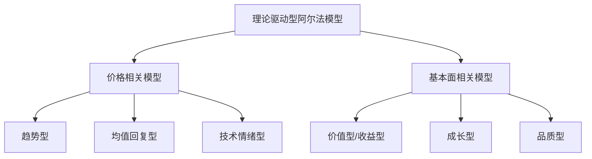
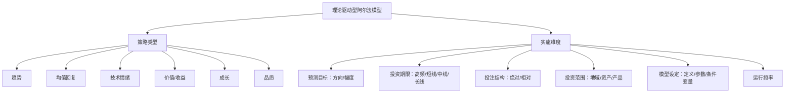
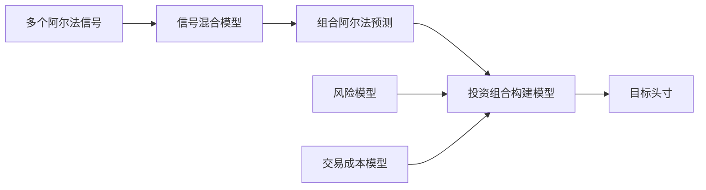
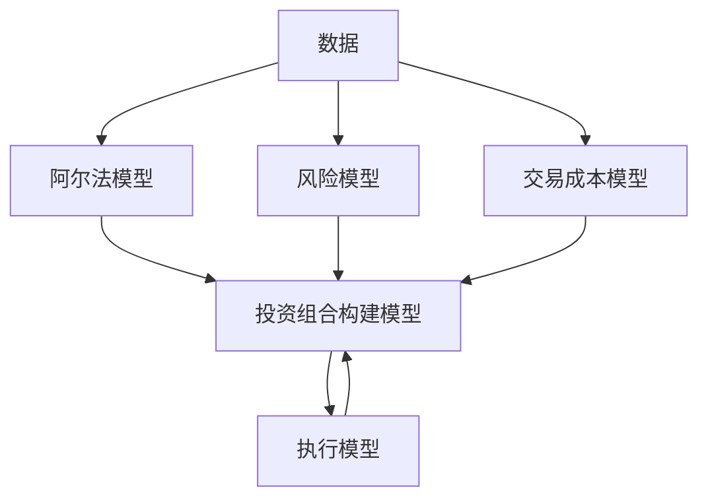

# 第3章 阿尔法模型：宽客如何盈利

> 预测，尤其是预测未来，是极为困难的一件事。  
> ——尼尔斯·玻尔

## 章节主旨

本章开始真正“打开黑箱”，讨论量化交易系统的第一个核心部件：阿尔法模型。阿尔法模型用于寻找盈利机会，它把交易者关于买卖时机、持有头寸、相对强弱、未来收益或价格方向的判断转化为系统化规则。

作者在本章中给出一个非常规但更贴近交易实践的定义：阿尔法是在交易中把握买卖时机和选择持有头寸的技巧。没有任何金融产品永远好或永远坏，因此阿尔法模型本质上不是永久持有某类资产的理由，而是判断何时买、何时卖、买什么、卖什么、以什么结构交易。

本章围绕四个问题展开：

1. 阿尔法模型有哪些基本类型：理论驱动型和数据驱动型。
2. 理论驱动型阿尔法模型如何分类：趋势、均值回复、技术情绪、价值/收益、成长、品质。
3. 宽客如何把一个交易思想落地为可运行策略：预测目标、投资期限、投注结构、投资范围、模型设定和运行频率。
4. 多个阿尔法信号如何组合：线性模型、非线性模型、机器学习和多组合方法。

## 一、阿尔法的含义：收益不是只靠市场暴露

阿尔法通常用于量化表述投资者的盈利能力，或投资者得到的与市场波动无关的回报。常规定义中，阿尔法是扣除市场基准回报后的投资回报，或仅由投资策略带来的价值。与此相对，由市场因素带来的回报被称为贝塔。

例如，某基金回报率为 12%，同期间市场基准回报率为 10%，并假设基金组合贝塔恰好为 1，则基金阿尔法为 2%。但作者指出，这种计算方式有缺陷：它无法区分超额收益到底来自策略能力，还是单纯好运。交易者往往倾向于把超过基准的收益归功于策略，但投资分析不能仅凭结果做这样的归因。

本章更重视阿尔法在交易系统中的作用：阿尔法模型是一系列为了增加盈利而在投资过程中使用的技巧或策略。例如趋势跟随策略，就是系统分析市场未来走势，并顺应趋势交易。价值投资者也并不是因为一只股票“便宜”就永远持有，而是在股票被低估时买入，在估值合理或被高估时卖出。

成熟阿尔法模型都有局限性。它们只能在一定范围内较准确地预测未来，在某些情形下会犯错。一个可用策略的关键不是永不犯错，而是在扣除错误损失和交易成本后仍然有利可图。在量化系统中，阿尔法模块像“乐观主义者”：它试图通过预测未来来获得收益。

## 二、两类阿尔法模型：理论驱动型和数据驱动型

作者强调，真正的阿尔法策略数量并没有表面上那么多。实务中看似花样繁多的策略，往往由有限几个核心思想衍生而来。理解量化策略的关键，是理解宽客如何以科学方法看待市场。

科学方法可以粗略分为理论主义和经验主义：

1. 理论型科学家先提出世界为何如此运行的理论，再用数据检验理论。例如工程师依据空气动力学设计飞机。
2. 经验型科学家认为，即使没有完整理论，也可以通过足够多的观察预测未来模式。例如人类基因组计划通过统计方法研究基因片段与人类特征之间的关系。

这一区别对应两类宽客：

1. 理论驱动型宽客先观察市场行为，提出可解释这些行为的经济或交易理论，再用市场数据检验理论是否有效。
2. 数据驱动型宽客不一定追求理论解释，而是用统计、机器学习或模式识别工具从数据中寻找可预测关系。

作者提醒：理论驱动型宽客在研究初期也依赖数据，数据驱动型宽客也会做主观设定。二者不是完全割裂，而是侧重点不同。理论驱动型方法更重视可解释的先验假设，数据驱动型方法更重视在数据中识别重复模式。

## 三、图 3-1：理论驱动型阿尔法模型分类

图 3-1 把理论驱动型阿尔法模型分成六类。可文本化为：

价格相关信息通常用于趋势跟随、均值回复和技术情绪策略。基本面信息通常用于价值、成长和品质策略。这个框架像一份策略菜单，宽客可以从中组合不同思想，形成自己的策略。

## 四、理论驱动型阿尔法模型

绝大多数宽客属于理论驱动型。他们提出关于市场如何运行的理论，并检验这些理论是否可以预测未来市场行为。作者反驳了两个常见误解：第一，宽客策略并不总是高度保密且独一无二；第二，宽客策略并不总是建立在深奥复杂的数学公式之上。很多核心思想相当直观。

### 1. 趋势型策略

趋势策略的基础观点是：已经上涨的金融产品更可能继续上涨，已经下跌的产品更可能继续下跌。趋势可以用收益率、移动平均线、突破、相对强弱等方式定义。

图 3-2 使用标准普尔 500 指数展示趋势：长期价格序列常表现出一段时间内持续上行或下行的走势。趋势跟随策略并不是量化交易发明的，历史上的郁金香泡沫和互联网泡沫中也存在追逐热门品种、卖出冷门品种的行为。

期货市场中的趋势跟随是最古老的量化策略之一。理查德·唐奇安创造了机械化趋势跟随策略，艾德·史柯达在 1970 年用 IBM 大型机实现程序化，并在长期职业生涯中取得非常高的回报。拉里·海特创建的敏特投资管理公司也以趋势跟随闻名，在 1987 年大崩盘期间获得高收益。文艺复兴科技的前身阿克斯康公司早期也使用趋势跟随及更复杂的期货交易策略。

但作者强调，趋势跟随的高收益伴随高风险。成功趋势跟随者通常要承受很大回撤，策略收益并不稳定。更一般地，本章所有主流阿尔法模型都可能长期低回报，因为它们寻找的机会不是持续存在的，而是不稳定、偶发的。好的策略往往是在机会出现时大量盈利，在机会稀少时控制损失。

### 2. 均值回复策略

均值回复策略认为，价格终将沿已有趋势的反方向运动，不可能无限延续。它的基本理论是价格围绕某个价值中枢波动，只要识别出这个中枢和偏离方向，就可以捕捉交易机会。

均值回复现象可能来自短期供需不平衡。例如某股票进入标准普尔 500 指数，指数基金被动买入，短期卖方供给不足导致价格快速上涨；当买方需求消退，上涨放缓，价格反向回落的概率上升。另一种解释是市场参与者并不了解其他人观点和行为，订单推动价格向新均衡移动时，局部超买或超卖会造成剧烈波动。

均值回复交易者通常逆势交易，因此给市场提供流动性，但也承担逆向选择风险。主观交易者中采用类似思路的人常被称为反转交易者。

统计套利是最著名的均值回复策略之一。其核心不是判断 A 公司股票本身便宜或昂贵，而是判断相对于 B 公司，A 公司股票是高估还是低估。埃德·索普、农西奥·塔尔塔利亚、格里·班伯格和大卫·肖等人的工作推动了这一思想的发展。统计套利标志着交易理念的重要转变：从绝对价值判断转向相对价值预测。

图 3-3 用美林和嘉信理财的股价价差展示均值回复：较长时间内，两家公司价差在较窄范围内波动。当价差显著背离时，交易者可以押注价差回到合理区间。

### 3. 趋势与均值回复并不必然冲突

趋势跟随和均值回复在理论上方向相反，但现实中可以同时有效，关键在于时间框架不同。长期趋势可能延续，而短期价格围绕趋势上下波动。

图 3-4 展示了这种关系：标准普尔 500 指数在较长期限上存在趋势，但短期内也有均值回复。2000-2002 年和 2008 年趋势较强，趋势跟随可能表现较好；2003-2007 年均值回复可能更有效。只要投资期限不同，两种策略都可能盈利。

### 4. 技术情绪型策略

技术情绪策略通常使用价格、成交量、期权、投资者行为等市场技术变量衡量市场情绪。它与趋势和均值回复关系密切，但更侧重从市场参与者情绪、仓位或交易行为中提取信号。

例如，认沽期权相对认购期权大幅增加，可能意味着投资者过度悲观；交易量、价格突破、市场宽度、隐含波动率等也可被视为情绪或技术状态变量。作者在本章把技术情绪列入价格相关理论模型，而不是基本面模型。

### 5. 价值型/收益型策略

价值型策略最常用于股票，但也可用于货币、债券、期货和其他市场。它通过收益、股息、账面价值、现金流、利率或类似基本面指标与价格之间的关系衡量资产是否便宜。

宽客更喜欢使用传统估值比率的倒数。例如，市盈率为价格除以每股收益，宽客常使用其倒数 E/P，即盈利收益率。股息收益率也是类似思想。使用收益率形式的好处是更简洁、更一致，尤其能避免 P/E 在收益为零或负数时产生误导。

图 3-5 对比 P/E 和 E/P。假设股价为正，E/P 在收益为正、为零或为负时都可以自然表达；而 P/E 在收益为零时无定义，在收益为负时排序直觉容易混乱。

作者认为，把价值策略简单定义为“低价买入”过于肤浅。价值策略更准确的理论是：市场有时会高估高风险资产的风险、低估低风险资产的风险，从而要求某些资产提供过高收益。投资者买入高收益资产，等待价格向更有效、更适中的水平移动而获利。因此价值投资者承担的是价格趋势继续恶化的风险，并因此获得补偿。

价值策略的重要形式是利差交易。交易者卖出低收益资产，用资金买入高收益资产，两种收益的差额就是利差所得。格雷厄姆和多德所说的“安全边际”在许多情形下可以通过利差计算。例如卖空低收益美国国债、买入高收益墨西哥债券，或在外汇市场中卖出低利率货币、买入高利率货币。

债券和货币市场对高收益与高风险关系的理解通常比股票市场更直接。政府债券、AAA 公司债和低评级公司债的收益率依次上升，本质上是投资者要求补偿更高风险。

在股票市场中，常见价值指标包括 EBITDA/EV、市净率、账面收益率等。法玛和弗伦奇的研究推动了账面市值比、规模和贝塔等变量在量化基本面策略中的使用。量化股票多空策略常根据多种价值因子给股票打分，买入高评级股票、卖出低评级股票。

商品市场中，价值更多体现为供需分析下的便宜/昂贵，而不是传统收益率。期货市场中的展期收益也是价值/收益型策略的一种表现：现货溢价市场中，期货价格低于现货价格，期货价格向现货靠拢带来正展期收益；期货溢价市场中，现货价格低于期货价格，展期收益为负。

### 6. 成长型策略

成长型策略试图通过分析资产过去或预期增长水平来预测未来走势。GDP 增长、公司收益增长、分析师盈利预测等都属于成长类变量。

判断一只股票属于成长型资产，并不直接意味着它未来收益一定好。成长型策略的理论是：在其他条件相同的情况下，应买入价格或基本面正在快速增长的产品，卖出增长较慢甚至负增长的产品。

一些成长指标本质上是前瞻性价值指标。例如 PEG 是 P/E 与 EPS 增长率之比，它把预期增长与价格估值联系起来。如果市场价格已经充分甚至过度反映未来增长，成长交易机会就不再存在，甚至可能应反向卖空。

成长策略的经济直觉是：快速扩张的公司比增长缓慢的竞争对手更容易获得市场份额。成长型投资者需要尽早判断公司股价处于增长期，从而捕捉更大上涨幅度。

宏观层面也存在成长策略。例如外汇交易者可能持有经济快速增长国家的货币，因为这些国家利率往往高于低增长或复苏经济体。这可被视为前瞻性利差交易。

股票量化多空策略常使用收益预测、价格目标、推荐等级等分析师变量。由于这些变量依赖市场分析师或经济学家的观点，也常被称为基于市场情绪的策略。作者指出，在实务中情绪型策略和成长型策略高度相关，因为分析师预测未来收益时经常参考历史增长。

### 7. 品质型策略

品质型策略认为，在其他条件相同的情况下，应买入或持有高品质资产，做空或减少持有低品质资产。它强调资金安全性，这是成长和价值策略本身并不直接强调的。

品质型策略常被称为安全投资转移策略，尤其在高风险市场环境中重要。过去它更多用于股票量化投资，较少用于宏观量化交易；但随着欧洲债务危机等事件，宏观策略也逐渐引入品质模型。

作者把品质指标分为五类：

1. 杠杆比率。其他条件相同，应卖出高杠杆公司股票，买入低杠杆公司股票。债务股本比是常见指标。
2. 收入来源多样性。具有多种增长渠道的国家或公司质量更高。公司收入波动率可用于衡量这一点，低波动收入更受青睐。
3. 管理水平。应买入领导团队优秀的公司，卖出管理不佳的公司。该类指标难以量化，但操纵性应计利润变化可作为管理质量疑虑的代理变量。
4. 欺诈风险。应买入欺诈风险较低的公司或国家，卖出风险较高者。收益质量指标衡量真实收益与财报净收益之间的一致程度。
5. 投资者对发行方实力的情绪。关注市场对杠杆、收入多样性、管理水平、欺诈风险变化的前瞻性评估。信用违约互换和隐含波动率都可能提供信息，但隐含波动率上升也可能来自市场走弱、增长预期下调等其他原因。

品质型策略表现高度依赖宏观环境。2008 年，它们在银行股相对价格预测中表现突出，因为高杠杆和抵押业务暴露成为重要风险。会计丑闻时期，收益质量策略也可能获利。但在市场良好或极度繁荣时，品质策略通常表现一般甚至较差。

## 五、数据驱动型阿尔法模型

数据驱动型策略不在图 3-1 中。它们使用主要与交易相关的输入变量，尤其是价格数据，试图找出对未来具有解释力的模式。数据挖掘做得好时，可以让数据通过可识别模式告诉交易者未来可能发生什么，而不必先有完整理论解释。

数据驱动策略有两个优势：

1. 技术门槛更高，实务中使用者较少，竞争可能较弱。
2. 它可以捕捉尚不能用理论解释的市场行为，而理论驱动策略通常只能捕捉人们已经认识到的行为。

高频交易中，纯经验主义数据挖掘很常见。高频时间尺度上的数据极其丰富，而人工和程序化高频交易的完整理论基础较弱，因此经验方法更有优势。

但数据驱动策略也有重大缺陷：

1. 研究者必须决定使用哪些数据。如果数据与预测目标无关，可能得到看似显著但荒谬的结果，例如用月相预测股市。
2. 如果使用所有可能变量，计算量可能巨大到无法实现。
3. 从历史数据中得到策略，隐含假设未来与历史相似，而市场结构经常变化。
4. 数据挖掘策略需要经常调整以适应市场变化，但调整本身也有风险。
5. 噪声和错误信号可能误导分析人员。

数据驱动策略的基本框架是：观察当前市场环境，在历史数据中寻找类似环境，根据历史中随后发生的结果估计未来各种情形的概率。当历史数据支持某种交易策略时，模型交易；否则不交易。

为了让这种策略可运行，宽客必须回答至少三个问题：

1. 如何定义“当前市场环境”。“现在”可以是一瞬间、过去 10 分钟、过去 10 年；“环境”可以包括价格、成交量、基本面或其他变量。
2. 使用什么搜索算法寻找“相似”模式，如何定义相似，如何计算未来情形概率。统计工具必须匹配问题，错误工具会带来错误结论。
3. 历史数据回溯多久。越近的数据通常越相关，越多的数据通常统计显著性更强；宽客必须在相关性和样本量之间权衡。

## 六、实施策略：从交易思想到可运行模型

一个阿尔法思想必须被具体实施，才能进入交易系统。作者把实施策略分为六个关键维度：预测目标、投资期限、投注结构、投资范围、模型设定和运行频率。

### 1. 预测目标

阿尔法模型可以预测方向，也可以预测幅度。

方向预测回答“上涨、下跌或不变”。幅度预测回答“上涨或下跌多少”。如果模型输出“未来一年期望收益为 11%”，它包含方向和幅度；如果只输出“未来上涨”，则只有方向。

方向预测更容易转化为交易信号，但幅度预测对投资组合构建更有用，因为它可以比较不同机会的吸引力。

### 2. 投资期限

投资期限是阿尔法预测有效的时间长度。相同策略在不同期限上可能给出完全不同结果。短期限策略的差异通常比长期限策略更大，因为运行频率高，细微设定会被大量交易放大。

图3-6“基于不同投资期限对同一策略的分析”用移动平均线说明这一点：2008 年 4-5 月，150 日/300 日和 60 日/100 日趋势策略都可能做空标准普尔 500；但 5 日/20 日策略在 43 个交易日中只有 8 天做空，5 日/10 日策略则有 15 天做空。短期参数差异会显著改变交易行为；同一个趋势跟随思想，只要投资期限不同，就可能给出相反持仓。

投资期限可粗略分为：

| 策略类别 | 预测或持仓期限 |
| --- | --- |
| 高频策略 | 不超过当前交易日 |
| 短线策略 | 一天到两周 |
| 中线策略 | 几周到几个月 |
| 长线策略 | 几个月或更长 |

这一区分并不绝对，但有助于理解策略差异。

### 3. 投注结构

投注结构决定模型预测的是金融产品自身，还是相对于其他产品的表现。

绝对预测例子：预测金价处于低位，未来会上涨。相对预测例子：预测金价相对白银便宜，未来表现会强于白银。

相对预测可以采用小组或配对结构，也可以采用大类分组。配对交易易理解，但难点在于很少有资产可以精确比较。两个互联网公司可能都依赖搜索业务，但广告、内容和其他收入来源差异很大。

大类分组通过板块、行业、资产类别等组群隔离共同因素，让策略关注组内相对变化。宽客既可以用统计方法分组，也可以用直觉或基本面分类分组。统计分组可能把短期价格走势相似但经济含义无关的资产归为一类；直觉分组则可能僵化、不准确，并难以适应相关性变化。

方向性投注和相对投注表现不同。通常情况下，相对阿尔法策略比绝对阿尔法策略收益更平稳；但极端行情下，相对策略可能因错误分组遭受损失。部分宽客会结合多种分组方法，例如先按板块分组，再用动态统计方法调整近期相关关系。

作者还澄清了“相对价值”一词：对冲基金行业常用它描述相对投注结构，但它并不必然等同于价值投资。相对均值回复、相对趋势和相对基本面策略都可能被称为相对价值。

### 4. 投资范围

宽客必须决定策略适用于哪些金融产品。投资范围至少包括：

1. 地理范围。例如美国股票市场策略用于中国香港市场时可能表现不同。
2. 资产种类。例如外汇市场成长策略用于股指可能表现大不相同。
3. 产品类别。例如股指期货不同于单只股票，即使都与股票资产相关。
4. 税务、监管、流动性和特殊排除规则。

宽客通常偏好三类产品：

1. 流动性好，交易成本可预期。
2. 数据质量高，历史数据充足。
3. 适合用系统化模型预测。

因此，宽客常集中在股票、期货、外汇以及部分债券和股指产品中；在缺乏流动性的场外公司债、可转债和许多新兴市场中较少见。随着场外市场电子化和监管改善，量化交易可能增加，而流动性本身也会成为策略适用范围的重要维度。

### 5. 模型设定

一个交易策略不能只有核心概念，必须精确定义所有细节。例如“趋势”可以定义为过去一段时间收益为正，也可以定义为价格高于移动平均线，还可以定义为趋势形成早期的特定价格模式。

这些定义差异会导致完全不同的交易行为。模型设定是宽客差异化和潜在优势的重要来源，也往往是外部观察者最难理解的黑箱部分。

参数设定是模型设定的重要方面。例如移动平均线中的 5 日/10 日、5 日/20 日就是参数。宽客可能用机器学习或数据挖掘选择参数，但必须避免让参数只适应历史噪声。

模型设定还包括条件变量。宽客常把趋势和均值回复组合起来，例如只在长期趋势向上时买入短期下跌的产品，或只在长期趋势向下时卖出短期上涨的产品。基于规则的模式识别策略也常使用条件变量。

### 6. 运行频率

运行频率是模型寻找新交易机会的频率。有的模型每月运行一次，有的几乎连续运行。

高运行频率带来更多交易机会，但也带来更高佣金、交易成本和噪声交易风险。低运行频率会减少交易次数，但单次交易更大，市场冲击更高，并可能错失稍纵即逝的机会。

运行频率取决于策略期限、输入变量类型、交易成本和市场流动性。许多宽客至少每周运行一次模型，短期策略往往实时连续运行。

### 7. 策略多样性

实施细节会带来大量策略变体。仅以价值策略为例，若考虑两种预测目标、四种投资期限、两种投注结构和四种资产类型，就有：

$$
2 \times 4 \times 2 \times 4 = 64
$$

种组合。这还不包括价值定义、辅助变量、参数和运行频率等细节。图 3-7 正是把阿尔法模型分类和实施维度扩展到一个更完整框架。

## 七、图 3-7：理论驱动型阿尔法模型框架

图 3-7 可以理解为两层结构：第一层是阿尔法思想类别，第二层是实施选择。

这个框架说明：策略名只是起点，真正决定交易行为的是具体定义和实施方式。

## 八、混合型阿尔法模型

宽客不必只选择一个阿尔法模型。最成功、最高深的宽客往往同时使用趋势、均值回复、基本面、不同期限、不同投注结构、不同产品和不同地域的多种阿尔法策略，并从多样性中受益。

混合阿尔法模型的核心问题是：当多个模型给出不同预测时，如何形成一个综合预测。

作者用埃克森美孚为例：一份价值分析报告认为未来一年股价会上涨 50%，一份趋势报告认为未来一年横盘整理。基金经理如何综合这两份报告，正是混合阿尔法模型要解决的问题。

常用混合方法有四类：

1. 线性模型。
2. 非线性模型。
3. 机器学习模型。
4. 不混合信号，而是为每个阿尔法模型构建独立投资组合，再混合投资组合。

图 3-8 的含义是：预测模型 A 和 B 各自只覆盖未来真实情况的一部分；如果二者捕捉的信息不完全重合，把 A 和 B 组合起来，成功概率可能高于单个模型。

### 1. 线性混合模型

线性模型是最常见的混合方法。它假设各变量或信号相互独立、可加，某变量的重要性不依赖于其他变量是否进入模型。

第一步是给每个阿尔法模型分配权重。权重通常用多元回归估计，即寻找最能解释历史交易行为的阿尔法模型组合。隐含假设是：若模型能合理解释历史，也可能解释未来并带来利润。

例如一个系统有两个模型：

| 模型 | 权重 | 预测收益 | 加权贡献 |
| --- | ---: | ---: | ---: |
| E/P 收益模型 | 70% | 20% | 14% |
| 趋势模型 | 30% | -10% | -3% |
| 合计 | 100% |  | 11% |

因此混合模型预测埃克森美孚未来一年收益为 11%。

等权重模型是线性模型的特例。交易者如果无力得到更精确权重，可能给所有阿尔法模型相同权重。另一种变形是等风险权重，即不同风险模型分配不同资金权重，使风险贡献相近。也有人使用主观判断分配权重。

### 2. 非线性混合模型

非线性模型假设变量之间并不独立，或变量关系会随时间变化。主要类型包括条件模型和旋转模型。

条件模型根据其他模型或外部变量决定某一阿尔法模型权重。例如 E/P 收益模型只有在价格趋势与收益模型方向一致时才有效：高收益股票只有趋势上行时才买入，低收益股票只有趋势下行时才卖出。如果两者不一致，收益模型被忽略。

表 3-1 是一个简单条件模型，原表可还原为：

| 条件 | 价值型 | 动量 | 信号 |
| --- | --- | --- | --- |
| 价值型策略与动量策略不一致 | 多头 | 空头 | 无 |
| 价值型策略与动量策略一致 | 多头 | 多头 | 多头 |

另一类条件模型使用外部变量分配权重。例如，当市场波动率高、股票相关性低时，统计套利可能表现较好，应给均值回复统计套利策略更高权重；当波动率低、相关性高时，应给方向性趋势策略更高权重；其他时段两者权重可能相同。

旋转模型根据阿尔法模型本身的近期表现调整权重，而不是直接跟随市场趋势。它给近期预测表现较好的模型更高权重，可理解为随时间变化的趋势跟随阿尔法策略。

### 3. 机器学习用于信号混合

有些宽客使用机器学习决定不同阿尔法模型的最优权重。与直接用机器学习预测市场行为相比，用机器学习混合已有阿尔法信号更常见，效果也更好。算法寻找对历史数据解释力最强的混合方式，并假设历史中表现良好的混合模型未来仍可能表现较好。

但机器学习在混合阿尔法模型中的使用仍不算普遍，只有一部分宽客使用这些方法。

### 4. 信号混合与投资组合构建不同

信号混合和投资组合构建都涉及加权与组合，但二者不是同一过程。信号混合对多个阿尔法信号加权，得到一个组合预测。投资组合构建模型则把阿尔法信号、风险模型、交易成本模型等作为输入，决定具体头寸规模。

简化流程是：

## 九、小结：预测方法、贝叶斯与频率统计

作者在小结中借纳特·西尔弗《信号与噪声》讨论预测方法的差异。很多预测差异并非来自科学学科不同，而是来自统计思想不同。

贝叶斯统计重视先验信息。先验是预测者事先知道的信息。新的信息会修正先验，信息越令人吃惊、越与先验冲突，就越会改变原有判断。

作者用配偶可能侮辱自己的例子说明：如果先验上配偶不太可能侮辱你，即使听到一句负面话语，最终判断也不应完全忽略这个先验。贝叶斯方法的本质是把先验和新证据结合起来。

频率统计则认为，数据可以告诉我们概率以及围绕概率的置信区间。例如从历史数据得出，当股票 E/P 比率为 0.03 或更低、且价格下降 10% 后，未来一年收益可能处于某个置信区间。频率统计与数据驱动型方法在哲理上更接近。

作者也指出，现实中贝叶斯与频率方法并非完全分离。许多理论型科学家也会从数据估计参数，许多自称贝叶斯的人也使用频率工具。关键在于理解先验、数据、理论和统计检验之间的关系。

本章最后回到阿尔法模型输出。宽客最终需要模型给出可用于交易系统的结果，常见输出包括：

1. 期望回报，例如“期望回报 = X%”。
2. 方向性预测，例如“预期方向 = 上、下或平”。
3. 加入时间元素，例如“未来 Y 天的期望收益”。
4. 加入概率元素，例如“获得该期望收益的概率为 Z%”。

图 3-9 是黑箱结构图，强调阿尔法模型只是量化交易系统中的一个模块。后续章节将继续讨论风险模型、交易成本模型、投资组合构建模型和执行模型。

作者认为，本章令人惊讶之处在于：用于量化管理资金的基本概念数量并不多，但实务中的量化策略极其丰富。差异主要来自宽客如何定义、设定、组合和执行这些基本思想。

## 公式与定义补全

以下公式用于补全本章提到但在提取文本中不完整或未展开的量化表达，目的是还原章节逻辑，并不改变原书含义。

### 1. 阿尔法与贝塔

单因子市场模型中，资产或组合收益可写为：

$$
R_{p,t} - R_{f,t} = \alpha_p + \beta_p (R_{m,t} - R_{f,t}) + \varepsilon_t
$$

其中，$R_{p,t}$ 为组合收益，$R_{f,t}$ 为无风险收益，$R_{m,t}$ 为市场收益，$\beta_p$ 衡量市场暴露，$\alpha_p$ 衡量在扣除市场暴露后的超额收益。

若简化为组合贝塔等于 1 且忽略无风险收益，则：

$$
\alpha \approx R_p - R_m
$$

例如：

$$
\alpha = 12\% - 10\% = 2\%
$$

### 2. 市盈率与盈利收益率

市盈率：

$$
\text{P/E} = \frac{P}{E}
$$

盈利收益率：

$$
\text{E/P} = \frac{E}{P}
$$

其中，$P$ 为每股价格，$E$ 为每股收益。若 $E=0$，P/E 无定义；若 $E<0$，P/E 排序容易产生误导。E/P 在 $P>0$ 时可以自然表示盈利、零盈利和亏损状态。

股息收益率：

$$
\text{Dividend Yield} = \frac{D}{P}
$$

账面收益率或账面市值比：

$$
\text{B/P} = \frac{\text{Book Value}}{\text{Market Price or Market Cap}}
$$

### 3. 利差交易与安全边际

利差交易的基本收益差可写为：

$$
\text{Carry} = y_{\text{long}} - y_{\text{short}}
$$

例如买入欧元收益率 4.25%、卖出美元融资成本 2%，则：

$$
\text{Carry} = 4.25\% - 2.00\% = 2.25\%
$$

在其他价格变化为零时，利差可视为基准收益或安全边际。

### 4. 期货展期收益

若现货价格为 $S_t$，到期时间为 $T$ 的期货价格为 $F_{t,T}$，期货向现货收敛时可粗略表示展期收益为：

$$
\text{Roll Yield} \approx \frac{S_t - F_{t,T}}{F_{t,T}}
$$

现货溢价市场：

$$
S_t > F_{t,T} \Rightarrow \text{Roll Yield} > 0
$$

期货溢价市场：

$$
S_t < F_{t,T} \Rightarrow \text{Roll Yield} < 0
$$

### 5. 成长与 PEG

PEG 比率可写为：

$$
\text{PEG} = \frac{\text{P/E}}{g}
$$

其中，$g$ 是预期 EPS 增长率。PEG 把估值与增长联系起来，本质上是前瞻性价值指标。

### 6. 统计套利价差与均值回复

两只相似资产的对冲价差可写为：

$$
S_t = \ln P_{1,t} - h \ln P_{2,t}
$$

其中，$h$ 是对冲比率。若价差偏离均值：

$$
z_t = \frac{S_t - \mu_S}{\sigma_S}
$$

当 $z_t$ 显著为正，可卖出资产 1、买入资产 2；当 $z_t$ 显著为负，可买入资产 1、卖出资产 2。实际交易还需考虑交易成本、流动性、风险限制和结构变化。

### 7. 线性混合阿尔法

若有 $n$ 个阿尔法模型，每个模型预测为 $a_i$，权重为 $w_i$，线性混合预测为：

$$
\hat{r} = \sum_{i=1}^{n} w_i a_i
$$

并通常要求：

$$
\sum_{i=1}^{n} w_i = 1
$$

本章例子可写为：

$$
\hat{r} = 0.70 \times 20\% + 0.30 \times (-10\%) = 11\%
$$

### 8. 条件混合模型

条件模型可写为：

$$
\hat{r} =
\begin{cases}
a_{\text{value}}, & \operatorname{sign}(a_{\text{value}})=\operatorname{sign}(a_{\text{momentum}}) \\
0, & \operatorname{sign}(a_{\text{value}})\ne \operatorname{sign}(a_{\text{momentum}})
\end{cases}
$$

这个表达对应表 3-1：当价值信号与动量信号一致时输出信号；不一致时不交易或降低权重。

### 9. 贝叶斯更新

贝叶斯定理的标准形式为：

$$
P(H \mid E) = \frac{P(E \mid H)P(H)}{P(E)}
$$

其中，$H$ 是假设，$E$ 是新证据。展开分母：

$$
P(H \mid E) = \frac{P(E \mid H)P(H)}{P(E \mid H)P(H) + P(E \mid \neg H)P(\neg H)}
$$

这对应作者关于先验和新信息的讨论：预测不是只看新证据，也要看证据出现前假设成立的可能性。

### 10. 阿尔法模型输出格式

阿尔法模型最终输出可标准化为：

$$
\hat{r}_{i,t:t+H} = E[R_{i,t:t+H} \mid \mathcal{I}_t]
$$

其中，$\mathcal{I}_t$ 是时点 $t$ 可用信息集，$H$ 是预测期限。方向性预测可写为：

$$
\text{Direction}_{i,t} =
\begin{cases}
\text{上}, & \hat{r}_{i,t:t+H} > \theta \\
\text{平}, & |\hat{r}_{i,t:t+H}| \le \theta \\
\text{下}, & \hat{r}_{i,t:t+H} < -\theta
\end{cases}
$$

其中，$\theta$ 是考虑交易成本和噪声后的最小有效阈值。
