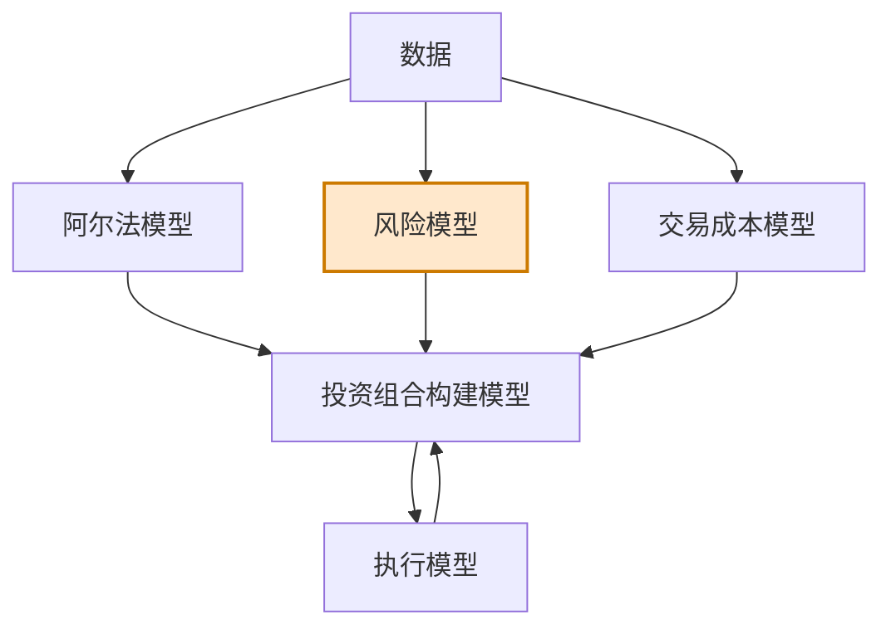

# 第4章 风险模型

> 市场的非理性状态会一直持续到你破产。  
> ——约翰·梅纳德·凯恩斯

## 章节主旨

本章讨论量化交易系统的第二个核心部件：风险模型。作者强调，风险管理不是简单规避风险，也不是机械减少损失，而是在有目的地选择敞口、控制敞口规模的基础上，提高收益质量和稳定性。

阿尔法模型寻找宽客愿意承担并希望从中盈利的敞口。风险模型处理的是另一类敞口：它们常常与追求阿尔法同时出现，但宽客并不认为这些敞口能在长期带来利润，也通常无意预测它们。风险模型的任务是识别、度量、控制甚至剔除这些不需要的敞口。

如果阿尔法模型像乐观派，风险模型就像悲观派。它不断追问：策略是不是承担了本不想承担的市场、行业、利率、规模、板块、杠杆或相关性风险？这些风险是否过大？是否应该约束、惩罚、对冲或完全消除？

## 一、风险不是阿尔法本身，而是阿尔法的附加敞口

作者用一个股票价值相对策略说明风险的定义。假设策略买入高收益股票、卖出低收益股票。若高收益股票未来表现不如低收益股票，这就是价值策略本身承担的阿尔法风险，因为宽客本来就押注价值因子有效。

但未经细化的价值策略可能无意中变成行业或板块投注。例如科技公司股价普遍下跌后，它们更可能显得“便宜”，价值策略可能集中买入科技股。如果策略本身无意预测科技板块未来表现，那么科技板块敞口就是风险，而不是阿尔法。

本章的关键定义是：

1. 阿尔法敞口：宽客有意预测并愿意承担的敞口。
2. 风险敞口：宽客无意预测、不期待长期获利，却可能随时影响收益的敞口。

风险模型并不试图消灭所有风险。若完全不承担风险，通常也无法取得收益。风险管理的实际作用是：控制敞口规模，剔除不希望出现的敞口，并把这些信息提供给投资组合构建模型。

作者也指出，风险管理常会降低策略收益，但许多宽客愿意接受这个折中，因为风险管理能降低收益波动，尤其能降低重大损失概率。LTCM、Amaranth、2007 年 8 月量化基金危机和 2008 年金融危机，都说明风险管理失误会不断累积并造成严重后果。

## 二、控制风险规模

规模控制是风险管理的第一层。即使某个交易看起来很有吸引力，也不应把所有资金投入其中。经验上很少有确定无疑的事情，过度集中最终可能导致破产。

宽客在控制风险规模时通常回答三个问题：

1. 用什么方式控制规模。
2. 用什么方式度量风险。
3. 什么状态才算规模已被控制。

### 1. 硬性约束

硬性约束是直接设定不可突破的风险线。例如规定单一头寸不能超过投资组合的 3%，无论阿尔法信号多强都不允许超过。

硬性约束优点是清晰、简单、可执行；缺点是可能武断。3% 可以，3.01% 不可以，这种边界并不总有经济意义。

### 2. 惩罚函数

惩罚函数允许在机会足够好时突破临界值，但突破越多，新增仓位越困难。它不是绝对禁止超限，而是让超限付出越来越高的代价。

这种方法表达了一个风险管理观点：有时候机会好到值得打破常规，但例外也必须被规则化处理。惩罚函数可以看作处理例外情形的规则。

临界值和惩罚函数既可以来自理论，也可以来自数据。理论驱动方法常从经验值开始，例如先设 5% 头寸上限，再通过历史模拟发现 3% 更好地平衡收益机会和错误识别。数据驱动方法则可能通过机器学习或参数搜索验证多组临界值和惩罚函数。

无论采用哪种方式，宽客都必须明确设定风险模型参数，而不能让风险边界隐含在主观直觉里。

## 三、度量风险

市场上有两种最常见的风险度量方式。

### 1. 纵向不确定性：波动率

第一种是纵向度量，也就是计算同一产品或组合在不同时期收益的标准差。在金融业中，这通常称为波动率。波动率越高，市场风险越大。

作者提醒，使用“不确定性”作为风险的代名词并不完美，只是因为它容易计算并能回答“风险有多大”这类问题。

### 2. 横截面差异：离散度

第二种是横截面度量，也就是在给定产品范围内度量不同金融产品表现的差异，通常计算同一时间截面上收益的标准差。宽客称之为离散度。

离散度越大，说明资产表现越多样化，投资组合可用于分散和相对投注的机会越多，市场整体风险反而可能较低。极端情况下，如果所有产品完全相关，一个产品波动时所有产品都随之波动，组合无法通过多样化降低风险。

离散度也可以通过相关系数或协方差衡量。资产之间越相似、相关性越高，市场风险越大。

### 3. 其他风险度量

其他不太常用但重要的风险度量包括信用价差、信用违约互换价格、隐含波动率等。这些指标可以捕捉信用风险、市场压力和投资者风险偏好变化。

## 四、限制值的适用范围

规模限制模型可以应用在多个层级：

1. 单一产品头寸。
2. 一类产品或一个资产类别。
3. 市场因子、板块、行业、市值、风格等风险敞口。
4. 投资组合整体杠杆。

一般来说，需要使用临界值或惩罚函数控制的风险，往往是阿尔法模型没有明确预测的风险。若阿尔法模型只预测单只股票而不预测整体股市，那么限制组合的股票市场方向敞口就是谨慎做法。

### 1. 杠杆率控制

风险模型的另一个重要任务是管理整体杠杆率。宽客可能在机会多时提高杠杆、机会少时降低杠杆，也可能为了给投资者提供相对稳定的风险水平而调整杠杆。

常见做法是用波动率或离散度衡量市场风险，再调整杠杆，使组合风险维持相对稳定。最常见工具是 VaR 模型。VaR 通常根据当前波动率估计组合在一定置信水平下的预期损失。当波动率上升时，模型会降低杠杆。

作者对这种做法提出保留意见。其他投资，如股票、债券、共同基金、私募基金，并不要求波动率保持固定；为什么宽客必须以固定波动率作为风险管理目标？如果宽客真的善于预测波动率或离散度，也许可以在期权市场等更直接地利用预测，而不是只用它们控制杠杆。

作者指出，这类模型可能让交易者在市场平静时承担过小风险，在市场动荡时承担过多风险，但它们仍是实务中最流行的工具。

### 2. 更合理但更困难的原则

理论上更合理的资金管理方式是：策略获胜概率高时提高杠杆，获胜概率低时降低杠杆。问题在于，关键变量“获胜概率”很难知道。

一些宽客允许杠杆随着阿尔法模型预测能力和预测结果变化，这与凯利准则思想相关。凯利准则根据投注胜率和赔率确定最优投注比例，目标是最大化长期资本增长。但投资中的投注往往相互关联、收益不均匀，因此实务中常使用半凯利或更保守版本。

## 五、限制风险种类：对冲无意敞口

除了控制敞口大小，一些风险模型会直接消除某类风险。

作者用雪佛龙和埃克森美孚的例子说明。假设投资者判断雪佛龙表现会优于埃克森美孚。如果只买入雪佛龙，投资者不仅押注雪佛龙相对优势，还暴露于整体市场和原油板块风险。若市场大跌或原油板块疲软，即使相对判断正确，交易仍可能亏损。

若投资者买入雪佛龙同时卖出等额埃克森美孚，就能在很大程度上消除市场方向风险和原油板块风险，使收益主要取决于雪佛龙是否强于埃克森美孚。

本节的基本准则是：尽量消除所有无意敞口，因为这些敞口并不总能提供足够补偿。

作者同时指出，风险管理并不一定只存在于独立风险模型中。阿尔法模型本身也可以包含风险管理。例如相对阿尔法策略可以直接预测股票相对其板块的收益，而不是预测股票绝对收益。这样投注结构本身就规避了板块方向风险。

理论上，如果阿尔法模型足够精细，可以把风险模型的必要元素内嵌进去，只预测策略希望盈利的敞口，并通过投注结构避开不可预测敞口。并非所有量化策略都这样做，但优秀阿尔法模型中常含有风险管理思想。

## 六、理论驱动型风险模型

理论驱动型风险模型关注已知的、可解释的系统性风险因素。它预先设定一系列风险因素，并度量投资组合对这些因素的敞口。

这里的“系统性风险”与“系统化交易”中的系统不是同一概念。系统性风险是无法通过分散化完全消除的共同风险。例如：

1. 股票投资中的整体市场风险。
2. 股票中的市值风险、板块风险、风格风险。
3. 债券中的利率风险。
4. 跨资产组合中的共同宏观风险。

若股市强势上涨，持有股票的组合大概率上涨；若股市大跌，持有股票的组合大概率亏损。通过持有多只股票无法消除整体市场方向风险。

类似地，债券持有人无论持有公司债还是政府债，都面临利率上升带来的风险。任何经济上有效的资产集合，通常都存在一个或多个共同系统风险因素。投资者应有意识地利用或消除这些因素，而不是无意中暴露。

理论驱动模型的优点是含义清晰、经济直觉强。市场风险、板块风险、利率风险等因素很难被认为完全不存在，因此即使模型短期表现不佳，宽客也更容易坚持。

## 七、经验型风险模型

经验型风险模型同样假设系统风险可以被度量和降低，但它不预先命名风险因素，而是用历史数据识别风险结构。

主成分分析等统计方法可以从历史数据中提取系统风险因子。这些因子可能没有名称，但常与已知风险对应。例如对不同到期日国债做主成分分析，第一主成分通常对应利率水平，也就是理论模型中的利率风险。

在股票市场中，统计风险模型常发现：市场本身是股票收益最重要驱动力，板块是第二重要驱动力。统计套利交易者常用这类模型剥离系统风险，只押注股票收益中无法由系统风险解释的部分。

经验型模型有两个方向的风险：

1. 它可能发现新的真实系统风险，只是暂时没有经济名称。
2. 它也可能被数据误导，识别出短暂或虚假的风险因素，这些因素未来很快消失。

因此经验型风险模型需要谨慎解释，不应把每个统计因子都自动视为稳定经济风险。

## 八、如何选择风险模型

### 1. 理论模型的优势

理论驱动型风险模型更受宽客青睐，因为风险因素有明确意义。任何理性投资者都能理解市场、行业、利率、规模等因素为何重要。这种理论基础会增强宽客对模型的信心。

作者用巴菲特在互联网泡沫期间坚持观点作类比：他能坚持不参与泡沫，很大程度上因为其市场判断有坚实理论基础。

### 2. 经验模型的优势

经验模型的主要优势是自适应。理论模型相对僵化，但市场驱动力会随时间变化。2003 年美国入侵伊拉克的进展曾显著影响股票、债券、货币和商品；2008 年初商品价格也是重要市场因素；某些时期，美联储政策预期会成为核心驱动。

经验模型可以从新数据中推断新的市场驱动因素，因此更适应变化。

### 3. 经验模型的核心缺陷

经验模型的自适应有滞后。市场环境变化初期，模型仍使用旧历史数据估计关系，可能错误判断风险；如果新行为延续，模型才逐渐跟上。

经验模型还面临统计显著性与自适应性之间的矛盾：

1. 样本越多，估计越可靠，但回溯时间越长，自适应越差。
2. 时间窗越短，自适应越强，但统计可信度越低。

例如使用两年每日滚动数据约 520 个交易日，每新增一天只替换最旧一天，样本变化很慢，新风险因素需要较长时间才能被识别。

使用日内数据可以缓和这一矛盾。若使用每分钟价格数据，每天可获得约 400 个样本点，只需较少天数就能达到每日收盘价长时间窗的样本量。

### 4. 混合与外部模型

两类风险模型并不互斥。宽客可以根据需要组合理论和经验模型。少数基金经理还会在察觉市场出现新的风险驱动因素后，临时建立定制化风险因子；当该因素不再重要时，再将其移除。

宽客也可以选择自建风险模型或购买外部模型。股票市场中，BARRA、Northfield、Axioma、Quantal 等供应商提供可授权使用的风险模型。外部模型部署快、研发成本低、效果通常不错，但较为通用，缺乏个性化；自建模型则能更好适配特定策略和投资范围。

## 九、小结

本章的核心结论是：风险管理不是单纯降低风险，而是在给定风险水平下，通过选择敞口并控制规模最大化收益。降低风险通常以减少收益为代价，因此风险管理重点是消除或减少不必要风险，同时承担那些可能带来足够收益补偿的风险。

宽客和主观交易者都需要风险管理，区别在于宽客主要用软件系统管理风险。主观交易者即使使用软件，也常只是度量风险，而不是系统性地调整仓位。

无论使用理论模型、经验模型还是混合模型，风险管理的目标一致：

1. 识别投资组合面临哪些系统性敞口。
2. 度量各种敞口规模。
3. 判断哪些风险可承受，哪些必须降低或剔除。

量化风险管理的优势在于，它要求宽客有意识地承担风险，而不是拼凑看起来好的仓位并忽视偶发敞口。若原油价格成为影响市场情绪的重要因素，不同部门和不同资产的仓位都可能被油价驱动。风险模型让宽客发现这类敞口，并判断是否采取应对方案。

图 4-1 是黑箱进度图，说明本章讨论的是阿尔法模型之后、交易成本模型之前的风险模块：

## 公式与定义补全

以下公式用于补全本章提到但未完整展开的风险度量、限制和资金管理关系。

### 1. 波动率

给定收益序列 $r_1,\dots,r_T$，样本均值为 $\bar r$，样本波动率为：

$$
\sigma = \sqrt{\frac{1}{T-1}\sum_{t=1}^{T}(r_t-\bar r)^2}
$$

若使用日收益率估计年化波动率，通常写为：

$$
\sigma_{\text{ann}} = \sigma_{\text{daily}}\sqrt{252}
$$

### 2. 横截面离散度

在同一时点 $t$，有 $N$ 个资产收益 $r_{1,t},\dots,r_{N,t}$，横截面均值为 $\bar r_t$，离散度为：

$$
\text{Dispersion}_t = \sqrt{\frac{1}{N-1}\sum_{i=1}^{N}(r_{i,t}-\bar r_t)^2}
$$

离散度越高，资产之间表现差异越大；相关性越高，离散度通常越低。

### 3. 相关系数与协方差

两个资产 $i,j$ 的协方差为：

$$
\operatorname{Cov}(r_i,r_j)=E[(r_i-\mu_i)(r_j-\mu_j)]
$$

相关系数为：

$$
\rho_{ij}=\frac{\operatorname{Cov}(r_i,r_j)}{\sigma_i\sigma_j}
$$

相关系数越接近 1，两个资产越难通过组合分散风险。

### 4. 硬性仓位约束

单一资产权重约束可写为：

$$
|w_i| \le w_{\max}
$$

例如 $w_{\max}=3\%$，则任何单一头寸绝对权重不得超过 3%。

行业或因子敞口约束可写为：

$$
|b_k^\top w| \le L_k
$$

其中，$w$ 是组合权重向量，$b_k$ 是第 $k$ 个风险因子的暴露向量，$L_k$ 是该因子的风险限额。

### 5. 惩罚函数

惩罚函数可以加入优化目标。例如当单一头寸超过阈值 $c$ 时：

$$
\text{Penalty}(w_i)=\lambda \max(0, |w_i|-c)^2
$$

其中，$\lambda$ 控制超限惩罚强度。超出阈值越多，边际惩罚越大。

### 6. 投资组合波动率

组合权重为 $w$，资产协方差矩阵为 $\Sigma$，组合方差为：

$$
\sigma_p^2 = w^\top \Sigma w
$$

组合波动率为：

$$
\sigma_p = \sqrt{w^\top \Sigma w}
$$

### 7. VaR

在正态近似下，置信水平为 $c$ 的单期 VaR 可写为：

$$
\operatorname{VaR}_c = z_c \sigma_p V - \mu_p V
$$

其中，$V$ 是组合价值，$\mu_p$ 是组合期望收益，$\sigma_p$ 是组合波动率，$z_c$ 是标准正态分位数。若短期内忽略均值：

$$
\operatorname{VaR}_c \approx z_c \sigma_p V
$$

当波动率上升时，为保持 VaR 不变，杠杆或组合规模通常需要下降。

### 8. 目标波动率杠杆

若目标波动率为 $\sigma^*$，当前未加杠杆策略波动率为 $\sigma_t$，杠杆可写为：

$$
L_t = \frac{\sigma^*}{\sigma_t}
$$

当 $\sigma_t$ 上升，$L_t$ 降低；当 $\sigma_t$ 下降，$L_t$ 上升。这正是目标波动率或 VaR 类风险控制的基本机制。

### 9. 凯利准则

在二元投注中，胜率为 $p$，败率为 $q=1-p$，净赔率为 $b$，凯利最优投注比例为：

$$
f^* = \frac{bp-q}{b}
$$

若 $b=1$，即赢一单位、输一单位，则：

$$
f^* = 2p - 1
$$

实务中因收益相关性、估计误差和回撤风险，常使用半凯利：

$$
f_{\text{half Kelly}} = \frac{1}{2}f^*
$$

### 10. 主成分分析风险因子

经验型风险模型可将资产收益矩阵 $R$ 的协方差矩阵分解为：

$$
\Sigma = Q \Lambda Q^\top
$$

其中，$Q$ 是特征向量矩阵，$\Lambda$ 是特征值对角矩阵。最大的若干特征值对应的特征向量可解释为主要统计风险因子。它们可能对应市场、板块、利率水平等已知风险，也可能是尚未命名或不稳定的统计关系。
