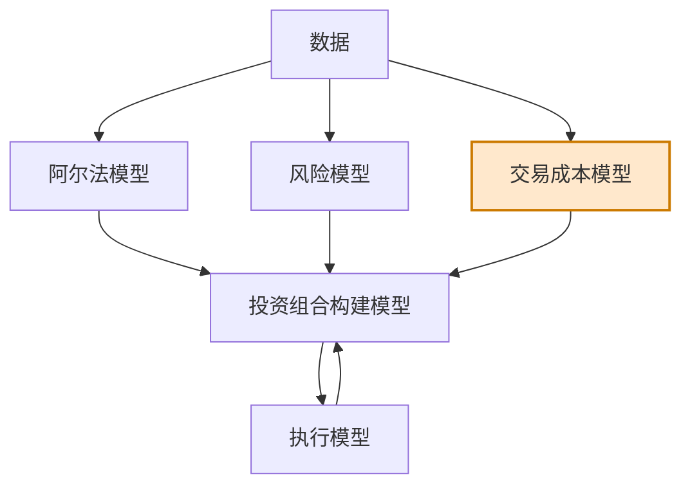

# 第5章 交易成本模型

> 奢难达富，俭不致贫。  
> ——萨缪尔·约翰逊

## 章节主旨

本章讨论量化交易系统的第三个核心输入：交易成本模型。若说阿尔法模型是乐观者，风险模型是担忧者，那么交易成本模型就是吝啬的会计。它不断提醒系统：交易不是免费的，除非交易带来的收益改善或风险降低足以覆盖成本，否则不应交易。

交易成本模型不是为了直接最小化交易成本，而是为了在投资组合构建时准确描述交易成本。真正的执行成本最小化会在第7章执行模型中讨论。本章重点是：在决定从当前组合转向目标组合之前，系统必须知道交易需要付出多大代价。

作者指出，许多成功宽客估计交易成本侵蚀了 20%-50% 的收益。如果低估交易成本，系统会过度交易，利润被成本慢慢吃掉；如果高估交易成本，系统会交易不足，持有过久，错过应调整的机会。因此交易成本模型的核心是准确性与计算速度、复杂性之间的权衡。

## 一、交易为什么必须考虑成本

量化交易中，进行交易通常只有两个理由：

1. 增加盈利概率或盈利规模，例如阿尔法模型发现新机会。
2. 降低亏损概率或亏损规模，例如风险模型要求降低某些敞口。

但这两个理由都必须经过交易成本约束。阿尔法模型认为某笔交易有利可图，并不意味着它值得执行；风险模型认为某个调整能降低风险，也不意味着降低的风险足以支付交易成本。

交易一旦发生，就会消耗市场流动性、经纪商服务、清算结算资源和交易基础设施。市场和经纪商并不关心交易者的预期收益，只要交易发生，成本就会产生。

因此，交易成本模型把指定交易规模的预计成本量化，并与阿尔法模型、风险模型共同输入投资组合构建模型。投资组合构建模型再决定目标投资组合是否值得调整。

## 二、交易成本的三部分

交易成本主要由三部分构成：

1. 佣金和费用。
2. 滑点。
3. 市场冲击成本。

### 1. 佣金和费用

佣金和费用支付给经纪商、交易所和监管者，用于补偿它们提供的市场接入、交易安全、基础设施、清算和结算服务。

对很多宽客而言，每笔交易佣金很低。宽客通常不大量使用银行人工服务，而是依赖银行基础设施直接进入市场。因此银行处理每笔交易的增量成本较低，即便佣金比例很低，考虑到宽客巨大交易量，经纪商仍能获得可观利润。

佣金之外，经纪商还会对清算和结算服务收费，通常包含在佣金中。清算包括监管报告、实时监控、税务处理和破产处理，结算则是证券交割与资金交付，是交易完成的最后步骤。

交易所和电子撮合网络提供流动性池接入。交易所必须吸引交易者在平台交易，交易量越大，越能吸引其他寻求流动性的交易者。交易所也承担运行和履约保障职能，因此对交易收费。

暗池也是重要交易场所。暗池通常由银行或独立公司设立，在客户内部匿名撮合买卖订单。2012 年左右，暗池已占美国股市交易量较高比例。暗池没有公开限价订单簿，订单只有在反向需求匹配时成交。

### 2. 滑点

滑点是从交易者决定交易到订单进入市场并实际执行之间，价格变化造成的成本。市场价格持续变化，交易决策在某一时点形成，但订单真正成交时价格可能已变化。

例如交易者计划以 100 美元卖出 100 股雪佛龙股票，但订单真正成交时价格跌到 99.90 美元，则每股 0.10 美元是滑点成本。如果价格上升到 100.10 美元成交，滑点反而为负，即带来有利结果。

滑点对不同策略影响不同：

1. 趋势跟随策略通常在价格已经沿预期方向运动后交易，因此更容易遭受滑点损失。
2. 均值回复策略下单方向常与当前趋势相反，因此滑点损失较少，甚至可能得到正滑点。

滑点主要取决于两个因素：

1. 决策到执行之间的时间延迟。系统与市场之间滞后越多，价格偏离决策价格的可能越大。
2. 产品波动率。高波动资产价格变化更快，滑点更重要。

作者举例：90 天期国债价格变化缓慢，滑点可能不是主要成本；谷歌股票日内平均波动幅度较大，滑点是重要成本。

一个反直觉点是：短期预测越准确，滑点破坏性可能越大。因为若预测准确，价格很快朝预期方向移动，但在订单未成交前，这段价格变化不能成为收益，只会抬高买入成本或降低卖出价格。

### 3. 市场冲击成本

市场冲击成本是交易者自己的订单对市场价格造成的影响。买入会推高价格，卖出会压低价格。对小订单而言，价格影响可能只在最优买卖价之间；对大订单而言，影响可能显著，极端情况下达到几个百分点。

市场冲击通常定义为订单进入市场时价格与订单实际执行价格之间的差额中，由交易者自身流动性需求造成的部分。

其经济原理是供需关系：交易者需求规模越大，必须吸引更多供给，交易价格就越不利。虽然原理简单，量化却困难。通常只有交易完成后才能观察到冲击，而此时该估计对交易前决策已经太晚。

度量市场冲击还会受到外部因素干扰，例如同一时间其他交易者是否也在同向交易、市场是否因消息处于异常波动中。这些因素难以预测和控制，因此交易成本模型通常聚焦订单规模相对于当时市场流动性的比例。

流动性可以通过买卖盘数量、订单簿深度、最优价外挂单数量等方式度量。

## 三、滑点与市场冲击的重合

滑点和市场冲击有时很难严格区分。

作者举例：交易者想卖出一只处于上涨趋势的股票。若股价在决策后从 100 美元升至 100.05 美元，订单入场时滑点为 -0.05 美元，因为卖出价格比决策价格更有利。若买单持续强劲，最终成交价为 100.20 美元，又产生 -0.15 美元的市场冲击成本。

问题在于，交易者卖单是否减缓了股价上涨？减缓多少？这部分很难从滑点、市场趋势和自身订单冲击中清晰分离。

因此，交易成本模型必须承认估计误差。模型在交易前预测成本，而真实成本只能在交易后观察。

## 四、流动性需求方、流动性供给方与 ECN

若交易者需要流动性，流动性供给方通常要求补偿。历史上流动性供给方主要是做市商或专业交易员，他们负责在交易者有需求时提供买卖对手方。

随着电子交易平台发展，很多产品即使没有传统做市商也能有序交易。电子通信网络（ECN）就是典型平台。ECN 的工作是吸引足够用户、显示充足流动性，并提供稳定技术系统。

股票市场中，许多 ECN 使用“返佣/收费”结构吸引流动性：

1. 向流动性需求方收费，例如主动买入卖价或主动卖出买价。
2. 向流动性供给方支付返佣，例如挂限价单等待成交。
3. ECN 保留两者差额作为收入。

作者举例，流动性需求方可能每股支付约 0.03 美元，流动性供给方每股获得约 0.02 美元，ECN 获取剩余约 0.01 美元。

一些均值回复策略适合被动执行，因此可通过提供流动性获得返佣，把交易成本的一部分转化为利润来源。但并非所有交易所都采用这种收费结构。有些交易所没有返佣，有些甚至反向收费。

## 五、暗池交易

暗池允许交易者匿名直接交易，部分产生原因是机构担心大单在公开市场产生市场冲击。暗池不公开限价订单簿，也看不到做市商或其他参与者提供的流动性。交易者提交订单，如果刚好有反向订单，就成交。

暗池的特点包括：

1. 匿名性降低了公开暴露大单意图的风险。
2. 对大单而言可能降低市场冲击。
3. 暗池交易的是交易所上市证券，但交易发生在场外。
4. 暗池依赖公开市场进行价格发现，否则参与者难以决定交易价格。
5. 因为只对特定客户开放、透明度较低，暗池争议较多。

## 六、交易成本模型的四种类型

交易成本模型用于估计不同订单规模下的成本。固定成本如佣金和费用构成成本基准线；滑点和市场冲击是可变成本，在交易前无法准确知道。

交易成本受多种因素影响：

1. 订单规模。
2. 产品流动性。
3. 产品波动率。
4. 当前趋势。
5. 供需不平衡。
6. 投资者基础和交易者类型。
7. 不同时间段的市场状态。

不同金融产品成本特征不同。谷歌、亚马逊、雪佛龙、埃克森美孚的交易成本都不完全相同。因此很多宽客会为投资范围内每一种产品建立单独模型，并用交易系统记录的历史成交数据更新模型。

在图形上，交易成本模型通常以订单规模为横轴、交易成本为纵轴。宽客普遍认为真实成本曲线更接近二次型：交易规模越大，市场冲击导致成本上升越快。

### 1. 常值型交易成本模型

常值型模型假设无论订单规模多大，交易成本都保持不变。它最简单，但通常不正确，因此不常用。

它可能适用的情形是：交易规模几乎保持不变，且流动性充分稳定。在这种情况下，真实成本曲线在常见交易规模附近变化不大，常值模型误差有限。

图 5-1 的含义是：模型成本是一条水平线，真实成本随交易规模上升；二者只在某个交点附近较准确。

### 2. 线性交易成本模型

线性模型假设交易成本以固定比率随订单规模增加。这比常值模型更合理，但仍只是对真实曲线的近似。

图 5-2 的含义是：线性模型在小规模时可能高估成本，在大规模时可能低估成本；只有在模型线与真实成本曲线交叉点附近较准确。

若交易规模集中在交点附近，线性模型可用；在更广范围内，它比常值模型更合理。

### 3. 分段线性交易成本模型

分段线性模型在不同规模区间使用不同直线。其思想是：在局部区间内线性近似可以成立，但真实二次曲线斜率会随着规模上升而变大，因此需要在某些断点后使用斜率更高的新直线。

图 5-3 展示了这种分段拟合。与常值和单一线性模型相比，分段线性模型在较大交易规模范围内更准确，同时仍保持计算简单。因此它是简洁性和准确性之间的折中方案，在宽客中很流行。

### 4. 二次型交易成本模型

二次型模型用二次函数描述交易成本，是本章讨论的模型中最准确、也最复杂的一类。它能体现订单规模越大、成本上升越快的市场冲击特征。

图 5-4 中，实线是交易前估计的期望成本，点线是交易后观察到的真实成本。二者不会完全重合，因为交易成本模型本质上是在预测，而预测不可能完美。

造成估计成本和真实成本差异的因素包括：

1. 产品波动性变化。
2. 流动性随时间变化。
3. 同一产品的交易者类型变化，例如做市商、对冲基金、共同基金、个人投资者占比变化。
4. 市场消息和供需不平衡。

宽客必须在准确性、速度和简洁性之间权衡。对于交易规模大、短期交易频繁、交易规模变化大的策略，复杂模型更有价值；对于交易规模稳定或很小的策略，简单模型可能足够。

## 七、四类成本函数的图形还原

图 5-1 到图 5-4 可用如下示意还原：

| 图示 | 模型 | 成本随规模变化 | 优点 | 缺点 | 适用情形 |
| --- | --- | --- | --- | --- | --- |
| 图 5-1 | 常值型 | 不变 | 极简单 | 大多不真实 | 交易规模稳定且较小 |
| 图 5-2 | 线性 | 固定斜率上升 | 简单、比常值合理 | 小规模可能高估，大规模可能低估 | 规模集中在常见区间 |
| 图 5-3 | 分段线性 | 分区间用不同斜率 | 准确性和简洁性折中 | 需要设断点和斜率 | 规模变化较大但需快速计算 |
| 图 5-4 | 二次型 | 加速上升 | 最贴近市场冲击直觉 | 估计和计算更复杂 | 大单、频繁交易、成本敏感策略 |

## 八、小结

交易成本模型在投资组合构建阶段提供“交易要花多少钱”的输入。它与执行模型不同：交易成本模型帮助投资组合构建模型判断是否值得转向目标组合，执行模型则在目标组合确定后，以尽可能低的成本完成交易。

成本最小化可以分为两步：

1. 投资组合构建模型使用交易成本模型估计从当前组合转向目标组合的成本。
2. 执行算法接收目标交易清单，尽量降低实际执行成本。

本章讨论的四类模型没有绝对优劣，关键是模型是否适合使用环境：

1. 交易产品固定、交易规模稳定或规模很小，简单模型可能足够。
2. 短期内大额交易、交易规模变化大或流动性敏感，复杂模型更有必要。
3. 所有模型都必须随市场状态更新，否则成本估计会失效。

图 5-5 是黑箱进度图。本章补上了投资组合构建模型的第三个输入：交易成本模型。

## 公式与定义补全

以下公式用于补全本章提到的交易成本结构和四类成本函数。

### 1. 总交易成本分解

单笔交易总成本可写为：

$$
TC = \text{Commissions and Fees} + \text{Slippage} + \text{Market Impact}
$$

若按每股成本表示：

$$
tc = c + s + m
$$

其中，$c$ 为佣金和费用，$s$ 为滑点，$m$ 为市场冲击。

### 2. 滑点

对买入订单，若决策价格为 $P_{\text{decision}}$，订单到达或成交价格为 $P_{\text{exec}}$，每股滑点可写为：

$$
s_{\text{buy}} = P_{\text{exec}} - P_{\text{decision}}
$$

对卖出订单：

$$
s_{\text{sell}} = P_{\text{decision}} - P_{\text{exec}}
$$

若 $s<0$，表示滑点有利于交易者。

### 3. 市场冲击

对买入订单，市场冲击可近似写为：

$$
m_{\text{buy}} = P_{\text{avg fill}} - P_{\text{arrival}}
$$

对卖出订单：

$$
m_{\text{sell}} = P_{\text{arrival}} - P_{\text{avg fill}}
$$

其中，$P_{\text{arrival}}$ 是订单进入市场时价格，$P_{\text{avg fill}}$ 是平均成交价格。实际中需区分市场自身波动和订单自身冲击，这正是建模难点。

### 4. 常值型交易成本模型

若订单规模为 $Q$，常值模型为：

$$
TC(Q)=a
$$

或按每股成本近似为常数：

$$
tc(Q)=a
$$

它假设规模变化不影响成本。

### 5. 线性交易成本模型

线性模型可写为：

$$
TC(Q)=a+bQ
$$

其中，$a$ 是固定成本，$b$ 是单位规模成本。若按成交金额或股份数衡量 $Q$，成本随规模等比例增加。

### 6. 分段线性交易成本模型

分段线性模型可写为：

$$
TC(Q)=
\begin{cases}
a+b_1Q, & 0 \le Q \le q_1 \\
a+b_1q_1+b_2(Q-q_1), & q_1 < Q \le q_2 \\
a+b_1q_1+b_2(q_2-q_1)+b_3(Q-q_2), & Q>q_2
\end{cases}
$$

通常有：

$$
b_1 < b_2 < b_3
$$

表示订单越大，边际成本越高。

### 7. 二次型交易成本模型

二次型模型可写为：

$$
TC(Q)=a+bQ+cQ^2
$$

其中，$c>0$ 表示市场冲击随订单规模加速上升。边际成本为：

$$
\frac{dTC}{dQ}=b+2cQ
$$

因此规模越大，每新增一单位交易带来的成本越高。

### 8. 参与率与流动性调整

市场冲击常与订单规模相对于市场成交量的比例有关。令 $ADV$ 为日均成交量，参与率为：

$$
\pi = \frac{|Q|}{ADV}
$$

成本模型可扩展为：

$$
TC(Q)=a+b|Q|+c\left(\frac{|Q|}{ADV}\right)^2
$$

或将波动率纳入：

$$
TC(Q)=a+b|Q|+c\sigma P \left(\frac{|Q|}{ADV}\right)^\gamma
$$

其中，$\sigma$ 是波动率，$P$ 是价格，$\gamma$ 控制冲击曲线形状。

### 9. 交易是否值得执行

若预期交易收益为 $\Delta \alpha$，风险降低收益等价为 $\Delta R_{\text{risk}}$，预计交易成本为 $TC$，则交易至少应满足：

$$
\Delta \alpha + \Delta R_{\text{risk}} > TC
$$

否则，即便阿尔法或风险模型建议调整，交易也可能不值得执行。

### 10. 从当前组合到目标组合的成本

若当前权重为 $w^{\text{current}}$，目标权重为 $w^{\text{target}}$，交易量向量为：

$$
\Delta w = w^{\text{target}} - w^{\text{current}}
$$

投资组合总交易成本可写为：

$$
TC_{\text{portfolio}} = \sum_{i=1}^{N} TC_i(\Delta w_i)
$$

这正是交易成本模型向投资组合构建模型提供的核心输入。
