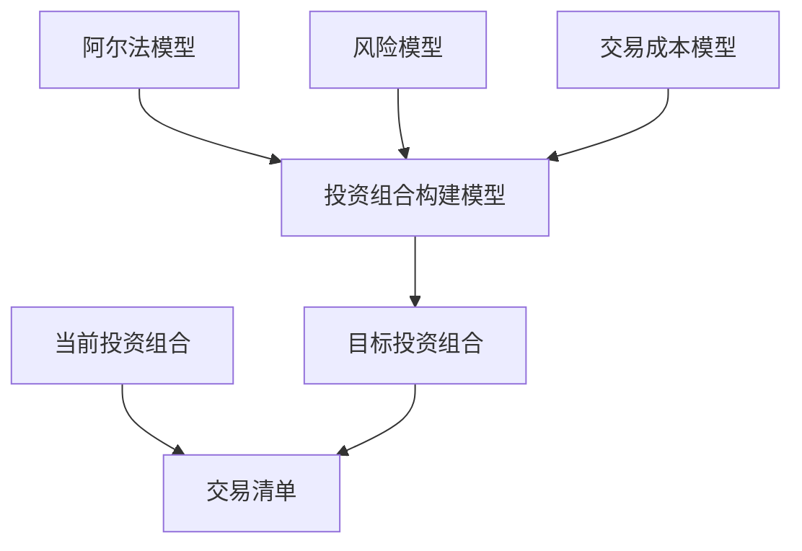
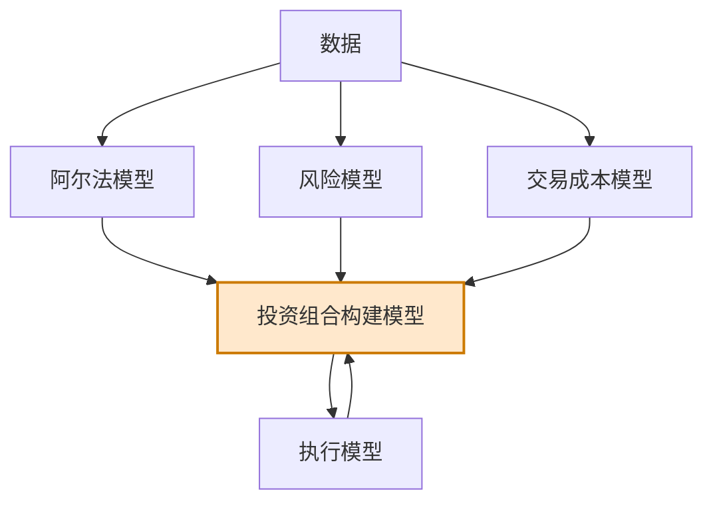

# 第6章 投资组合构建模型

> 基于现在和未来，才能做出明智的决策。  
> ——艾萨克·阿西莫夫

## 章节主旨

本章讨论黑箱中负责“裁决”的模块：投资组合构建模型。阿尔法模型给出盈利机会，风险模型指出不希望承担的风险，交易成本模型提醒交易需要付出代价；投资组合构建模型综合三者，决定目标投资组合中每个产品的头寸方向和规模。

投资组合构建的核心问题是：如何在期望收益、风险和交易成本之间取得平衡。过度强调阿尔法机会，可能忽略风险并导致损失；过度强调风险，可能错过收益；过度强调交易成本，则可能让系统长期不交易、持仓僵化。

作者把量化投资组合构建模型分为两大类：

1. 基于规则的模型：依赖宽客的经验、直觉和启发式规则。
2. 基于优化的模型：使用算法寻找目标函数意义下的最优组合。

本章说明，投资组合构建是量化交易中极重要但常被低估的环节。即使阿尔法模型很好，如果把最多资金分配给最差机会、把最少资金分配给最好机会，最终收益仍会很差。

## 一、投资组合构建模型的角色

投资组合构建模型接收三个核心输入：

1. 阿尔法模型：哪些资产更有吸引力，期望收益或方向如何。
2. 风险模型：哪些风险敞口应限制、降低或剔除。
3. 交易成本模型：从当前组合调整到目标组合需要付出多少成本。

其输出是目标投资组合，即理想头寸和各头寸规模。若当前组合与目标组合不同，二者差额就是需要执行的交易。

## 二、基于规则的投资组合构建模型

常见基于规则模型有四类：

1. 相等头寸加权。
2. 相等风险加权。
3. 阿尔法驱动型加权。
4. 决策树加权。

前两类模型最简单，核心是“等权重”，但“等”的对象不同。阿尔法驱动模型主要让阿尔法信号决定头寸规模。决策树方法按某种顺序使用一系列规则决定头寸规模，可以简单也可以复杂。

### 1. 相等头寸加权

相等头寸加权非常普遍。使用该模型的宽客认为：如果某个头寸好到值得拥有，就没有必要再用更多信息区分规模。它隐含假设金融产品具有同质性，不必按风险、信号强度或其他指标差异化分配。

看似简单的等权重法背后有三个理由。

第一，非等权重方法默认阿尔法模型能准确预测头寸方向、幅度和相对概率。等权重派认为，阿尔法模型可能只足以判断方向，未必足以判断不同机会应分配多少资金。只要方向性预测足够强，就建立同等规模头寸。

第二，非等权重方法往往在“最强信号”上下注最多，但最强信号有时伴随例外风险。动量策略中，最强信号常出现在价格已经大幅上涨或下跌之后，交易者可能在趋势末端加仓，承担趋势反转风险。均值回复策略中，最强信号常出现在价格剧烈偏离时，但这种偏离可能由真实信息驱动，趋势继续而非反转。这类问题可称为逆向选择偏误。

第三，等权重能降低坏数据造成的灾难性头寸风险。若某只股票价格因数据错误被除以 100，阿尔法模型可能发出极强买入信号。等权重方法会限制该错误信号造成的头寸规模。

此外，许多阿尔法模型的显著性和预测能力主要基于平均表现，而不是尾部事件。若尾部事件产生极高预测收益，它可能是机会，也可能是高风险异常。等权重能避免过度押注尾部。

等权重的基本思想是通过尽可能多的头寸实现多样化。但它也常受流动性约束，只能在流动性允许范围内接近等权重。

### 2. 相等风险加权

相等风险加权根据每个头寸的波动率或其他风险指标反向调整权重。波动率越高，分配权重越小；波动率越低，分配权重越大。目标不是让资金规模相等，而是让每个头寸对组合风险的贡献更接近。

表 6-1 展示了一个两股票组合。根据 PDF 原表还原如下：

| 股票 | 相等权重 | 波动率 | 基于波动率调整权重 |
| --- | ---: | ---: | ---: |
| 谷歌 | 50% | 2.5% | 39% |
| 埃克森美孚公司 | 50% | 2.0% | 61% |

谷歌波动率更高，因此风险调整权重更低；埃克森美孚波动率更低，因此权重更高。

这种做法的理论基础很直接：波动大的小盘股不应与波动小的大盘股分配相同资金。若投入相同金额，高波动股票每一美元对组合波动贡献更大，相当于无意中下了更重的注。

相等风险加权的缺点是风险度量通常回顾历史。例如波动率低的银行股，在 2008 年前多年表现稳定，但金融危机期间波动突然大幅上升。如果模型只看过去一段稳定时期，就会低估未来风险并分配过大权重。

### 3. 阿尔法驱动型加权

阿尔法驱动型加权让阿尔法模型决定头寸规模。其理念是，阿尔法模型最能反映每个头寸的吸引力，因此应由信号强弱决定权重。

这种方法通常不会让最大头寸趋于无穷，而是先由风险模型给出单一头寸或组别最大上限，再根据信号强度决定实际头寸接近上限的程度。例如：

1. 单个头寸不超过组合 3%。
2. 单一板块头寸不超过组合 20%。
3. 预测收益越高，头寸越接近上限。

这类方法强调盈利目标，但必须谨慎。期货趋势跟随策略若使用阿尔法驱动权重，可能在趋势已经充分形成后给出最强信号，随着趋势延续不断加仓，最终在趋势反转时持有最大头寸并遭受回撤。阿尔法驱动权重要求模型不仅能预测方向，还能预测幅度和信号可靠性。

### 4. 决策树加权

决策树加权通过一系列规则按顺序决定头寸规模。原文在本章只简要列出该类方法，没有展开具体树结构。它可以很简单，例如先筛掉交易成本过高产品，再按风险分组，再按阿尔法信号分配；也可以很复杂，将多个条件和约束串联起来。

### 5. 基于规则模型小结

基于规则模型并不排斥阿尔法、风险和交易成本。相等权重模型也可以使用交易成本模型筛掉成本过高的产品；阿尔法模型也可以内部设置规则，例如若期望收益低于交易成本阈值，就把信号设为 0。

不同规则模型与黑箱其他模块的交互方式不同。等权重方法使用风险模型的方式，可能与阿尔法加权方法完全不同。

基于规则模型可以非常简单，也可以非常复杂。共同挑战是：宽客必须说明这些规则为什么合理，而不是仅仅因为“看起来可以”。

## 三、投资组合最优化

投资组合优化是量化金融最早受到学术界关注的领域之一。哈里·马科维茨 1952 年发表《投资组合选择》，提出均值方差优化，并因此与威廉·夏普分享 1990 年诺贝尔奖。

现代投资组合理论的核心假设是投资者厌恶风险：若两个产品收益相同但风险不同，投资者偏好低风险产品；只有存在额外收益补偿，投资者才愿意承担额外风险。这引出风险调整收益概念。

均值方差优化以三个输入为基础：

1. 期望收益，即各资产平均期望回报。
2. 期望风险，通常由收益标准差或方差衡量。
3. 期望相关系数矩阵，描述资产之间如何共同变化。

优化器输出一系列投资组合：在不同风险水平下能达到最高收益的组合。这条组合集合称为有效边界。

### 1. 目标函数

优化工具试图最大化分析师定义的目标函数。常见目标函数是在考虑波动率后最大化收益，也可以是最大化夏普比率、最大化收益/回撤比，或只最大化期望收益。

优化器通过算法在各种可行组合中搜索。对给定组合，它检验收益和风险特征，并与其他组合比较，寻找导致组合改进或退步的方向。最终定位在给定约束下最优的一组组合。

图 6-1 用两个假设产品 ABC 和 DEF 展示优化过程。X 轴和 Z 轴表示两种产品权重组合，Y 轴表示期望夏普比率。若 ABC 期望收益为正，DEF 期望收益绝对值相同但为负，优化器会选择 100% 做多 ABC、100% 做空 DEF。

## 四、优化工具的输入变量

### 1. 期望收益

传统财富管理常把长期历史收益当作期望收益，因为目标是构建长期资产配置，不需频繁调整。宽客则倾向使用阿尔法模型输出作为期望收益。

阿尔法模型可能输出：

1. 数值化期望收益。
2. 价格方向。
3. 评分或排名。
4. 吸引力指标。

方向预测也可以转化为收益预测。例如所有正向信号赋予相同正收益，所有负向信号赋予相同负收益，并设置最小阈值，只有足够显著的预测才被视为非零。

这类优化中，精确收益数值不一定重要，重要的是每个潜在头寸的方向符号。

### 2. 期望波动率

许多从业者用历史实际波动率作为输入，也有人预测未来波动率。常见方法是随机波动模型，其中最著名的是 GARCH。

随机过程既有可预测性，也有随机性。随机波动模型认为波动率会在一段时期处于高位，下一段时期处于低位，偶尔还会跳跃。GARCH 模型是最常用的波动率预测方法之一。

图 6-2 展示标准普尔 500 指数历史波动率：2000-2003 年波动较大，2003 年中至 2007 年中较平稳，2007 年中至 2008 年又显著波动。GARCH 类模型适合描述这种波动率聚集和周期变化。

波动率预测也可使用趋势、均值回复或基本面方法，可以预测单一产品波动率，也可以预测多个产品的相对波动率。

### 3. 期望相关性

相关系数衡量两个产品变化的相似程度，取值范围为 -1 到 1：

1. 1 表示完全同向。
2. -1 表示完全反向。
3. 0 表示不相关。

相关系数与价格趋势不是同一概念。两家公司可能一家公司长期上涨、另一家公司长期下跌，但若它们收益仍受共同市场、行业或油价因素驱动，相关系数仍可能很高。

在量化交易中，标准相关系数有很多问题，最关键的是关系随时间不稳定。图 6-3 展示标准普尔 500 指数与日经 225 指数的年滚动相关系数：长期全样本相关系数约 0.37，但滚动相关性最低约 0.01，最高约 0.66。即使使用 5 年滚动窗口，相关系数也在 0.21 到 0.57 间变化。

不同时区会影响日收益相关性。例如美国与日本市场存在交易日滞后，因此可用周收益或将日本收益滞后一天来缓解。

图 6-4 说明，合理分组能提高相关性稳定性。埃克森美孚与雪佛龙同属大型全球石油公司，20 多年相关系数平均约 0.7，最低约 0.40，最高约 0.89；雪佛龙与阳光微系统属于完全不同板块，平均相关约 0.14，最低约 -0.14，最高约 0.36。

即便相似资产之间，相关性仍不稳定。这不是优化器或相关系数本身的错误，而是金融市场本身由多种动态因素共同驱动。

## 五、优化技术

### 1. 无约束优化

无约束优化是最基本的优化方法。若目标函数允许，它可能把所有资金投入单一金融产品。实际中，无约束优化常给出怪异结果：把全部组合集中到风险调整收益最高的产品上。

这种结果通常不可接受，因为它忽略了集中度、流动性、风险和交易限制。

### 2. 带约束优化

为解决无约束优化问题，宽客加入约束和惩罚项，使结果更合理。常见约束包括：

1. 单一头寸不超过组合 3%。
2. 单一板块不超过组合 20%。
3. 市场、行业、风格或因子敞口保持中性。
4. 卖空限制、借券限制、流动性约束。
5. 组合目标风险、总杠杆、换手率限制。

作者指出一个有趣问题：若约束太强，真正推动组合构建的可能是约束，而不是优化。例如 100 个产品中每个头寸不超过 1.5%，平均仓位为 1%，则最优仓位只比平均仓位高 50%，结果接近等权重。

风险模型也可通过约束或惩罚项进入优化器。例如要消除板块风险，可以让同板块股票在相关矩阵中具有高正相关，也可以设置板块敞口惩罚函数。惩罚函数应使风险越大，所需补偿收益以更快速度增加。

交易成本同样可进入优化器。宽客可以为每只股票建立市场冲击经验函数，也可以用波动率、交易量、订单规模等变量建立一般市场冲击函数，并把期望交易成本作为优化输入。

图 6-5 展示加入约束后的优化过程。若要求 ABC 和 DEF 投资额差异不超过 20%，优化器会忽略不满足约束的区域，只在可行区域搜索。约束过多时，可能不存在可行最优解。

实际优化比图示复杂得多。多资产、多约束、多因子情况下，目标函数曲面可能有多个局部极值。快速搜索可能停在局部最优，全局搜索更彻底但耗时过长。优化算法必须在搜索质量和速度之间平衡。

### 3. 布莱克-李特曼优化方法

费希尔·布莱克和鲍勃·李特曼在 1990 年提出布莱克-李特曼方法，后来在 1992 年发表。该方法试图解决优化输入变量存在测量误差的问题，尤其是把投资者观点的置信度纳入优化。

例如，历史上雪佛龙与埃克森美孚相关系数约 0.7，但阿尔法模型预测埃克森美孚上涨、雪佛龙下跌。在预测期限内，二者相关性可能会低甚至为负。布莱克-李特曼方法允许投资者用自己的收益观点调整历史相关性和期望收益。

如果投资者对预测置信度低，而历史相关性强，则模型更接近历史关系；如果置信度高，则投资者观点发挥更大作用。许多宽客偏好该方法，因为它能更全面地把阿尔法模型与优化器其他输入结合起来。

### 4. 格里诺德-卡恩方法：优化要素投资组合

格里诺德和卡恩在《积极投资组合管理》中提出的思想，是直接优化一组“要素投资组合”，而不是直接优化所有单个证券头寸。

方法如下：

1. 为每类阿尔法信号构建一个基于规则的要素投资组合，例如动量组合、价值组合、成长组合。
2. 每个要素组合可用等权重或等风险权重构建。
3. 用历史数据模拟每个要素组合的收益时间序列。
4. 在优化时，把这些要素投资组合当作可投资资产进行组合优化。

优势是维度更低。若单个股票有几千只，优化复杂度很高；若要素组合不超过 20 个，优化更容易、更稳定。该方法也可以纳入风险模型、交易成本模型、组合规模和风险目标。

作者给出一个权重计算例子：有两个阿尔法要素，都只给方向信号，+1 为买入，-1 为卖出。每个要素组合中有 100 只等权股票，每只权重 1%。优化结果显示第一个要素组合权重 60%，第二个 40%。某公司在第一个模型中信号为 +1，第二个为 -1，则最终权重为：

$$
1\% \times (+1) \times 60\% + 1\% \times (-1) \times 40\% = +0.2\%
$$

意味着该公司在整体组合中为 0.2% 多头。

### 5. 重新取样效率

理查德·米肖提出重新取样效率方法，目标是缓解优化器对输入估计误差过度敏感的问题。均值方差优化对期望收益、波动率、相关性的小扰动非常敏感，输入稍有变化，推荐组合可能大幅变化。

重新取样效率使用蒙特卡罗模拟重新组合历史数据，生成多个可能历史序列。这样可以在不同假设情形下检验策略表现，减少对单一历史路径的依赖。

例如用 1982-2008 年标准普尔 500 指数收盘价检验趋势策略。如果担心未来不会完全重复过去，可以从历史收益分布中抽样，生成多个替代历史序列。这些序列保持类似平均收益和波动率，但路径不同。策略在这些路径中表现好坏的频率，可用于判断未来稳健性。

但该方法有效的前提是历史样本能代表完整分布。如果样本遗漏极端事件，重新取样也会低估风险。例如只使用 1988-2006 年标准普尔 500 日收益，会遗漏 1987 年、2007-2008 年的极端熊市，导致尾部风险样本不足。

### 6. 基于数据挖掘的优化方法

部分宽客使用监督学习、遗传算法等机器学习方法解决投资组合优化问题。支持者认为，均值方差优化本质上也是在可能组合中搜索目标函数最优解，而机器学习领域已经广泛研究类似搜索问题。因此机器学习可能找到比传统均值方差方法更好的组合。

作者只做简要介绍，强调机器学习用于优化属于数据挖掘方法在投资组合构建中的应用。

## 六、关于优化方法的结语

优化器可能出现一个看似奇怪的结果：阿尔法模型预测某产品收益为正，但最终组合却把它作为空头；或预测为负，却最终做多。

原因通常来自约束、风险和交易成本。假设股票市场中要求每个行业风险中性，即软件行业多头每一美元都要有一美元软件行业空头。如果软件行业所有股票期望收益都为正，优化器可能做多期望收益最高的股票，同时做空期望收益最低但仍为正的股票，以满足行业中性约束。

这种现象通常发生在小头寸中，因为对这些头寸来说，交易成本或风险管理的重要性可能高于期望收益。

另一个现象是替代效应。如果 ABC 预期收益高于 DEF，但 ABC 交易成本很高，而 ABC 与 DEF 相关性很强，优化器可能选择持有 DEF 替代 ABC。

优化工具背后的意图很清楚，但技术本身是量化交易系统中最像黑箱的部分。阿尔法、风险、交易成本、头寸限制、风险目标和多因子交互共同作用，可能产生难以直观解释的输出。

## 七、投资组合构建模型的输出

无论采用哪种方法，投资组合构建模型的输出都是目标投资组合：理想头寸和各头寸规模。

若构建全新组合，模型推荐的所有头寸都需要建立。若只是周期性重新运行模型，则只需做增量交易，填补新目标组合与当前组合之间的差距。

可以表达为：

1. 当前组合：已有头寸。
2. 目标组合：投资组合构建模型输出。
3. 交易清单：目标组合减去当前组合。

## 八、宽客如何选择投资组合构建模型

作者观察到，使用基于规则权重分配系统的宽客多采用绝对型阿尔法方法，也就是预测单个金融产品自身表现；这些宽客多从事期货交易。

使用优化工具的宽客则倾向于相对型阿尔法方法，尤其是股票市场中性策略。原因可能是，相对型阿尔法策略隐含相信产品之间关系具有一定稳定性。若不同金融产品之间比较不可靠，相对策略本身就难以实施；若关系稳定，使用相关矩阵和优化工具构建组合就更合乎逻辑。

绝对型阿尔法策略则把组合视为一系列相对独立的投注，因此依赖相关系数矩阵未必有用。这类宽客更可能直接关注风险限制、阿尔法收益预测和交易成本，并用基于规则模型实现组合构建。

因此，阿尔法模型类型很可能影响最合适的投资组合构建模型选择。

## 九、小结

本章描述了两大类投资组合构建模型。基于规则模型使用启发式方法，优化工具沿着现代投资组合理论展开。每类方法都有挑战：

1. 基于规则模型必须解释规则的任意性为什么合理。
2. 优化方法必须处理期望收益、波动率和相关性估计误差。
3. 所有方法都必须结合具体阿尔法模型、风险模型和交易成本模型。

所有投资组合构建方法的共同主线是：把阿尔法模型预测的期望收益转化为实际投资组合。这个转化可以很简单，也可以很复杂，取决于宽客选择的框架。

目标函数由宽客定义。有人最大化夏普比率，有人最大化收益/回撤比，有人最大化期望收益而不考虑风险。只要存在风险敞口，宽客就必须决定是否添加约束，以及如何添加约束。目标是在相应约束下最大化组合优点。

图 6-6 是黑箱进度图。本章讨论的投资组合构建模型接收阿尔法、风险和交易成本三个输入，并输出目标投资组合。下一章将讨论如何执行这些目标交易。

## 公式与定义补全

以下公式用于补全本章涉及的组合构建、风险平价、均值方差优化、相关性和优化约束。

### 1. 目标交易

当前组合权重为 $w^{\text{current}}$，目标组合权重为 $w^{\text{target}}$，需要执行的交易为：

$$
\Delta w = w^{\text{target}} - w^{\text{current}}
$$

### 2. 等头寸加权

若组合中有 $N$ 个入选头寸，方向信号为 $s_i \in \{+1,-1\}$，等头寸权重可写为：

$$
w_i = \frac{s_i}{N}
$$

若需要总杠杆为 $L$：

$$
w_i = s_i \frac{L}{N}
$$

### 3. 相等风险加权

若忽略相关性，并希望每个资产风险贡献相近，权重可与波动率成反比：

$$
w_i \propto \frac{1}{\sigma_i}
$$

归一化后：

$$
w_i = \frac{1/\sigma_i}{\sum_{j=1}^{N}1/\sigma_j}
$$

表 6-1 中，谷歌波动率 2.5%，埃克森美孚波动率 2.0%，则：

$$
w_{\text{GOOG}}=\frac{1/2.5}{1/2.5+1/2.0}\approx 44.4\%
$$

原表给出的 39%/61% 可理解为在具体风险度量或调整方式下得到的示例权重，核心方向是一致的：波动率更高者权重更低。

### 4. 阿尔法驱动权重

若阿尔法预测为 $\hat r_i$，单一头寸上限为 $w_{\max}$，可用简单比例规则：

$$
w_i = s_i \min\left(w_{\max}, k|\hat r_i|\right)
$$

其中，$s_i=\operatorname{sign}(\hat r_i)$，$k$ 是把预测收益映射到头寸规模的比例系数。

### 5. 组合期望收益

资产期望收益向量为 $\mu$，组合权重为 $w$，组合期望收益为：

$$
E[R_p] = w^\top \mu
$$

### 6. 组合方差与波动率

资产协方差矩阵为 $\Sigma$，组合方差为：

$$
\sigma_p^2 = w^\top \Sigma w
$$

组合波动率为：

$$
\sigma_p = \sqrt{w^\top \Sigma w}
$$

### 7. 夏普比率

若无风险利率为 $r_f$，组合夏普比率为：

$$
\text{Sharpe} = \frac{w^\top \mu - r_f}{\sqrt{w^\top \Sigma w}}
$$

许多优化工具以最大化夏普比率或类似风险调整收益为目标。

### 8. 均值方差优化

常见均值方差目标函数可写为：

$$
\max_w \left(w^\top \mu - \frac{\lambda}{2}w^\top \Sigma w\right)
$$

其中，$\lambda$ 表示风险厌恶程度。常见约束包括：

$$
\sum_{i=1}^{N} w_i = 1
$$

以及：

$$
w_{\min,i} \le w_i \le w_{\max,i}
$$

### 9. 有效边界

有效边界可通过在给定目标收益下最小化风险得到：

$$
\min_w w^\top \Sigma w
$$

满足：

$$
w^\top \mu = \mu^*
$$

$$
\sum_{i=1}^{N} w_i = 1
$$

改变 $\mu^*$ 可得到不同风险水平下的最优组合集合。

### 10. 相关系数

两个资产 $i,j$ 的相关系数为：

$$
\rho_{ij}=\frac{\operatorname{Cov}(r_i,r_j)}{\sigma_i\sigma_j}
$$

相关矩阵与波动率可组成协方差矩阵：

$$
\Sigma_{ij}=\rho_{ij}\sigma_i\sigma_j
$$

### 11. GARCH(1,1)

GARCH(1,1) 的典型形式为：

$$
r_t = \mu + \varepsilon_t
$$

$$
\varepsilon_t = \sigma_t z_t
$$

$$
\sigma_t^2 = \omega + \alpha \varepsilon_{t-1}^2 + \beta \sigma_{t-1}^2
$$

其中，$z_t$ 通常假设为均值 0、方差 1 的随机变量。该模型体现波动率聚集：大波动后未来波动率更可能较高。

### 12. 约束与惩罚

硬性行业中性约束可写为：

$$
B^\top w = 0
$$

其中，$B$ 是行业或风险因子暴露矩阵。

软性惩罚可写为：

$$
\max_w \left(w^\top \mu - \frac{\lambda}{2}w^\top \Sigma w - \gamma \cdot TC(w-w^{\text{current}}) - \eta \|B^\top w\|^2\right)
$$

其中，$TC(\cdot)$ 是交易成本函数，$\eta$ 控制风险敞口惩罚强度。

### 13. 要素投资组合权重合成

若第 $k$ 个要素组合权重为 $a_k$，第 $k$ 个要素对股票 $i$ 的组合内权重为 $v_{ik}$，则最终权重为：

$$
w_i = \sum_{k=1}^{K} a_k v_{ik}
$$

若 $v_{ik}=q_i s_{ik}$，其中 $q_i$ 为等权重基准、$s_{ik}$ 为方向信号，则：

$$
w_i = q_i \sum_{k=1}^{K} a_k s_{ik}
$$

本章例子中：

$$
w_i = 1\%\times(60\%\times 1 + 40\%\times(-1)) = 0.2\%
$$

### 14. 替代效应

若两个资产高度相关，优化器可能用交易成本更低的资产替代预期收益更高但成本更高的资产。简化条件可写为：

$$
\hat r_A - TC_A < \hat r_B - TC_B
$$

即使：

$$
\hat r_A > \hat r_B
$$

只要成本调整后 $B$ 更优，且 $A,B$ 相关性足够高，优化器就可能选择 $B$。
