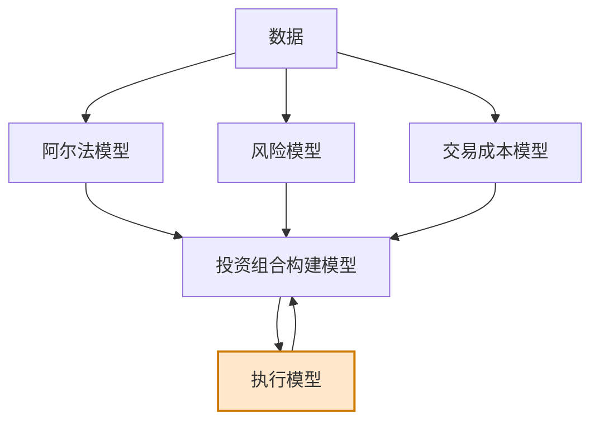

# 第7章 执行模型

> 品质绝非偶然，而是崇高目标、不懈努力、睿智指导和娴熟执行共同作用的结果。  
> ——威廉·福斯特

## 章节主旨

本章讨论黑箱的最后一个生产模块：执行模型。阿尔法模型、风险模型和交易成本模型经过投资组合构建模型生成目标投资组合，但屏幕上的目标组合不等于真实持仓。执行模型负责把目标组合转化为市场中的实际交易。

执行模型的核心目标有两个：

1. 尽可能完整地完成投资组合构建模型要求的交易。
2. 以尽可能低的成本完成这些交易。

完整性重要，是因为未完全执行会让实际组合偏离优化后的目标组合；低成本重要，是因为交易越频繁，每次节省的成本对长期表现越关键。

## 一、执行交易的基本途径

执行交易有两种基本途径：

1. 电子途径。
2. 人为中介，例如经纪商人工处理。

绝大多数宽客使用电子交易，因为交易量通常很大，人工处理既不现实也不必要。电子化交易主要通过直接市场准入（DMA）实现：交易者通过经纪商基础设施和交易接口，在电子市场直接提交订单。

本章为方便起见，把 ECN、交易柜台和其他流动性池统称为交易所，只有在需要区分具体类型时再说明。

需要澄清的是，DMA 不是宽客专用。主观交易者也可以使用 DMA 平台，甚至可以手动在电脑系统中输入订单，再由系统传到电子市场。

过去交易者常给经纪商打电话，由经纪人决定订单处理时机、规模、价格，并与对手方协商大宗交易。现在电子交易平台上，执行算法更可靠。执行算法规定如何拆分大订单、如何应对限价指令簿、如何调整价格和订单行为。

执行算法来源有三类：

1. 自行创建。
2. 使用经纪商提供的算法。
3. 从第三方软件厂商获得。

## 二、一揽子竞价

虽然宽客多数订单由算法执行，但有时也会使用经纪商提供的一揽子竞价服务。

一揽子竞价中，交易者把想交易的一揽子投资组合用特征描述，例如多空价值比率、行业、市值等。经纪商基于这些特征给出费用报价，通常用交易组合总市值的点数表示。100 点等于 1%。

若宽客接受，经纪商保证以给定价格完成交易。宽客购买的是交易价格确定性；经纪商收取费用，并承担未来市场价格相对承诺价格更好或更坏的风险。

量化投资组合的人为执行通常更像一揽子竞价，而不是人工逐笔执行大量单独订单。

## 三、订单执行算法的目标与评价

订单执行算法决定系统如何执行目标交易。它与主观交易者执行订单时考虑的问题类似，区别主要在机制而非思路。

执行算法的主要目标是：以尽可能低的成本，尽可能完整地完成订单。

降低成本包括降低第5章讨论的市场冲击和滑点。还有一个重要概念是印迹，即市场参与者可被探测到的行为模式。如果执行算法具有明显印迹，其他参与者可以预测其行为，并抢先或跟随交易，从而加大市场冲击和滑点。

### 1. 中间市场价格

中间市场价格是最佳买入价和最佳卖出价的平均值，是判断交易价格是否公平的常用基准。

如果买家能以最佳买入价成交，价格低于中间价，对买方有利；卖方若以最佳卖出价成交，也被认为有利。

### 2. VWAP

交易量加权平均价格（VWAP）是衡量多笔交易执行质量的常见基准，尤其用于一天或几天内执行的大订单。它反映某段时间内市场交易价格的成交量加权平均。

但 VWAP 也可能被误导。如果某投资者当天买入巨量大单，自己的买入会推高价格和 VWAP；此时他用受自己交易影响的 VWAP 评价执行算法，会产生解释困难。

## 四、进取订单与被动订单

执行算法首先要决定订单进取程度。进取型与被动型代表交易者希望交易完成的急迫程度。

### 1. 进取订单

进取订单通常无附加条件地进入市场，只要订单簿上有对应买卖盘，就按当前市场可得价格成交。市价订单是典型进取订单。

买入市价订单至少要支付当前卖出价；卖出市价订单至多得到当前买入价。如果订单规模超过最佳价位可成交数量，就会沿订单簿多个价位依次成交。

进取订单适合交易紧迫、信号强、机会可能迅速消失的情形。

### 2. 被动订单

被动订单通常是限价订单。交易者控制自己愿意接受的最差价格，但承担订单不成交或只部分成交的风险。

所有限定价格的买卖申报指令集合称为限价指令簿。在大多数电子市场中，订单优先级通常遵循：

1. 价格优先。
2. 明订单优先于同价暗订单。
3. 时间优先。

有些市场不采用时间优先，而是按相同价格订单规模比例分配进取订单。例如两个买单同为 100 美元，规模分别为 100 和 900 单位；若 100 单位卖单进入市场，两个买单按 10% 和 90% 分配成交。

按比例分配会带来两个问题：

1. 规模虚大：交易者为了获得更大成交份额，挂出比真实意愿更大的订单。
2. 交易过量：若挂单过小，交易者需要频繁建立和取消订单，以追求成交。

### 3. 逆向选择

被动订单面临逆向选择风险。主动打到你挂单的人可能拥有更好的信息，愿意以你的价格成交，可能意味着成交后短期价格朝不利方向移动。第14章会进一步讨论这一点。

交易所返佣会鼓励被动订单。许多交易所向流动性提供者返利，向流动性消耗者收费。例如被动订单成交可能获得每股约 0.2 美分返利。但代价是成交概率降低和逆向选择风险。

### 4. 策略类型与订单进取性

动量策略通常更适合进取执行，因为市场形势可能迅速变化；均值回复策略通常更适合被动执行，因为它逆势交易，较好的执行价格可以缓冲风险。

信号强度和置信度也影响进取性。强信号、高置信度更适合进取执行；弱信号、不确定信号更适合被动执行。

一个折中做法是把限价订单放在最佳买入价和最佳卖出价之间，即改善报价。以最佳价跟随已有队列称为跟单，生成新的最优买价或卖价称为推单。推单价格比纯被动等待更不利，但成交概率更高，且逆向选择风险可能较低。

### 5. 订单簿形态与合理价格

执行算法越来越多地根据限价指令簿形态调整进取性。传统价格引用常使用最近成交价或最佳买卖价，但最近成交价只是过去交易，不能完全指导当前交易。

若最佳买入价上有 10000 单位订单，而最佳卖出价只有 1 单位，市场真实压力更偏向买方。许多算法会根据订单簿买卖盘不平衡计算合理价格，并据此调整下单。

## 五、其他订单类型

交易所和资产类别众多，订单类型不断变化。本章列举若干常见类型。

### 1. 暗订单

暗订单隐藏自身订单信息，市场其他参与者看不到。代价是相同价位下优先权低于明订单。

暗订单目的是隐藏交易意图，减少市场对订单不平衡的感知，从而降低市场冲击。但它降低了成交概率。

冰山算法是暗订单的一种应用。大订单被拆成许多小订单，只有很小部分显示在市场上，大部分以暗订单形式存在，其他交易者只能看到“冰山露出水面”的部分。

### 2. 收盘市价订单与停止限价订单

收盘市价订单要求经纪商在交易日收盘竞价阶段提交市价订单。

停止限价订单要求经纪人必须按订单价格或更好价格成交，否则等待该价格重新出现。

### 3. FOK、AON、GTC

立即全部执行或者撤销订单（fill-or-kill）要求订单立即全部成交，否则自动撤销。

全部成交或不交易订单（all-or-none）类似 FOK，但没有立即撤销机制；如果无法马上全部成交，订单仍留在指令簿。

取消前有效订单（good-till-canceled）不会在交易日结束自动取消，可持续几天甚至几周，直到交易者明确取消。

### 4. 扫架订单 ISO

美国股票市场中，由于全国市场系统规则（Regulation NMS）的漏洞，存在扫架订单（ISO）。NMS 禁止封闭市场，即同一产品最佳买入价和最佳卖出价相等但未撮合的状态。

问题在于交易所公共合并报价系统存在延迟。假设买家以 100 美元买入 5000 股 WXYZ，市场上 100 美元卖单只有 3000 股。通常应先成交 3000 股，剩余 2000 股以 100 美元买单进入订单簿。但由于系统延迟，已成交的 3000 股卖单不会马上从公共订单簿消失，NMS 禁止封闭市场导致剩余买单被迫等待。

直接从交易所获得更快数据的公司可以看到卖单已移除，并抢先挂出 100 美元买单。等原订单剩余 2000 股终于进入订单簿时，反而优先级落后。

ISO 允许被认可的公司自行合规检查，不必强制等待公共合并订单簿更新，从而避免上述优先级问题。

## 六、大订单与小订单

无论市价订单还是限价订单，执行算法都必须决定订单规模。

大订单相对小订单的交易成本会不成比例地快速上升，因为流动性需求越大，供给价格越高。常见做法是拆单。例如把 100000 股订单拆成 1000 个 100 股小订单，在某个时间窗内分散执行。

拆单可以降低市场冲击，但也带来风险：

1. 分散执行期间价格可能变化。
2. 立即成交价格和分散成交平均价格可能差异很大。
3. 拆单策略本身可能形成可识别印迹。

拆单规模取决于交易成本模型对不同规模订单成本的估计、订单进取性判断、信号吸引力和交易紧迫性。吸引力强的订单通常执行更快。

## 七、何处下单：智能路由与暗池

一些市场中，同一金融产品存在多个流动性池。例如 BATS 和 Archipelago 都可交易美股。智能下单方法研究的是在当前形势下应选择哪个流动性池。

若某个流动性池价格明显更优，选择它很直接。Reg NMS 的目标之一是减少同一股票在不同流动性池具有不同最优价格的现象，并要求各有效流动性池同时展示最优买卖价。这降低了美国股票市场智能路由的一部分优势。

但许多市场仍存在碎片化结构，智能路由仍然重要。即使在美国股票市场，不同流动性池之间也会有暂时性或持续差异。

暗池在订单执行中的作用日益增强。明交易平台显示限价指令簿，暗交易平台不显示订单信息。暗池适合大订单，因为订单不会公开暴露给其他市场参与者。若有相反方向订单，双方可匿名成交。

美国股票市场超过 30% 的交易量曾估计通过暗池完成。暗池流动性还包括所有不发生在明交易平台的交易，例如零散订单被做市商内部撮合。交易所、暗池、做市商之间正在争夺订单流。

## 八、交易基础设施

电子交易需要交易者与交易所之间的连接、通信协议、硬件和软件。宽客必须决定基础设施各部分是自建还是购买。

### 1. 经纪商与 DMA

由于监管和市场接入要求，绝大多数交易者通过第三方经纪公司执行交易。使用经纪商的好处是基础设施由经纪商解决，复制整套基础设施成本高昂。

最常见连接方式是 DMA：交易者订单通过经纪商服务器发送到不同流动性池。

### 2. 主机托管

对延迟敏感策略，DMA 延迟可能太高。主机托管（colocation）把交易服务器放在尽可能靠近交易所服务器的地方，通常在同一数据中心，以缩短订单传输距离。

高质量 DMA 从交易者服务器发出订单到到达交易所通常有 10-30 毫秒延迟；合理设计的主机托管通道可低于 1 毫秒。对高频和延迟敏感策略，这种提升有意义。

### 3. FIX 协议

金融信息交换协议（FIX）是电子交易中最重要的通信基础设施之一。FIX 起源于 1992 年富达和所罗门兄弟之间的通信框架，后来成为银行、资产管理公司和交易所之间实时电子通信的标准。

订单和执行信息每天以数十亿计，标准化格式至关重要。FIX 协议免费开源，实现 FIX 的软件称为 FIX 引擎。宽客可购买或自建 FIX 引擎。延迟极敏感的宽客，如高频交易者，更倾向构建定制 FIX 引擎以追求速度。

### 4. 软件、硬件与内部延迟

宽客可以购买现成硬件、订单管理系统、第三方执行算法，也可以定制芯片和硬件。专用硬件可能比纯软件更快，但一旦定制后难以修改。

宽客还会精简算法、数据库和执行软件，以降低处理数据和发送订单过程中的内部延迟。操作系统也会被考虑。许多宽客使用 Linux 或 Unix，因为它们更易配置、执行效率高。部分公司曾使用游戏主机处理器或 GPU，因为特定任务上速度更快。

## 九、小结

执行模型是量化系统与市场接触的地方。宽客必须先决定自建还是购买交易通道。世界级交易基础设施昂贵且技术难度高，因此长期策略、小型组合和低频交易者常从经纪商或执行服务供应商购买连接和算法服务。

第三方算法通常比自有算法贵得多，费用可能通过佣金体现。对经验丰富或管理大量资产的交易者来说，自建专有执行模型和基础设施可能值得。

执行领域在电子化交易后不断产生研究成果，并将在未来继续演化。本章补完黑箱内部的最后一个生产模块。图 7-1 可文本化为：

## 公式与定义补全

以下公式用于补全执行评价、成本度量、订单拆分和订单簿相关表达。

### 1. 中间市场价格

若最佳买入价为 $B_t$，最佳卖出价为 $A_t$，中间市场价格为：

$$
M_t = \frac{A_t+B_t}{2}
$$

买卖价差为：

$$
\text{Spread}_t = A_t - B_t
$$

### 2. VWAP

在某段时间内，有多笔成交价格 $P_i$ 和成交量 $V_i$，VWAP 为：

$$
\text{VWAP} = \frac{\sum_i P_i V_i}{\sum_i V_i}
$$

若评价买入执行，平均成交价低于 VWAP 通常更好；若评价卖出执行，平均成交价高于 VWAP 通常更好。但当交易者自身影响 VWAP 时，解释需谨慎。

### 3. 执行短缺

执行短缺可衡量从决策价格到实际成交价格的损失。买入订单：

$$
\text{Shortfall}_{\text{buy}} = \bar P_{\text{fill}} - P_{\text{decision}}
$$

卖出订单：

$$
\text{Shortfall}_{\text{sell}} = P_{\text{decision}} - \bar P_{\text{fill}}
$$

其中，$\bar P_{\text{fill}}$ 是平均成交价格。

### 4. 订单完成率

若目标交易量为 $Q$，实际成交量为 $Q_{\text{filled}}$，完成率为：

$$
\text{Fill Rate} = \frac{Q_{\text{filled}}}{Q}
$$

执行算法需要在完成率和成本之间权衡。

### 5. 拆单

若总订单规模为 $Q$，拆为 $n$ 个相同小订单，则每个子订单规模为：

$$
q = \frac{Q}{n}
$$

拆单减少单次市场冲击，但增加时间暴露。总成本可粗略写为：

$$
TC_{\text{total}} = \sum_{k=1}^{n} TC(q_k) + \text{Timing Risk}
$$

### 6. 订单簿不平衡

若最佳买入价挂单量为 $V_b$，最佳卖出价挂单量为 $V_a$，订单簿不平衡可写为：

$$
\text{Imbalance} = \frac{V_b - V_a}{V_b + V_a}
$$

当该指标为正且较大时，买方压力更强；为负且较大时，卖方压力更强。

### 7. 合理价格的简单形式

可用买卖盘数量加权估计合理价格：

$$
P_{\text{fair}} = \frac{A_t V_b + B_t V_a}{V_b + V_a}
$$

若买盘量远大于卖盘量，合理价格更接近卖出价；若卖盘量远大于买盘量，合理价格更接近买入价。

### 8. 进取性决策

执行进取性可抽象为信号强度、置信度、时间敏感性和交易成本的函数：

$$
\text{Aggressiveness} = f(|\alpha|,\ \text{Confidence},\ \text{Urgency},\ \text{Spread},\ \text{Depth})
$$

信号越强、置信度越高、机会越短暂，订单越应进取；价差越大、深度越低，则进取执行成本越高。

### 9. 主机托管延迟收益

若普通 DMA 延迟为 $L_{\text{DMA}}$，主机托管延迟为 $L_{\text{colo}}$，延迟改善为：

$$
\Delta L = L_{\text{DMA}} - L_{\text{colo}}
$$

本章例子中，若 DMA 为 10-30 毫秒，主机托管低于 1 毫秒，则延迟改善约为 9-29 毫秒以上。
