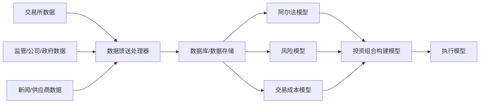

# 第8章 数据

> 我会卖了孩子后再卖数据，但我不会卖掉我的孩子。  
> ——匿名期货量化交易者

## 章节主旨

本章讨论量化交易系统的输入基础：数据。量化交易是典型输入/输出模型，黑箱内部无论多复杂，最终都依赖输入数据。如果输入数据质量差，输出结果也不会可靠。这正是“输入垃圾，输出垃圾”。

数据决定模型能做什么、怎么做、以什么频率做，也决定系统需要什么样的软件、硬件、数据库和清洗流程。很多顶级量化公司会直接从源头收集数据，在数据抓取、清洗、存储和速度上投入大量资源，甚至设立几十到上百人的团队专门处理数据。

本章围绕四个问题展开：

1. 数据为什么重要。
2. 数据有哪些类型和来源。
3. 数据清洗要处理哪些错误。
4. 数据应如何存储和组织。

## 一、数据的重要性

量化交易模型的输入属性决定了模型能完成的任务。若只有生菜、西红柿和黄瓜，做不出喷气式发动机；若只有季度 GDP 数据，也不可能建立按分钟持仓的快速交易模型。

数据的时间频率、覆盖范围、发布时间和传输方式，都会限制策略设计。例如：

1. 美国季度 GDP 数据发布时间慢，无法支持分钟级交易。
2. 美国宏观数据可能对债券或货币有用，但未必足以建立股票策略。
3. 美国 GDP 数据也无法直接提供乌拉圭或波兰证券市场信息。

数据也决定数据库和基础设施。高频数据需要高速传输、低延迟处理和高性能存储；低频基本面数据则更需要点时有效性、修订记录和跨供应商映射。

作者用火星气候卫星失败说明输入数据单位错误的严重性。一个团队用牛顿作为力单位，另一个团队用磅力处理传入数据，导致卫星轨道控制输入错误，最终卫星被火星大气烧毁。控制模型本身可能正确，但输入数据单位错误足以摧毁整个系统。

这一例子对应量化交易中的虚假精确。模型输出常带许多小数，看起来非常精确，但如果输入数据错误、滞后、单位错误或时间戳错误，精确数字只是虚假的。

错误数据会浪费大量研究时间，甚至让研究员得出完全不适用于现实世界的理论。若数据存在严重问题，无论检验方法多复杂、模型多精致，都无法判断交易系统是否有效。

## 二、数据类型

数据可粗略分为两类：

1. 价格数据。
2. 基本面数据。

### 1. 价格数据

价格数据不只是金融产品价格，还包括从交易行为中得到或提取的信息。例如：

1. 股票价格。
2. 交易量。
3. 每笔交易的时间和规模。
4. 限价指令簿中的买卖价格和数量。
5. 指数水平和波动百分比。

即使某些数值不是可交易产品本身的价格，例如标准普尔 500 指数每日波动百分比，也可归入价格数据，因为它来自市场交易和价格行为。

### 2. 基本面数据

基本面数据范围更广，可理解为除价格数据外、用于描述金融产品状态或帮助预测未来价格的数据。常见类别包括：

1. 财务健康状况。
2. 财务表现。
3. 财务价值。
4. 情绪。

股票层面，资产负债表可反映财务健康，利润表和现金流量表可反映财务表现，自由现金流、应计项目与收入之比、现金流与利润之比可用于评价质量。宏观层面，GDP、贸易赤字、个人存款、财政预算等可反映国家经济状况。

价值类基本面数据包括账面价值、净现金流等。情绪类数据包括分析师评级、公司内部人员买卖、股票期权隐含波动率、经济学家对 GDP 增长的预测等。

### 3. 创新数据仍可归入基本框架

研究人员不断寻找新数据来源。例如：

1. 对新闻报道做自然语言和句法分析，提取量化情绪指标。
2. 使用 GPS 或卫星定位数据判断经济活动水平。

这些方法很有创造性，但本质上通常仍属于基本面或情绪数据，只是采集手段更快、更细或更另类。

### 4. 数据频率与策略周期

价格数据通常更新频率高，多用于短期策略，包括日内和高频策略。基本面数据多为周度、月度或季度数据，多用于中长期策略。

这不是绝对规律。基本面或情绪变化策略也可能很短期，但一般来说，数据更新频率越高，越适合短周期策略；数据更新越慢，越适合长期策略。

## 三、数据来源

数据来源很多。最直接的方法是从源头获取原始数据，例如直接从纽交所获取纽交所股票价格数据。

直接获取源头数据的好处是：

1. 最大限度控制清洗和存储。
2. 速度优势明显。
3. 减少中间供应商改写或延迟。

缺点是成本高、工程复杂。多市场、多交易所、多资产类别会产生大量数据源，每个源都需要连接、格式转换和维护。

主要数据源包括：

| 数据源 | 常见数据 |
| --- | --- |
| 交易所 | 价格、交易量、时间戳、持仓量、空头持仓量、订单簿 |
| 监管机构 | 财务报表、大股东持股、内部买卖 |
| 政府 | 失业率、通胀、GDP 等宏观经济数据 |
| 公司 | 财务报告、公告、红利变化 |
| 新闻机构 | 新闻报道 |
| 数据专营供应商 | 经纪商报告、基金现金流、加工后的生产数据 |

由于直接连接数据源工作量很大，很多公司购买数据供应商加工后的数据。例如供应商从全球监管文件中提取财务报表，清洗、标准化后授权给宽客使用。

### 1. 标识符与证券主管

多个供应商可能用不同标识符识别同一证券。例如一个供应商用股票代码，另一个用 SEDOL、ISIN、CUSIP 或自有代码。宽客必须把这些数据映射到内部数据库中同一家公司或证券记录。

完成这一映射的工具称为证券主管。它把不同供应商识别证券的方式统一到宽客交易系统内部的唯一标识。

### 2. 第三方数据供应商

第三方数据供应商会整合多个数据源和二手供应商的数据，维护证券主管，甚至做数据清洗。它们让宽客更容易使用数据，因此很流行。

但便利有代价：第三方供应商在宽客和原始数据之间增加了一层，可能带来速度损失，也可能减少宽客对清洗、存储和获取方式的控制。

## 四、数据清洗

即使原始数据源和供应商做了大量工作，数据仍可能缺失或错误。量化系统每小时甚至每分钟处理海量数据，发现这些问题并不容易。

### 1. 缺失值

缺失值是常见问题。若没有数据，系统无法运行；更糟的是，只用部分存在的数据可能计算出错误结果。

处理缺失值有两类常见方法：

1. 系统明确允许缺失，并在关键数据缺失时不贸然运行。
2. 对缺失位置进行填补或插补。

宽客必须区分零和空值。价格为零表示资产价值可能归零，空值表示价格未知。很多数据库默认把缺失赋值为零，这在交易系统中可能极其危险。

常见缺失处理包括：

1. 使用最近一个已知价格，直到新价格可用。
2. 对历史数据使用前后值插补。
3. 根据相关产品、行业、指数或竞争对手表现估计缺失值。

插补适合历史数据库修复，不适合实时交易直接依赖。

### 2. 错误观测值

错误观测值包括小数点错误、单位错误、坏点等。英国股票价格有时用英镑，有时用便士，若系统错误理解单位，10 英镑可能被当成 1000 英镑，导致模型误以为价格暴涨 100 倍并触发错误交易。

价格数据也可能出现坏点，即根本不该出现或不该以该方式出现的数值。

最常见处理方法是异常值过滤。异常值过滤寻找价格中幅度很大、突然的变动，并平滑或删除。

但异常值过滤有重要风险：有些异常点是真实存在的。图 8-1 显示 2008 年 7 月 15 日美元兑墨西哥比索 9 月期货在几秒内快速下跌近 3%，随后恢复。图 8-2 显示 2008 年 3 月 28 日 10 年期德国国债期货几秒内下跌 1.4%，随后恢复。后者还是世界上交易最活跃的期货合约之一。

因此一些宽客使用异常值过滤作为提醒，而不是自动删除；系统提示后由人工查看事实再决定处理方式。

### 3. 多源交叉验证

若同一数据有多个来源，可以用不同来源交叉核实。若多个供应商数据一致，该值更可能正确；若不一致，至少有一个来源有问题。

但不一致后如何处理仍是难题。可通过前后值、相关资产表现、市场事件和人工判断修复。

### 4. 公司行为错误

公司行为包括配股、分红、拆股等。若一只股票 3:1 配股，价格通常下降约 2/3 以抵消股数增加。若数据供应商没有记录配股或没有调整历史价格，系统可能以为股价一夜下跌 67%。

解决方法包括独立追踪公司行为、使用异常值过滤提醒并人工复核。

### 5. 错误时间戳

错误时间戳常见于日内和实时数据。时间序列路径对阿尔法策略至关重要，因为交易信号依赖买入、卖出和清仓时机。如果时间戳错误，系统可能以为策略有效但实际无效，或实际有效却被误判为无效。

如果量化公司实时抓取并存储数据，可以比较数据自带时间戳与内部接收时间，以检查时间戳是否合理。但这要求可靠实时存储和高效软件，不应拖慢系统。

购买历史数据的宽客则更多依赖多源交叉验证。

### 6. 前视偏差

前视偏差是指在某些事情真实发生前，就错误地假设已经知道相关信息，也就是“昨天之前就知道了昨天的新闻”。

数据不同步是前视偏差的重要来源。美国公司财报通常在季度末后 4-8 周发布，但数据供应商可能把最终财报数字标记在季度末日期。若宽客三年后回测，数据中显示公司 3 月 31 日每股收益为 1 美元，模型就可能在 4 月使用这个数字买入；但现实中投资者直到 5 月 1 日才知道该信息。

宏观经济数据也存在类似问题，初值可能几个月后修正。如果回测使用修正后数据，却假设历史上当时已经知道修正值，就会夸大策略表现。

解决方法：

1. 记录数据发布日期和修订日期。
2. 回测时只允许模型使用当时真实可获得的数据。
3. 对某些数据加入人工滞后，确保模型不会提前使用信息。

真实交易中不存在这种意义上的前视偏差，因为宽客当然希望尽快纳入所有可获得信息；问题主要出现在历史研究和回测中。

### 7. 全球市场收盘不同步

另一类前视偏差来自全球市场收盘时间不同。SPY 下午 4:15 结束交易，而标普 500 成分股下午 4:00 结束交易；欧洲市场在纽约时间上午 11 点到中午结束；亚洲市场在纽约开盘前已收市。

同一天的“收盘价”并不代表同一时刻的市场状态。2008 年 10 月 10 日全球市场剧烈波动就是例子：亚洲、欧洲和美国市场的下跌与反弹在时间上错位。若忽略不同市场收盘时间，基于同日收盘价的分析可能产生错误结论。

## 五、数据存储

数据通常存储在数据库中。常见形式包括平面文件、指针平面文件、关系数据库和数据立方体。

### 1. 平面文件

平面文件是没有关系结构的二维数据库，类似表格。优点是简单、易搜索、加载开销小。缺点是对大文件进行顺序搜索时可能很慢。

指针平面文件通过索引改进搜索。索引像一张虚拟速查表，使大数据集搜索更高效。

### 2. 关系数据库

关系数据库允许数据之间存在复杂关系。例如宽客不仅要追踪股票价格，还要追踪股票所在行业、板块、国家指数和市场信息。

若使用平面文件，可能需要为每组数据建立独立表，且公司行为、并购等事件会导致多张表都要更新。关系数据库则可建立一张属性表，记录每只股票的行业、板块、市场等属性，再通过关系管理其他数据。

关系数据库搜索能力强，但涉及多张表和关系时也可能变慢。

### 3. 数据立方体

数据立方体是重要关系数据库形式。它把金融产品和属性放在三维结构中：

1. 一个轴是日期。
2. 一个轴是产品。
3. 一个轴是属性，例如收盘价、每股收益等。

每天都创建包含所有产品和所有属性的数据立方体，可以避免频繁搜索某产品某属性的最新数据点。它简化了关系，但也降低灵活性。如果数据关系或查询方式变化，强行固定的结构可能带来问题。

### 4. 存储选择没有绝对最优

各种存储方法各有优缺点。最优方法取决于问题：数据频率、查询模式、更新方式、延迟要求、历史回测需求和实时交易需求都影响选择。和黑箱其他部分一样，宽客在数据存储上的判断会决定系统成败。

## 六、小结

数据很少是量化交易中最吸引眼球的部分，但它是所有模型的基础。理解数据来源、类型、清洗、存储和偏差问题，有助于理解并评价量化交易系统。

本章补上了黑箱外围最关键的输入模块。图 8-3 可文本化为：

## 公式与定义补全

以下公式用于补全本章涉及的数据清洗、偏差处理和存储结构中的标准化表达。

### 1. 输入/输出模型

量化交易系统可抽象为：

$$
y_t = f(x_t)
$$

其中，$x_t$ 是输入数据，$y_t$ 是模型输出，$f(\cdot)$ 是黑箱内部模型。若 $x_t$ 错误，$y_t$ 即使精确也不可靠。

### 2. 最近值填补

缺失价格可用最近已知值填补：

$$
\tilde P_t = P_{\tau}, \quad \tau=\max\{s<t: P_s \text{ 可用}\}
$$

该方法适合某些历史或低频场景，但实时交易中需谨慎使用。

### 3. 线性插值

若 $P_{t_0}$ 和 $P_{t_1}$ 可用，$t_0<t<t_1$，缺失值可线性插值：

$$
\tilde P_t = P_{t_0} + \frac{t-t_0}{t_1-t_0}(P_{t_1}-P_{t_0})
$$

### 4. 异常值过滤

可用收益率阈值检测异常值：

$$
r_t = \ln\frac{P_t}{P_{t-1}}
$$

若：

$$
|r_t| > k\sigma_r
$$

则标记为异常点。其中，$\sigma_r$ 是近期收益波动率，$k$ 是阈值。标记不等于自动删除，因为真实极端行情也可能满足该条件。

### 5. 多源交叉验证

若两个供应商价格为 $P_t^{(1)}$ 和 $P_t^{(2)}$，可用相对差异检验：

$$
\delta_t = \frac{|P_t^{(1)}-P_t^{(2)}|}{(P_t^{(1)}+P_t^{(2)})/2}
$$

若：

$$
\delta_t > \epsilon
$$

则需要标记并复核。

### 6. 拆股调整

若发生 $m:1$ 拆股，历史价格通常需除以 $m$，股数乘以 $m$：

$$
P_{\text{adj}} = \frac{P_{\text{raw}}}{m}
$$

$$
Shares_{\text{adj}} = m \times Shares_{\text{raw}}
$$

若不调整，模型会把公司行为误认为真实价格大幅变化。

### 7. 点时可得性

为避免前视偏差，数据不仅要记录观察期，还要记录可得时间：

$$
\text{Use}(x_i,t)=1 \quad \text{only if} \quad \text{available\_time}(x_i) \le t
$$

回测时，模型在时点 $t$ 只能使用当时已经发布且可获得的数据。

### 8. 人工滞后

若数据发布时间不可靠，可加入保守滞后 $L$：

$$
\text{Use}(x_i,t)=1 \quad \text{only if} \quad \text{period\_end}(x_i)+L \le t
$$

这会牺牲部分及时性，但能降低前视偏差风险。

### 9. 数据立方体

数据立方体可抽象为三维数组：

$$
X_{t,i,k}
$$

其中，$t$ 表示日期，$i$ 表示金融产品，$k$ 表示属性，例如收盘价、成交量、EPS、行业分类等。

### 10. 第一类错误与第二类错误

若因错误数据导致认为无效策略有效，可对应第一类错误：

$$
P(\text{拒绝原假设} \mid \text{原假设为真})
$$

若因错误数据导致认为有效策略无效，可对应第二类错误：

$$
P(\text{未拒绝原假设} \mid \text{原假设为假})
$$

在策略研究中，数据错误会同时增加这两类判断风险。
