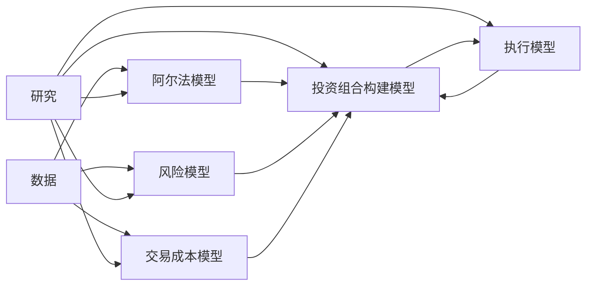

# 第9章 研究

> 任何事都应尽量从简，但不可过简。  
> ——爱因斯坦

## 章节主旨

本章讨论量化交易的核心活动：研究。优秀宽客的声誉很大程度来自精心设计、严格、持续而不知疲倦的研究项目。研究不仅用于开发阿尔法模型，也用于风险模型、交易成本模型、投资组合构建模型、执行算法和监控工具。

作者强调，研究的目标不是证明一个策略一定正确，而是审慎检验一个经过周密思考的投资策略，寻找其可能失效的方式。量化交易中，策略选择必须尽量建立在研究而非愿望、情绪或事后解释之上。

本章的核心问题是：

1. 宽客如何用科学方法研究策略。
2. 交易思想从何而来。
3. 样本内和样本外检验如何进行。
4. 如何判断模型“好坏”。
5. 如何识别过度拟合、前视偏差和错误假设。

## 一、研究蓝图：科学的方法

优秀宽客共有的特征是遵循科学方法。科学方法让量化交易中的重要判断更严谨、更有纪律。若没有这种严谨性，研究员很容易被痴心妄想、情绪化和事后解释带偏。

科学方法通常包括四步：

1. 观察世界中的模式。
2. 形成理论解释这些模式。
3. 根据理论推导可检验的结论。
4. 通过检验寻找可能推翻理论的反例。

作者用万有引力说明。观察到物体没有支撑会下落后，科学家提出万有引力理论，并推导行星轨道应可预测。海王星的预测支持了牛顿理论，但不能“证明”牛顿理论。按照卡尔·波普尔的证伪思想，一个尚未被反驳的理论只能暂时被认为正确。牛顿理论后来被爱因斯坦广义相对论取代，而广义相对论本身也不是最终证明。

量化研究与此类似。研究者观察到市场存在趋势，于是形成“趋势存在”的理论：市场未来表现可能与近期历史表现同向。她用移动平均线交叉等方法定义历史趋势，并检验其预测是否优于随机预测。如果没有证据反驳，她可以在一定资本范围内承担该理论有效的风险。

但宽客与自然科学家有重大区别。自然规律相对稳定，金融市场高度动态。监管变化、投资者心理变化、交易者竞争、技术结构变化都会改变市场。因此量化研究必须持续进行，不能把某次研究当作永久结论。

## 二、思想的产生

作者总结了交易思想的四个常见来源：

1. 对市场的观察。
2. 学术文献。
3. 研究员或投资组合经理在量化公司之间流动。
4. 对主观判断型交易者行为的系统化提炼。

### 1. 对市场的观察

这是最接近科学方法的思想来源。趋势跟随策略就是经典例子。

理查德·唐奇安观察到许多市场存在牛市和熊市式的持续方向运动，并假设可以构建系统探测趋势开始与持续。他提出简单规则：若某市场价格高于过去两周最高收盘价，则做多；若低于过去两周最低收盘价，则做空；在此期间持有相应头寸。

这个规则极简单，却在 1950-1970 年创造了成功记录，并催生了管理数千亿美元资产的趋势跟随行业。

### 2. 学术文献

金融和其他科学领域文献中有大量可供宽客检验的思想。例如，关于 CFO 如何管理盈利和财务数据的论文，启发宽客寻找财务报表操纵、收益质量、应计项目等交易机会。

量化公司常系统收集学术期刊、工作论文和会议资料中的可检验思想。马科维茨《投资组合选择》是最经典例子，它提出均值方差优化，成为投资组合构建工具箱中的核心方法。

宽客也会借鉴天文学、物理学、心理学等领域思想，将其他科学方法迁移到金融问题中。

### 3. 人才流动

研究员和投资组合经理在量化公司间迁移，也会传播思想。即使公司使用竞业条款和保密协议，宽客仍会把经验和方法带到新机构。

作者列举了许多例子：AQR 与高盛量化方法之间的联系，理查德·丹尼斯训练“海龟”交易员，肖氏公司从摩根士丹利统计套利团队后发展出多个同行，文艺复兴科技因研究员流失引发诉讼等。

投资者有时也会在不同量化公司之间传递他们观察到的信息，成为思想传播的载体。

### 4. 主观交易经验

宽客也会从成功主观交易者行为中提炼规则。例如“亏损时止损，盈利时让利润奔跑”可以形成止损策略，系统地处理未实现亏损。

但并非所有主观经验都能系统化成功。技术分析中的头肩形、上三角等图形模式常被量化基金尝试转化为规则，但结果未必有效。原因可能是这些思想本身缺乏理论基础，也可能是人工交易中的灵活性难以转化为固定规则。

关键经验是：不是所有成功交易者都有可复制技巧，识别真正有效因素的方式是把思想纳入研究流程，看它能否经受检验。

## 三、检验：研究的中心

检验是研究的中心。常见流程看似简单：

1. 构建模型。
2. 用样本内数据训练模型。
3. 用样本外数据检验模型是否仍有效。

但研究充满风险。研究员容易因为投入时间和愿望而放松严谨性，因此必须警惕过度拟合、前视偏差、样本偏差和错误假设。

## 四、样本内测试：训练模型

样本内测试又称训练。模型用样本内数据寻找最优参数。

参数是定义模型某些方面并影响表现的变量。例如策略认为“便宜股票表现优于昂贵股票”，并用盈利收益率 E/P 衡量便宜。但 E/P 高到什么水平才算便宜？低到什么水平才算昂贵？这些阈值就是参数。

作者用购房顾问类比。顾问要帮助你买房，需了解房子大小、地理位置、学区、房屋状况等变量的重要性。他通过观察你对不同房子的反应，推断你的偏好权重。量化模型训练也是如此：通过测试多组参数，寻找表现最好的参数组合。

样本内研究是模型最容易表现好的阶段，因为全部历史数据已经可见，类似小学生拿着答案做题。模型不需要真正预测未来，只需合理解释历史。

样本内测试有两个维度：

1. 样本宽度：使用多少股票、哪些行业、市值范围、资产范围。
2. 样本长度：使用多长时间窗口，近期数据还是全部历史数据。

使用更多数据可让模型适用于更多市场环境，更稳健；但数据越多，模型也越容易被调整到只解释过去。许多宽客会用交叉数据做样本内检验和模型拟合，以降低这种风险。

## 五、“良好”模型的组成部分

作者用一个标准普尔 500 指数策略说明模型评价指标。该策略根据股票风险溢价做日度方向判断：若标普 500 收益率高于 10 年国债收益率，视为做多信号；若低于债券收益率，视为做空信号。样本为 1982 年 6 月至 2000 年 12 月日收盘价。

### 1. 累积盈利图

累积盈利图是最有力的输出，因为能直观看到策略是否盈利、是否平稳、下行风险如何、在哪些时期有效。

图 9-1 显示该策略测试阶段持续盈利，但收益流起伏明显，存在多年不活跃、大幅亏损和巨额盈利阶段。研究员可立即看到实际问题：若策略多年无明显盈利，真实投资者能否坚持？

### 2. 平均收益率

平均收益率表明策略过去盈利如何。如果回测阶段表现不佳，真实交易更难奏效。

该标普 500 策略在未扣除交易成本和佣金前，累计盈利 746%，年化收益率 12.1%。但作者提醒，回测盈利容易制造错觉，必须结合其他风险与稳健性指标。

### 3. 收益变异性

收益随时间的变异性衡量平均收益的不确定性。相同平均收益下，波动越低，策略越好。

例如年收益 20%、年标准差 2% 的策略，比年收益 20%、年标准差 20% 的策略更可信。

作者所在公司还关注“块度”：显著高于平均收益的时期收益占总收益的比例。它衡量收益是否集中在少数时期。标准普尔 500 策略日收益率年化标准差为 21.2%。

### 4. 波峰到波谷最大降幅

最大降幅衡量盈利曲线从任意累计高点到之后低点的最大回撤。若策略先盈利 10%、再亏损 15%、再盈利 15%，最终收益约 7.5%，但最大回撤为 15%。

回撤越低越好。研究员还应分析多个回撤和恢复时间。恢复时间长通常不受欢迎，因为亏损后长时间无法回到高点。

标普 500 策略最大回撤为 -39.7%，主要来自 1987 年夏天做空标普 500 指数。1987 年 10 月崩盘前策略看起来还不错，这说明历史回撤必须谨慎解读。

样本偏差是重要问题。例如 1990-1997 年可转换债券套利策略看起来回撤有限，但 1998 年表现极差。若样本没有覆盖不利市场环境，就会低估下行风险。

作者还提到重复采样：把历史收益像洗牌一样重新排列，生成许多可能路径，再计算每条路径最大回撤，以更稳健地估计潜在下行风险。

### 5. 预测力

$R^2$ 表示预测模型解释被预测变量变异的比例，取值 0 到 1。金融市场中，预测未来价格、收益或趋势的 $R^2$ 很难很高。若 $R^2$ 高得异常，除非确认无误，否则应怀疑错误甚至内幕信息。

作者引用经验：金融预测中 $R^2=0.05$ 已非常好，有人认为 $0.02$ 就不错。图9-2“标准普尔500指数策略指数的 $R^2$”显示，1982-2000 年标普 500 策略的 $R^2$ 低于 0.01。这不是说策略没有价值，而是说明金融预测的信噪比极低，极小的解释力也可能有交易意义。

宽客还常用分位数组检验预测力。若模型有效，最差预测组应对应最差实际收益，最好预测组应对应最好实际收益，且各组收益随预测单调改善。

图 9-3 按五分位展示标普 500 策略信号与收益关系。最左侧信号组平均收益 -2.35%，第二组 -0.19%，随后收益逐步改善，显示信号与次日收益存在单调关系。

### 6. 胜率或盈利时间占比

胜率衡量策略盈利是否来自少数极端交易，还是来自大量小利润交易。盈利时间占比也用于衡量一致性。

标普 500 策略不是每天产生信号。它 65% 时间产生 0 信号，19% 时间盈利，16% 时间亏损。在非零信号交易时间里，约 54% 时间盈利。

### 7. 风险调整收益比率

常见风险调整收益指标包括：

1. 夏普比率：超额平均收益与收益波动率之比。
2. 信息比率：平均收益与波动率之比，去掉无风险利率项。
3. 斯特林比率：平均收益与低于平均收益的波动率之比。
4. Calmar 比率：平均收益与最大回撤之比。
5. Omega 比率：正收益之和与负收益之和之比。

标普 500 策略信息比率为 0.57，斯特林比率 0.87，Calmar 比率 0.31，Omega 比率 1.26。最令人失望的是较低的 Calmar 比率，意味着承担 1% 回撤风险只获得 0.31% 收益。

### 8. 与其他策略的关系

许多宽客同时运行多个策略，因此需要判断新策略能否改善现有策略组合。常见方法是计算新策略与现有策略的相关系数，或直接比较加入新策略前后的组合表现。

不能改善组合的好思想，最终也没有实际价值。

### 9. 时间延迟

研究员需要检验策略对信息及时性的敏感程度。若交易信号出现后延迟一天、两天、三天才执行，收益如何变化？这可以衡量策略机会持续多久，也能反映策略拥挤度。越拥挤的机会，盈利衰减越快。

图9-4“阿尔法时间延迟策略的解释”以微软 2006 年 4 月 28 日被分析师下调评级为例。开盘前评级变化已发生，开盘价已下跌约 11.1%。回测系统不能假设能提前捕捉这一跌幅。若在评级变化后几天才交易，收益明显变差。这个图的作用是提醒研究者：信息何时真正可交易，和信息何时出现在历史数据中，不是同一件事。

有趣的是，延迟并不总是坏事。标普 500 策略延迟一天进入市场，累计收益从 746% 提高到 870%，年化收益从 12.1% 提高到 12.9%。这反而不是好信号，因为它说明策略可能过早发出信号，实时可交易性值得怀疑。

### 10. 参数敏感性

研究员应检验参数小幅变化是否导致结果大幅变化。若 P/E 低于 12 视为便宜、高于 50 或为负视为昂贵，策略年化收益 10%、波动率 15%。若把阈值改成 11 和 49，结果大幅变化，则应怀疑策略。因为 P/E 10 与 11、49 与 50 不应产生本质差异。

参数邻近区域应产生相似结果；若不是，可能存在过度拟合。

## 六、过度拟合

过度拟合是判断量化策略时最重要的风险之一。它指模型能很好解释过去，但对未来解释力差。

过度拟合常见来源包括：

1. 因子数量过多。
2. 条件语句过多。
3. 交易太少导致统计不显著。
4. 参数选择过于贴合历史偶然结果。

### 1. 模型复杂度

研究员可用数千个因子解释过去资产价格波动，模型可能几乎完美解释历史。但量化交易的目标是预测未来，而不是解释过去。过去最多是不完美的未来指南。

复杂模型也可能来自大量条件。例如只有当过去 1 天下跌、10 天上涨、20 天下跌、100 天上涨时才做多。这样的模型可能有事后解释，但因包含太多“如果”，极其脆弱。

### 2. 节约原则

预测中对简单模型的偏好称为节约。节约意味着谨慎增加假设，尽可能用少量假设解释未来。奥卡姆剃刀准则可概括为：如无必要，勿增实体。

模型既不能过于复杂，也不能过于简单。购房例子说明，若顾问加入客卫瓷砖颜色、屋顶材料等太多无关因素，会混乱；若只考虑房屋大小和学区，又遗漏重要变量。量化研究必须在过度解释过去和过度简化之间平衡。

### 3. 低频信号的过度拟合

交易极不频繁的策略即使回测很好，也可能缺乏统计意义。例如规则为“标普 500 下跌至少 40% 后买入，创新高后卖出”，过去 40 年可能只有 3 次信号。每 13 年一次的交易信号很难让人放心投入资本。

### 4. 参数选择

参数可以主观设定，也可以通过搜索选择。主观设定优点是不拟合历史，策略要么起作用，要么不起作用；缺点是严重依赖研究员判断，最优值可能偏离设定。

另一种方法是遍历参数，选择表现最好的参数。图 9-5 展示了参数选择问题：D 点表现最高但孤立，周围区域差，可能只是历史偶然；C 点处于高位但靠近悬崖；B 点不是最高，却处于更稳定区域，因此更鲁棒。

谨慎宽客宁愿选择 B 点，而不是 D 点，因为 B 点代表一个稳定、宽容的参数区域，更可能是未来的一般性规律，而非历史偶然噪声。

参数可一次性固定，也可随市场数据更新重新拟合。重复拟合会增加模型复杂度，也可能增加过度拟合风险。

### 5. 噪声与怀疑

资本市场产生海量数据，但数据极嘈杂。美国股票交易所每天信息量可超过 1TB。过去数据对未来波动影响很小，许多样本外 $R^2$ 接近 0.04。少量信号埋在大量噪声中，因此任何能近乎完美解释噪声过程的模型都应被高度怀疑。

优秀研究员需要同时具备信心和怀疑。信心使他们相信理论可以发展和改进；怀疑和谦逊使他们能接受大多数想法最终失效。

## 七、样本外检验

样本外检验是检验流程的第二部分。样本内训练后，参数固定，模型在新的样本外数据集上检验。样本外检验用来判断去掉“答案要点”后，策略是否真的有效。

许多宽客使用样本外 $R^2$ 与样本内 $R^2$ 的比值衡量鲁棒性。如果比值大于等于 0.5，可认为模型较好；若显著偏小，应怀疑模型实用性。

样本外检验有多种方法：

1. 使用除样本内数据以外的剩余数据。
2. 滚动样本外检验：丢弃旧数据，加入新数据，反复拟合和检验。
3. 扩展窗口检验：随着时间推移不断增加训练数据。

滚动样本外方法可让模型适应时间变化，但也可能过度吸收近期信息，降低鲁棒性。

### 样本外数据污染

样本外检验操作难点在于，研究员可能不自觉污染样本外数据。

典型情况是：模型在样本外表现差，研究员检查失败原因，发现环境改变，于是修改模型解释这些新信息，再回到样本内重新拟合并在同一样本外数据上检验。此时样本外数据已被用于模型调整，实际上变成了样本内数据。

这种来回切换会破坏样本外检验目的。

### 加工数据与前视偏差

研究员对历史越熟悉，就越可能不自觉使用未来知识。例如现在知道互联网泡沫会破灭，但 1999 年并不确定。如果用今天的知识设计历史策略，就会产生微妙的前视偏差。

一些宽客称这种现象为加工数据。为减少加工数据带来的前视偏差，一些量化公司会把策略研发和策略选择分离，限制研究员看到样本外数据，随机改变样本内/样本外比例，甚至不告知研究员样本外数据范围。

另一种方法是放弃样本外检验，把全部警惕放在样本内结果、参数最小化和严格节约原则上。但这需要研究员极高自律。

## 八、检验中的假设条件

回测不仅检验模型，还包含许多假设。若假设错误，回测结果会失真。本章重点讨论交易成本和空头头寸可得性。

### 1. 交易成本假设

历史回测中的策略并未真实交易，因此没有真实市场冲击和滑点证据。研究员必须假设交易成本。

交易成本假设会显著影响策略判断。若假设交易无成本，高频策略会显得非常吸引人，因为任何微小价格预测都值得交易。

作者举例：模型 55% 时间正确，正确时每股赚 0.01 美元；45% 时间错误，错误时每股亏 0.01 美元。每 100 股期望盈利 0.10 美元。但若实际交易成本为每股 0.01 美元，则正确时收支平衡，错误时每股亏 0.02 美元，每 100 股期望亏损 0.90 美元。

低估交易成本会导致过度换手并亏损；高估交易成本会导致持仓过久。若必须犯错，过高估计比过低估计更安全，但最理想是接近真实成本。

### 2. 空头头寸可得性

股票市场中性或多空策略还必须假设能否卖空。很多最适合做空的股票可能在卖空限制列表中，经纪商无法借到股票。若没有真实借券，却卖空，就是裸卖空，在美国违法。

如果回测没有历史借券可得性数据，策略可能假设可以做空最优股票，但现实中无法执行，只能使用较差替代空头，表现会显著下降。

## 九、小结

研究是量化投资过程中高度敏感的环节。研究员判断是最重要影响因素。研究阶段犯下的错误会深深嵌入策略，系统化实施后可能造成灾难。

研究也不是一次性工作。市场持续变化，宽客必须持续进行活跃而丰富的研究，以保持盈利能力。

模型是对市场过去行为的归纳。越通用的模型通常越鲁棒，但在任何特定时点可能不够精确；越具体的模型可能更精确，但当市场条件变化时更容易失败。量化研究的核心挑战是在普遍性与专一性、鲁棒性与精确性之间权衡。

作者用爱因斯坦的句子作为准则：任何事都应尽量从简，但不可过简。

图 9-6 表示黑箱完整结构：模型组件包括阿尔法、风险、交易成本、投资组合构建和执行；驱动组件包括数据和研究。

## 公式与定义补全

以下公式用于补全本章涉及的回测指标、拟合优度、风险调整收益和检验框架。

### 1. 收益率

单期收益率：

$$
r_t = \frac{P_t-P_{t-1}}{P_{t-1}}
$$

对数收益率：

$$
r_t = \ln\frac{P_t}{P_{t-1}}
$$

### 2. 累积收益

若初始资本为 1，策略累计收益曲线为：

$$
V_T = \prod_{t=1}^{T}(1+r_t)
$$

累计收益率为：

$$
R_{0:T}=V_T-1
$$

### 3. 年化收益率

若总收益为 $R_{0:T}$，样本年数为 $Y$：

$$
R_{\text{ann}} = (1+R_{0:T})^{1/Y}-1
$$

### 4. 年化波动率

日收益标准差为 $\sigma_{\text{daily}}$，年化波动率为：

$$
\sigma_{\text{ann}}=\sigma_{\text{daily}}\sqrt{252}
$$

### 5. 最大回撤

累计净值为 $V_t$，历史峰值为：

$$
H_t = \max_{s\le t}V_s
$$

回撤为：

$$
DD_t = \frac{V_t-H_t}{H_t}
$$

最大回撤为：

$$
MDD = \min_t DD_t
$$

### 6. $R^2$

若真实收益为 $y_t$，预测值为 $\hat y_t$，均值为 $\bar y$，则：

$$
R^2 = 1 - \frac{\sum_t (y_t-\hat y_t)^2}{\sum_t (y_t-\bar y)^2}
$$

$R^2$ 越高，模型解释变异越多。但金融收益预测中异常高的 $R^2$ 应被谨慎审查。

### 7. 胜率

若交易收益为 $r_i^{\text{trade}}$，胜率为：

$$
\text{Win Rate} = \frac{\#\{i:r_i^{\text{trade}}>0\}}{\#\{i:r_i^{\text{trade}}\ne 0\}}
$$

盈利天数占比为：

$$
\text{Positive Days} = \frac{\#\{t:r_t>0\}}{T}
$$

### 8. 夏普比率

$$
\text{Sharpe} = \frac{\bar r-r_f}{\sigma_r}
$$

若使用年化值：

$$
\text{Sharpe}_{\text{ann}} = \frac{R_{\text{ann}}-r_{f,\text{ann}}}{\sigma_{\text{ann}}}
$$

### 9. 信息比率

若不扣除无风险利率，或相对基准收益为 $r_t-r_{b,t}$：

$$
\text{Information Ratio} = \frac{\overline{r-r_b}}{\sigma_{r-r_b}}
$$

### 10. Calmar 比率

$$
\text{Calmar} = \frac{R_{\text{ann}}}{|MDD|}
$$

### 11. Omega 比率

以阈值 $\theta$ 为基准，Omega 比率可写为：

$$
\Omega(\theta)=\frac{\sum_t \max(r_t-\theta,0)}{\sum_t \max(\theta-r_t,0)}
$$

若 $\theta=0$，即正收益之和与负收益绝对值之和的比值。

### 12. 分位数组单调性

将预测信号 $s_i$ 分为 $K$ 组，计算每组未来收益均值：

$$
\bar r_k = E[r_{t+1}\mid s_t \in Q_k]
$$

若多头信号越强未来收益越高，应观察到：

$$
\bar r_1 \le \bar r_2 \le \cdots \le \bar r_K
$$

这种单调性比单一回测收益更能说明预测关系是否稳定。

### 13. 样本外与样本内 $R^2$ 比值

$$
\text{Robustness Ratio}=\frac{R^2_{\text{out-of-sample}}}{R^2_{\text{in-sample}}}
$$

若该比值接近或大于 0.5，模型通常更令人放心；若远低于 0.5，应警惕过度拟合。

### 14. 交易成本对期望收益的影响

单股毛收益为 $g$，交易成本为 $c$，胜率为 $p$，错误概率为 $1-p$，若正确赚 $g$、错误亏 $g$，净期望收益为：

$$
E[\text{net}] = p(g-c) + (1-p)(-g-c)
$$

本章例子中 $p=55\%$，$g=0.01$，若 $c=0$：

$$
E = 0.55(0.01)+0.45(-0.01)=0.001
$$

每 100 股盈利 0.10 美元。若 $c=0.01$：

$$
E = 0.55(0)+0.45(-0.02)=-0.009
$$

每 100 股亏损 0.90 美元。

### 15. 前视偏差约束

回测中只能使用当时可获得信息：

$$
\mathcal{I}_t = \{x_i:\text{available\_time}(x_i)\le t\}
$$

模型预测必须满足：

$$
\hat r_{t+1}=f(\mathcal{I}_t)
$$

若使用了 $\text{available\_time}(x_i)>t$ 的数据，即存在前视偏差。
